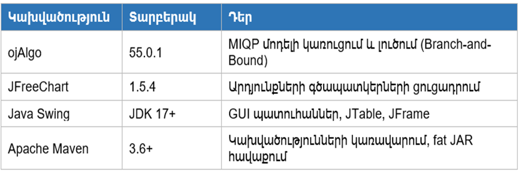

**Բովանդակություն**

[Ներածություն [3](#ներածություն)](#ներածություն)

[Գլուխ 1. Խնդրի մաթեմատիկական մոդելավորում
[7](#գլուխ-1.-խնդրի-մաթեմատիկական-մոդելավորում)](#գլուխ-1.-խնդրի-մաթեմատիկական-մոդելավորում)

[§1.1. Խնդրի ընդհանուր նկարագրություն
[7](#խնդրի-ընդհանուր-նկարագրություն)](#խնդրի-ընդհանուր-նկարագրություն)

[§1.2. Ուռուցիկ ծրագրավորման տարրի ներմուծում
[10](#ուռուցիկ-ծրագրավորման-տարրի-ներմուծում)](#ուռուցիկ-ծրագրավորման-տարրի-ներմուծում)

[§1.3. Մաթեմատիկական մոդելը
[13](#մաթեմատիկական-մոդելը)](#մաթեմատիկական-մոդելը)

[§1.3.1. Որոշում կայացնող փոփոխականներ
[14](#որոշում-կայացնող-փոփոխականներ)](#որոշում-կայացնող-փոփոխականներ)

[§1.3.2. Նպատակային ֆունկցիա
[15](#նպատակային-ֆունկցիա)](#նպատակային-ֆունկցիա)

[§1.3.3. Սահմանափակումներ [17](#սահմանափակումներ)](#սահմանափակումներ)

[§1.3.4. Խնդրի ամբողջական ձևակերպումը
[19](#խնդրի-ամբողջական-ձևակերպումը)](#խնդրի-ամբողջական-ձևակերպումը)

[Գլուխ 2. Օպտիմիզացիայի տեսություն և մեթոդներ
[20](#գլուխ-2.-օպտիմիզացիայի-տեսություն-և-մեթոդներ)](#գլուխ-2.-օպտիմիզացիայի-տեսություն-և-մեթոդներ)

[§2.1. Գծային և ամբողջաթիվ ծրագրավորում
[20](#գծային-և-ամբողջաթիվ-ծրագրավորում)](#գծային-և-ամբողջաթիվ-ծրագրավորում)

[§2.1.1. Սիմպլեքս մեթոդ [20](#սիմպլեքս-մեթոդ)](#սիմպլեքս-մեթոդ)

[§2.1.3. Ճյուղավորումների և սահմանների մեթոդ
[23](#ճյուղավորումների-և-սահմանների-մեթոդ)](#ճյուղավորումների-և-սահմանների-մեթոդ)

[§2.2. Ուռուցիկ օպտիմիզացիա
[26](#ուռուցիկ-օպտիմիզացիա)](#ուռուցիկ-օպտիմիզացիա)

[§2.2.1. Հիմնական սահմանումներ:
[26](#հիմնական-սահմանումներ)](#հիմնական-սահմանումներ)

[§2.2.2. Ակտիվ Բազմությունների ալգորիթմ (Active Set algorithm):
[28](#ակտիվ-բազմությունների-ալգորիթմ-active-set-algorithm)](#ակտիվ-բազմությունների-ալգորիթմ-active-set-algorithm)

[Գլուխ 3. Ծրագրային իրականացում և թվային փորձարկումներ
[33](#գլուխ-3.-ծրագրային-իրականացում-և-թվային-փորձարկումներ)](#գլուխ-3.-ծրագրային-իրականացում-և-թվային-փորձարկումներ)

[§3.1. Օգտագործվող գործիքներ և տեխնոլոգիաներ
[33](#օգտագործվող-գործիքներ-և-տեխնոլոգիաներ)](#օգտագործվող-գործիքներ-և-տեխնոլոգիաներ)

[§3.1.1. Ծրագրավորման լեզու՝ Java 17
[33](#ծրագրավորման-լեզու-java-17)](#ծրագրավորման-լեզու-java-17)

[§3.1.2. Օպտիմալացման գրադարան՝ ojAlgo 55.0.1
[33](#օպտիմալացման-գրադարան-ojalgo-55.0.1)](#օպտիմալացման-գրադարան-ojalgo-55.0.1)

[§3.1.3. Գրաֆիկական գրադարան՝ JFreeChart 1.5.4
[34](#գրաֆիկական-գրադարան-jfreechart-1.5.4)](#գրաֆիկական-գրադարան-jfreechart-1.5.4)

[§3.1.4. Կառուցման գործիք՝ Apache Maven
[34](#կառուցման-գործիք-apache-maven)](#կառուցման-գործիք-apache-maven)

[§3.2. Ծրագրային կոդ և ծրագրային կոդի նկարագրություն
[35](#ծրագրային-կոդ-և-ծրագրային-կոդի-նկարագրություն)](#ծրագրային-կոդ-և-ծրագրային-կոդի-նկարագրություն)

[§3.2.1. Ծրագրային կոդ [35](#ծրագրային-կոդ)](#ծրագրային-կոդ)

[§3.2.2. Ծրագրային կոդի նկարագրություն
[35](#ծրագրային-կոդի-նկարագրություն)](#ծրագրային-կոդի-նկարագրություն)

[§3.3. Փորձարկումների պլան
[37](#փորձարկումների-պլան)](#փորձարկումների-պլան)

[§3.3.1. Մոդել 1. Գծային մոտարկում
[39](#մոդել-1.-գծային-մոտարկում)](#մոդել-1.-գծային-մոտարկում)

[§3.3.2. Մոդել 2. Ուռուցիկ մոդել
[46](#մոդել-2.-ուռուցիկ-մոդել)](#մոդել-2.-ուռուցիկ-մոդել)

[§3.3.3. Արդյունքների համեմատական վերլուծություն
[53](#արդյունքների-համեմատական-վերլուծություն)](#արդյունքների-համեմատական-վերլուծություն)

[Գլուխ 4․ ՈՒռուցիկ և ամբողջաթիվ ծրագրավորման մեթոդների կիրառմամբ (գինու
գործարանի օրինակով) արտադրության պլանավորման համալիր օպտիմիզացման
աշխատանքների ինքնարժեքի և գնի հաշվարկը
[56](#գլուխ-4-ուռուցիկ-և-ամբողջաթիվ-ծրագրավորման-մեթոդների-կիրառմամբ-գինու-գործարանի-օրինակով-արտադրության-պլանավորման-համալիր-օպտիմիզացման-աշխատանքների-ինքնարժեքի-և-գնի-հաշվարկը)](#գլուխ-4-ուռուցիկ-և-ամբողջաթիվ-ծրագրավորման-մեթոդների-կիրառմամբ-գինու-գործարանի-օրինակով-արտադրության-պլանավորման-համալիր-օպտիմիզացման-աշխատանքների-ինքնարժեքի-և-գնի-հաշվարկը)

[§4.1. Համալրող առարկաների ծախսի հաշվարկ
[57](#համալրող-առարկաների-ծախսի-հաշվարկ)](#համալրող-առարկաների-ծախսի-հաշվարկ)

[§4.2. Էլեկտրաէներգիայի ծախսի հաշվարկ
[58](#էլեկտրաէներգիայի-ծախսի-հաշվարկ)](#էլեկտրաէներգիայի-ծախսի-հաշվարկ)

[§4.3. Աշխատողների հիմնական աշխատավարձի հաշվարկը
[58](#աշխատողների-հիմնական-աշխատավարձի-հաշվարկը)](#աշխատողների-հիմնական-աշխատավարձի-հաշվարկը)

[§4.4. Աշխատողների լրացուցիչ աշխատավարձի հաշվարկը
[59](#աշխատողների-լրացուցիչ-աշխատավարձի-հաշվարկը)](#աշխատողների-լրացուցիչ-աշխատավարձի-հաշվարկը)

[§4.5. Սարքավորումների պահպանման և շահագործման ծախսերի հաշվարկը
[59](#սարքավորումների-պահպանման-և-շահագործման-ծախսերի-հաշվարկը)](#սարքավորումների-պահպանման-և-շահագործման-ծախսերի-հաշվարկը)

[§4.6. Տարածքի վարձակալության ծախսի հաշվարկը
[61](#տարածքի-վարձակալության-ծախսի-հաշվարկը)](#տարածքի-վարձակալության-ծախսի-հաշվարկը)

[§4.7. Ընդհանուր տնտեսական ծախսերի հաշվարկը
[61](#ընդհանուր-տնտեսական-ծախսերի-հաշվարկը)](#ընդհանուր-տնտեսական-ծախսերի-հաշվարկը)

[§4.8. Համակարգի/փաթեթի ինքնարժեքի կալկուլացիան
[61](#համակարգիփաթեթի-ինքնարժեքի-կալկուլացիան)](#համակարգիփաթեթի-ինքնարժեքի-կալկուլացիան)

[§4.9. Շահույթի և միավորի գնի հաշվարկը
[62](#շահույթի-և-միավորի-գնի-հաշվարկը)](#շահույթի-և-միավորի-գնի-հաշվարկը)

[Գլուխ 5. Արհեստական բանականությունը գյուղատնտեսության մեջ և անօդաչու
թռչող սարքերի կիրառությունը բնապահպանական խնդիրներում
[63](#գլուխ-5.-արհեստական-բանականությունը-գյուղատնտեսության-մեջ-և-անօդաչու-թռչող-սարքերի-կիրառությունը-բնապահպանական-խնդիրներում)](#գլուխ-5.-արհեստական-բանականությունը-գյուղատնտեսության-մեջ-և-անօդաչու-թռչող-սարքերի-կիրառությունը-բնապահպանական-խնդիրներում)

[Գլուխ 6. Գինու գործարանում արտադրական պրոցեսի կազմակերպում համաձայն
արտադրական սանիտարիայի ժամանակակից պահանջների
[71](#գլուխ-6.-գինու-գործարանում-արտադրական-պրոցեսի-կազմակերպում-համաձայն-արտադրական-սանիտարիայի-ժամանակակից-պահանջների)](#գլուխ-6.-գինու-գործարանում-արտադրական-պրոցեսի-կազմակերպում-համաձայն-արտադրական-սանիտարիայի-ժամանակակից-պահանջների)

[Եզրակացություն [79](#եզրակացություն)](#եզրակացություն)

# 

# Ներածություն

**Թեմայի արդիականությունը․**

Ժամանակակից շուկայական տնտեսության պայմաններում արտադրական
ձեռնարկությունների համար ռեսուրսների արդյունավետ օգտագործումը և
արտադրության ռացիոնալ պլանավորումը դարձել են մրցակցային առավելություն
ձեռք բերելու և շահութաբերության ապահովման առանցքային գործոնները։
Հայաստանի գինեգործական ոլորտը, լինելով երկրի ագրոարդյունաբերական
համալիրի կարևոր բաղկացուցիչ մաս, հանդիպում է բազմաթիվ մարտահրավերների՝
սահմանափակ ռեսուրսների պայմաններում արտադրության ծավալների օպտիմիզացման,
արտադրանքի տեսականու ճիշտ ընտրության և շուկայական պահանջարկի
տատանումներին արդյունավետ արձագանքելու հարցերում։

Արտադրության պլանավորման դասական մոտեցումները, որոնք հիմնված են գծային
ծրագրավորման մեթոդների վրա, հաճախ չափազանց պարզեցնում են իրական
տնտեսական պայմանները։ Այդ մոդելները սովորաբար ենթադրում են, որ ապրանքի
գինը և արտադրության ծախսերը անփոփոխ են և չեն կախված արտադրության
ծավալից։ Սակայն իրականում շուկայական մեխանիզմները շատ ավելի բարդ են՝
պահանջարկը և գինը փոխադարձ կապված են, արտադրության ծավալների աճը կարող է
հանգեցնել գների իջեցման, իսկ որոշակի ապրանքատեսակների արտադրության մեջ
մտնելու համար անհրաժեշտ են նախնական ներդրումներ։

Պահանջարկի գնային էլաստիկության երևույթը, որը արտահայտում է պահանջարկի
քանակական փոփոխության կախվածությունը գնից, դարձնում է արտադրության
պլանավորման խնդիրը ոչ գծային։ Գինու արդյունաբերության համար այս հարցը
հատկապես կարևոր է, քանի որ այս ոլորտում գործում են պրեմիում և ստանդարտ
դասի ապրանքներ՝ տարբեր գնային սեգմենտներում, յուրաքանչյուրն ունենալով իր
հատուկ շուկայական պահանջարկի բնութագիրը։

Այսպիսով, գինու գործարանի արտադրության իրատեսական պլանավորումը պահանջում
է կիրառել համալիր մոտեցում, որը միավորում է ամբողջաթիվ ծրագրավորման
(որոշումների կայացման մոդելավորման համար) և ուռուցիկ ծրագրավորման (ոչ
գծային շուկայական կախվածությունների հաշվարկման համար) մեթոդները։ Նման
խնդիրները դասակարգվում են որպես խառը-ամբողջաթիվ ուռուցիկ ծրագրավորման
(Mixed-Integer Convex Programming - MICP) խնդիրներ և ներկայացնում են
օպտիմիզացիայի տեսության ժամանակակից զարգացումների կիրառական ուղղություն։

Վերջին տարիներին տեղեկատվական տեխնոլոգիաների և կիրառական մաթեմատիկական
մեթոդների զարգացումը ստեղծել են նոր հնարավորություններ բարդ օպտիմիզացիոն
խնդիրների լուծման համար։ Java ծրագրավորման լեզվի և դրա հզոր գրադարանների
առկայությունը թույլ են տալիս արագ և արդյունավետ կերպով մոդելավորել ու
լուծել ձեռնարկությունների արտադրական պլանավորման խնդիրները։

**Խնդրի ձևակերպումը և նրա տեսական նշանակությունը․**

Սույն դիպլոմային աշխատանքում դիտարկվող խնդիրը կարելի է ձևակերպել հետևյալ
կերպ. անհրաժեշտ է որոշել գինու գործարանի օպտիմալ արտադրական ծրագիրը՝
մաքսիմիզացնելով ընդհանուր շահույթը սահմանափակ ռեսուրսների պայմաններում,
երբ հաշվի են առնվում հետևյալ գործոնները՝

Առաջին՝ արտադրանքի վաճառքից ստացվող եկամուտը կախված է արտադրության
ծավալից ոչ գծային օրենքով՝ շուկայական պահանջարկի էլաստիկության պատճառով։

Երկրորդ՝ պրեմիում դասի գինիների արտադրությունը պահանջում է միանվագ
ֆիքսված ծախսեր, որոնք ծագում են միայն այն դեպքում, եթե տվյալ
ապրանքատեսակը ընդգրկվում է արտադրական ծրագրում։

Երրորդ՝ գործարանն ունի սահմանափակ ռեսուրսներ՝ հումք (խաղող), արտադրական
հզորություններ, աշխատաժամանակ, պահեստային տարածություններ և այլն։

**Աշխատանքի նպատակը և խնդիրները․**

Սույն ավարտական աշխատանքի հիմնական նպատակն է մշակել գինու գործարանի
արտադրության օպտիմալ պլանավորման համապարփակ մաթեմատիկական մոդել և դրա
հիման վրա ստեղծել ծրագրային լուծում, որը թույլ կտա գտնել մաքսիմալ
շահույթ ապահովող արտադրական ծրագիրը՝ հաշվի առնելով ինչպես ռեսուրսային
սահմանափակումները, այնպես էլ շուկայական պահանջարկի ոչ գծային դինամիկան։

Այս նպատակին հասնելու համար լուծվում են հետևյալ խնդիրները.

Առաջինը վերաբերում է խնդրի մաթեմատիկական մոդելավորմանը։ Անհրաժեշտ է տալ
խնդրի մաթեմատիկական ձևակերպումը, որը կներառի երկուական փոփոխականներ՝
պրեմիում դասի գինիների արտադրության մեջ մտնելու որոշման մոդելավորման
համար, և ուռուցիկ (մասնավորապես՝ քառակուսային) նպատակային ֆունկցիա՝
շուկայական պահանջարկի գնային էլաստիկության հաշվարկման համար։ Մոդելը պետք
է ներառի նաև գծային սահմանափակումներ՝ ռեսուրսների սահմանափակ պաշարների
արտացոլման համար, և տրամաբանական սահմանափակումներ՝ դիսկրետ և անընդհատ
փոփոխականների միջև կապի ապահովման համար։

Երկրորդ խնդիրն է տեսական հիմքերի ուսումնասիրությունը։ Պետք է մանրամասն
դիտարկել գծային ծրագրավորման տեսությունը և Սիմպլեքս մեթոդը՝ որպես
օպտիմիզացիայի հիմնարար ալգորիթմ։ Անհրաժեշտ է ուսումնասիրել ամբողջաթիվ
ծրագրավորման հիմնական մեթոդները։ Կիրառվում է նաև ուռուցիկ օպտիմիզացիայի
տեսությունը՝ ուռուցիկ և գոգավոր ֆունկցիաների հատկությունները,
Կուն-Թակերի օպտիմալության պայմանները և քառակուսային ծրագրավորման
մեթոդները։ Արդյունքում հանգում ենք խառը-ամբողջաթիվ ուռուցիկ ծրագրավորման
խնդիրների լուծման ալգորիթմներին և դրանց համակցման սկզբունքներին։

Երրորդ խնդիրը կապված է ծրագրային իրականացման հետ։ Անհրաժեշտ է Java
ծրագրավորման լեզվով մշակել համապարփակ ծրագրային համակարգ, որը կիրառում է
ojAlgo գրադարանը՝ ուռուցիկ օպտիմիզացիայի խնդիրների մոդելավորման համար և
JFreeChart գրադարանը՝ արդյունքների վիզուալիզացիայի համար։ Ծրագիրը պետք է
ընդունի մուտքային տվյալներ (ապրանքների բնութագրեր, ռեսուրսների քանակներ,
շուկայական պարամետրեր) և գեներացնի օպտիմալ արտադրական ծրագիրը՝ նշելով
յուրաքանչյուր ապրանքատեսակի արտադրության ծավալները և կանխատեսվող
շահույթը։

Չորրորդ խնդիրը վերաբերում է թվային փորձարկումներին և արդյունքների
վերլուծությանը։ Պետք է ստեղծել իրատեսական տվյալների բազա, որը
բնութագրում է գինու գործարանի գործունեությունը (գինիների տեսակները և
արտադրական ռեսուրսները)։ Անհրաժեշտ է իրականացնել համեմատական
ուսումնասիրություն՝ լուծելով խնդիրը երկու տարբերակով. առաջինը՝ պարզեցված
գծային մոդել, որտեղ անտեսվում է գնի կախվածությունը ծավալից, և երկրորդը՝
ամբողջաթիվ ուռուցիկ մոդել։ Պետք է համեմատել ստացված արտադրական ծրագրերը,
վերլուծել տարբերությունները օպտիմալ ծավալների և ընտրված տեսականու մեջ, և
գնահատել՝ որքանով է ոչ գծային շուկայական կախվածությունների հաշվի առնումը
բարելավում կանխատեսվող շահույթը։

**Աշխատանքի գիտական նորույթը և գործնական արժեքը․**

Գիտական նորույթը. Սույն աշխատանքի գիտական նորույթը կայանում է ամբողջաթիվ
և ուռուցիկ ծրագրավորման մեթոդների համակցված կիրառման մեջ արտադրության
պլանավորման հարցում։ Մինչդեռ գոյություն ունեն բազմաթիվ աշխատություններ
գծային ամբողջաթիվ մոդելների կիրառման վերաբերյալ, իսկ ուռուցիկ
օպտիմիզացիան հիմնականում օգտագործվում է ֆինանսական պորտֆելների
օպտիմիզացիայի համար, խառը-ամբողջաթիվ ուռուցիկ մոդելների կիրառումը
արտադրական պլանավորման համար համեմատաբար նոր ուղղություն է։

Աշխատանքում առաջարկվող մոդելը միաժամանակ հաշվի է առնում երեք կարևոր
ասպեկտներ՝ դիսկրետ որոշումների կայացումը (արտադրել կամ չարտադրել),
ռեսուրսների սահմանափակ պաշարները և շուկայական պահանջարկի ոչ գծային
դինամիկան։ Այս համալիր մոտեցումը թույլ է տալիս ավելի իրատեսական կերպով
մոդելավորել արտադրական պլանավորման խնդիրը և ստանալ ավելի ճշգրիտ և
արդյունավետ լուծումներ։

# Գլուխ 1. Խնդրի մաթեմատիկական մոդելավորում

## §1.1. Խնդրի ընդհանուր նկարագրություն

Արդի արտադրական ձեռնարկությունների համար արտադրության պլանավորման
օպտիմալացման խնդիրը կենսական նշանակություն ունի շուկայական մրցակցության
պայմաններում։ Սույն աշխատանքում դիտարկվում է գինու գործարանի արտադրական
գործունեության օպտիմալ կազմակերպման խնդիրը, որը բնութագրվում է մի շարք
առանձնահատկություններով և սահմանափակումներով։ Գինու գործարանն իր
գործունեության շրջանակներում արտադրում է n տեսակի տարբեր գինիներ,
որոնցից յուրաքանչյուրն ունի իր յուրահատուկ տեխնոլոգիական պահանջները,
շուկայական դիրքավորումը և շահութաբերությունը։ Արտադրվող գինիների
տեսականին ներառում է ինչպես զանգվածային սպառման գինիներ, այնպես էլ
պրեմիում դասի արտադրանք, որոնք պահանջում են լրացուցիչ ռեսուրսներ և
ներդրումներ։

Գործարանը բախվում է ռեսուրսների սահմանափակվածության խնդրին։ Արտադրական
գործընթացում ներգրավված են m տեսակի ռեսուրսներ, որոնց թվում են հումք և
նյութերը, մասնավորապես՝ տարբեր սորտերի խաղող, շաքարավազ, խմորիչներ,
կոնսերվանտներ և այլ բաղադրիչներ, որոնց պաշարները սահմանափակ են և կախված
են բերքի ծավալից, մատակարարների հնարավորություններից և պահեստային
տարածությունից։ Դրանց զուգահեռ կարևորվում են արտադրական հզորությունները,
այսինքն՝ խմորման տարողությունները, տակառները, արտադրական գծերը և
շշալցման սարքավորումները, որոնց թողունակությունը սահմանափակված է
տեխնիկական պարամետրերով և շահագործման ռեժիմով։ Նշանակալից դեր է խաղում
նաև աշխատուժը, մասնավորապես՝ որակավորված անձնակազմը, ներառյալ
էկոլոգներին, տեխնոլոգներին և բանվորներին, որոնց աշխատաժամանակի ֆոնդը
սահմանափակված է օրենսդրական նորմերով և կադրային պոտենցիալով։ Բացի այդ,
անհրաժեշտ է հաշվի առնել ֆինանսական միջոցները՝ շրջանառու կապիտալը, որը
անհրաժեշտ է հումքի ձեռքբերման, արտադրական գործընթացի ապահովման և ընթացիկ
ծախսերի ֆինանսավորման համար, ինչպես նաև պահեստային տարածությունները՝
հումքի պահպանման, արտադրանքի պարունակման և պատրաստի արտադրանքի պահման
տարածքները, որոնց ծավալը սահմանափակված է ֆիզիկական տարածությամբ և
պահպանման պայմաններով։

Արտադրվող գինիների տեսականու մեջ առանձնացվում են m (m \< n) տեսակի
պրեմիում դասի գինիներ, որոնք պահանջում են հատուկ մոտեցում։ Այս
կատեգորիայի գինիները բնութագրվում են մի շարք առանձնահատկություններով,
մասնավորապես՝ բարձր որակի հումքով, ընտիր սորտերի խաղողով, որը հավաքվում
է ձեռքով և անցնում է խիստ ընտրություն, ինչպես նաև հատուկ
տեխնոլոգիաներով, որոնք ներառում են երկարատև խմորում, տակառներում
հասունացում և հատուկ մշակման մեթոդներ։ Նշանակալից է նաև պրեմիում
փաթեթավորումը՝ բարձրորակ շշեր, հատուկ պիտակներ և փայտե տուփեր, ինչպես
նաև լրացուցիչ սարքավորումների անհրաժեշտությունը, օրինակ՝ հատուկ
տակառներ, ջերմային վերահսկման համակարգեր և ֆիլտրացիայի լրացուցիչ փուլեր։

Պրեմիում գինիների արտադրությունը սկսելու համար անհրաժեշտ է կատարել
միանվագ ֆիքսված ծախս fⱼ, որը ներառում է սարքավորումների ձեռքբերում և
տեղակայում, մասնավորապես՝ հատուկ տակառներ, ջերմաստիճանի վերահսկման
համակարգեր և ֆիլտրացիայի սարքավորումներ։ Դրան զուգահեռ իրականացվում է
տեխնոլոգիական գծի կարգավորում, այսինքն՝ սարքավորումների ճշգրտում,
փորձարկումներ և որակի վերահսկման համակարգի ստեղծում։ Կարևոր է նաև
անձնակազմի վերապատրաստումը՝ էնոլոգների և տեխնոլոգների հատուկ ուսուցում և
միջազգային սերտիֆիկացիա, ինչպես նաև մարքեթինգային ներդրումները՝ բրենդի
ստեղծում, փաթեթավորման դիզայն և գովազդային արշավներ։ Վերջապես, անհրաժեշտ
է սերտիֆիկացում և լիցենզավորում՝ միջազգային ստանդարտների ստացում և որակի
սերտիֆիկատներ։ Այս ֆիքսված ծախսերը կատարվում են միայն մեկ անգամ՝
պրեմիում գինու տվյալ տեսակի արտադրությունը սկսելու որոշման դեպքում, և
չեն կախված արտադրվող արտադրանքի ծավալից։ Սա ստեղծում է «ամբողջ թե ոչինչ»
տիպի որոշման խնդիր՝ կամ սկսել է տվյալ գինու արտադրությունը և կատարել
ամբողջ ներդրումը, կամ հրաժարվել այդ արտադրանքից։

Յուրաքանչյուր i-րդ տեսակի գինու արտադրության համար պահանջվում են որոշակի
ռեսուրսներ, որոնց քանակը կախված է արտադրվող ծավալից։ Այս ռեսուրսների
պահանջարկը կարող ենք արտահայտել տեխնոլոգիական գործակիցների միջոցով,
որտեղ rₖᵢ-ն ներկայացնում է k-րդ տեսակի ռեսուրսի ծախսը i-րդ գինու մեկ
միավորի, օրինակ՝ մեկ շիշ կամ մեկ լիտր, արտադրության համար, իսկ Rₖ-ն՝
k-րդ տեսակի ռեսուրսի ընդհանուր մատչելի պաշարը պլանավորման
ժամանակահատվածում։ Տեխնոլոգիական գործակիցները rₖᵢ որոշվում են արտադրական
տեխնոլոգիայի, գինու տեսակի հատկանիշների և որակի պահանջների հիման վրա։
Օրինակ՝ խաղողի պահանջարկը մեկ շիշ կարմիր գինու համար կարող է լինել 1.5
կգ, մինչդեռ սպիտակ գինու համար՝ 1.2 կգ։ Խմորման տարողության զբաղեցման
տևողությունը կարող է տարբերվել՝ պարզ գինիների համար 2 շաբաթ, պրեմիում
գինիների համար՝ 4-6 շաբաթ։ Աշխատաժամերի ծախսը կարող է լինել 0.1 ժամ
զանգվածային արտադրանքի համար և 0.5 ժամ՝ պրեմիում գինու համար։

Արտադրության ծախսերը ներառում են նաև փոփոխական ծախսեր, որոնք կախված են
արտադրության ծավալից։ Յուրաքանչյուր i-րդ գինու համար սահմանվում է մեկ
միավորի արտադրության գծային ծախս cᵢ, որը ներառում է հումքի ուղղակի
ծախսերը՝ խաղող, օժանդակ նյութեր, փաթեթավորման նյութեր, էներգետիկ
ծախսերը՝ էլեկտրաէներգիա, գազ, ջուր, աշխատավարձը՝ բանվորների և
տեխնոլոգների աշխատավարձային ֆոնդ, ընթացիկ պահպանում և սպասարկումը՝
սարքավորումների նորոգում, սանիտարական մշակում, ինչպես նաև այլ փոփոխական
ծախսերը՝ տրանսպորտ, որակի վերահսկում, պահեստավորում։ Ենթադրվում է, որ
փոփոխական ծախսերը գծայինորեն կախված են արտադրության ծավալից՝ cᵢ դրամ
յուրաքանչյուր լրացուցիչ միավորի համար։ Այս պարզեցումը արդարացված է միջին
ժամանակահատվածների համար, երբ արտադրական հզորությունների օգտագործումը
գտնվում է նորմալ աշխատանքային միջակայքում և չկան էական սանդղային
էֆեկտներ։

Գործարանի արտադրական ծրագրի մշակման խնդիրը կայանում է հետևյալում՝
անհրաժեշտ է որոշել յուրաքանչյուր i-րդ գինու արտադրվող քանակը xᵢ և
որոշել, թե որ պրեմիում գինիների արտադրությունը սկսել (yⱼ = 1) և որոնցից
հրաժարվել (yⱼ = 0), այնպես որ մաքսիմիզացվի ընդհանուր շահույթը՝ հաշվի
առնելով բոլոր ռեսուրսային սահմանափակումները, ծախսերը և շուկայական
պայմանները։ Խնդրի բարդությունը պայմանավորված է մի քանի գործոններով,
մասնավորապես՝ խառը բնույթով, քանի որ մի մասը շարունակական փոփոխականներ
են՝ արտադրության ծավալներ, իսկ մյուս մասը՝ երկուական՝ արտադրություն
սկսելու որոշումներ։ Բարդությունը պայմանավորված է նաև ռեսուրսների
սահմանափակվածությամբ՝ մի քանի տեսակի ռեսուրսների միաժամանակյա հաշվառում,
ֆիքսված ծախսերով՝ պրեմիում գինիների համար միանվագ ներդրումների
անհրաժեշտություն, և շուկայական փոխհարաբերություններով՝ պահանջարկի և
գների փոխկապակցվածություն։ Այս բոլոր առանձնահատկությունները պահանջում են
համապատասխան մաթեմատիկական ապարատի կիրառում, որը կարող է արդյունավետորեն
մոդելավորել և լուծել տվյալ օպտիմիզացիայի խնդիրը։

## §1.2. Ուռուցիկ ծրագրավորման տարրի ներմուծում

Արտադրության պլանավորման դասական մոդելները հիմնված են գծային
ծրագրավորման ապարատի վրա, որտեղ ենթադրվում է, որ եկամուտը գծայինորեն
կախված է արտադրվող արտադրանքի քանակից։ Այս մոտեցումը ենթադրում է, որ
արտադրանքի վաճառքի գինը մնում է հաստատուն՝ անկախ շուկայում առաջարկվող
քանակից։ Սակայն իրական շուկայական պայմաններում այս ենթադրությունը հաճախ
չի համապատասխանում իրականությանը։ Տնտեսագիտության տեսության համաձայն՝
շուկայում ապրանքի պահանջարկը և գինը փոխկապակցված են։ Այս կախվածությունը
բնութագրվում է պահանջարկի գնային էլաստիկության հասկացությամբ, որը ցույց
է տալիս, թե ինչպես է փոխվում պահանջարկի քանակը գնի փոփոխության
արդյունքում։ Ընդհանուր դեպքում՝ գինը ցածր լինելու դեպքում պահանջարկը
բարձր է, իսկ գնի բարձրացման դեպքում պահանջարկը նվազում է։

Հատկապես գինու արդյունաբերության համար այս կախվածությունը իրական է։
Գինին հանդիսանում է այնպիսի ապրանք, որի սպառումը զգայուն է գնային
փոփոխությունների նկատմամբ։ Սպառողները հակված են փոխարինել թանկ գինիներն
ավելի մատչելի այլընտրանքներով, կամ ընդհակառակը՝ բարձր գնով գինին
դիտարկել որպես պրեստիժի ցուցիչ։ Մեր մոդելում կիրառենք պահանջարկի գնային
կախվածության գծային մոտարկում, որը լայնորեն օգտագործվում է տնտեսագիտական
վերլուծություններում։ Ենթադրենք, որ i-րդ տեսակի գինու համար շուկայում
հավասարակշռության գինը որոշվում է հետևյալ կախվածությամբ՝ pᵢ(xᵢ) = aᵢ -
bᵢxᵢ, որտեղ xᵢ--ն արտադրվող գինու քանակն է՝ շշերով կամ լիտրերով,
pᵢ(xᵢ)--ն՝ մեկ միավորի կամ շշի գինը, aᵢ \> 0--ն՝ ազատ անդամ, որը
բնութագրում է առավելագույն գինը, որը սպառողները պատրաստ են վճարել փոքր
քանակների համար, իսկ bᵢ \> 0--ն՝ պահանջարկի էլաստիկության գործակից, որը
ցույց է տալիս, թե որքանով է իջնում գինը արտադրության ծավալի
յուրաքանչյուր միավորի ավելացման դեպքում։

Այս գծային կախվածությունը արտացոլում է հետևյալ տնտեսագիտական իմաստը։ Երբ
xᵢ = 0, այսինքն՝ արտադրանքը շուկայում բացակայում է, տեսականորեն գինը
հասնում է իր առավելագույն արժեքին aᵢ։ Սա ցույց է տալիս արտադրանքի
բացառիկության կամ դեֆիցիտի դեպքում սպառողների պատրաստակամությունը բարձր
գներ վճարել։ Յուրաքանչյուր լրացուցիչ արտադրված միավոր մտցնելով շուկա՝
գինը իջնում է bᵢ չափով, ինչը արտացոլում է մատակարարման ավելացման և
սպառողների հագեցվածության էֆեկտը։ Գործակից bᵢ-ի արժեքը որոշում է շուկայի
զգայունությունը առաջարկի փոփոխությունների նկատմամբ։ Փոքր bᵢ նշանակում է,
որ շուկան կայուն է և գները քիչ են փոխվում ծավալների փոփոխության դեպքում,
իսկ մեծ bᵢ-ն ցույց է տալիս բարձր մրցակցություն և սուր գնային արձագանք
առաջարկի փոփոխություններին։

Գործնականում պարամետրերը aᵢ և bᵢ կարող են գնահատվել պատմական տվյալների
վերլուծության միջոցով՝ ուսումնասիրելով անցյալ ժամանակահատվածների վաճառքի
ծավալների և գների փոխհարաբերությունները, շուկայի հետազոտությունների
միջոցով՝ ուսումնասիրելով սպառողների վարքագիծը տարբեր գնային
մակարդակներում, ռեգրեսիոն վերլուծության միջոցով՝ կիրառելով էկոնոմետրիկ
մեթոդներ պահանջարկի ֆունկցիայի պարամետրերի գնահատման համար, ինչպես նաև
փորձագիտական գնահատականների միջոցով՝ մարքեթինգի և վաճառքի բաժինների
փորձագետների կարծիքների հիման վրա։ Գնային կախվածության այս մոդելավորումը
ենթադրում է մի քանի կարևոր պայմաններ, մասնավորապես՝ կատարյալ
մրցակցություն, երբ գործարանը չունի մենաշնորհային կարգավիճակ և չի կարող
միակողմանիորեն սահմանել գները, շուկայական հավասարակշռություն, երբ
արտադրված ամբողջ քանակը վաճառվում է հավասարակշռության գնով, գծային
մոտարկման վավերականություն, երբ աշխատանքային միջակայքում գծային մոդելը
բավականաչափ ճշգրիտ է, և անկախություն, երբ տարբեր գինիների շուկաները
չունեն խաչաձև փոխազդեցություն, չնայած իրականում լինում են փոխարինող և
լրացնող ապրանքներ։

Հիմնվելով այս գնային մոդելի վրա՝ կարող ենք որոշել i-րդ գինու վաճառքից
ստացվող ընդհանուր հասույթը։ Եթե արտադրվում և վաճառվում է xᵢ քանակի
արտադրանք pᵢ(xᵢ) գնով, ապա ընդհանուր հասույթը կլինի՝ Rᵢ(xᵢ) = xᵢ ·
pᵢ(xᵢ) = xᵢ · (aᵢ - bᵢxᵢ) = aᵢxᵢ - bᵢxᵢ²։ Այս արտահայտությունը
ներկայացնում է քառակուսային ֆունկցիա՝ ներքև ուղղված ճյուղերով պարաբոլի
տեսքով։ Վերլուծենք այս ֆունկցիայի հիմնական հատկությունները։ Նախ՝
գոգավորությունը, քանի որ երկրորդ ածանցյալը ըստ xᵢ-ի հավասար է -2bᵢ \< 0,
ինչը նշանակում է, որ ֆունկցիան խիստ ուռուցիկ է։ Սա երաշխավորում է, որ
եթե գոյություն ունի լոկալ մաքսիմում, այն նաև գլոբալ մաքսիմումն է։
Երկրորդ՝ մաքսիմումի կետը, որը առանց սահմանափակումների դեպքում հասույթի
մաքսիմումը հասնում է xᵢ\* = aᵢ/(2bᵢ) կետում, որտեղ մաքսիմալ հասույթը
կազմում է Rᵢ\* = aᵢ²/(4bᵢ)։ Երրորդ՝ տնտեսագիտական իմաստը, հասույթի
գոգավորությունը արտացոլում է «կոր եկամտի» էֆեկտը։ Արտադրության
ավելացումը միաժամանակ ավելացնում է վաճառքի ծավալը, բայց նվազեցնում գինը,
և որոշակի կետից հետո գնի անկումը գերակշռում է ծավալի աճը։ Չորրորդ՝
սահմանափակումների ազդեցությունը, իրական խնդրում օպտիմալ լուծումը կարող է
տարբերվել անսահմանափակ մաքսիմումից՝ պայմանավորված ռեսուրսների կամ
արտադրական հզորությունների սահմանափակումներով։

Հասույթի ֆունկցիայի գոգավորությունը հանդիսանում է մաթեմատիկական
օպտիմիզացիայի տեսանկյունից նշանակալի հատկություն։ Ուռուցիկ ֆունկցիայի
մաքսիմիզացման խնդիրը կամ համարժեքորեն՝ գոգավոր ֆունկցիայի մինիմիզացիան,
պատկանում է ուռուցիկ օպտիմիզացիայի դասին, որը բնութագրվում է մի շարք
կարևոր առավելություններով։ Դրանց թվում են լոկալ և գլոբալ օպտիմումների
համընկնումը, քանի որ ցանկացած լոկալ մաքսիմում հանդիսանում է նաև գլոբալ
մաքսիմում, ինչը պարզեցնում է լուծման որոնումը։ Բացի այդ, գոյություն
ունեն արդյունավետ ալգորիթմներ, այսինքն՝ բազմաթիվ արդյունավետ թվային
մեթոդներ, որոնք երաշխավորված ժամանակում գտնում են օպտիմալ լուծում։
Կարևոր են նաև անցնելիության հատկությունները, քանի որ ուռուցիկ
օպտիմիզացիայի խնդրի լուծումների բազմությունը նույնպես ուռուցիկ է, ինչպես
նաև կայունությունը, երբ փոքր աղմուկների կամ տվյալների անորոշությունների
դեպքում լուծումը փոքր է փոխվում։

Սույն խնդրում նպատակային ֆունկցիան կներառի մի քանի գինիների հասույթների
գումարը հանած ծախսերը։ Քանի որ ուռուցիկ ֆունկցիաների գումարը նույնպես
ուռուցիկ է, իսկ գծային ֆունկցիաները՝ ծախսերը, նույնպես ուռուցիկ են, ապա
ամբողջ նպատակային ֆունկցիան կլինի ուռուցիկ։ Սա թույլ է տալիս կիրառել
ուռուցիկ օպտիմիզացիայի հզոր մեթոդները։ Գոգավոր նպատակային ֆունկցիայի
ներմուծումը նաև բերում է լրացուցիչ ինտերպրետացիայի հնարավորություն։
Նպատակային ֆունկցիայի գրադիենտը կամ առաջին ածանցյալները հետևյալն է՝
∂Rᵢ/∂xᵢ = aᵢ - 2bᵢxᵢ։ Սա հանդիսանում է սահմանային հասույթը՝ լրացուցիչ
մեկ միավոր արտադրելուց ստացվող հասույթի ավելացումը։ Օպտիմալ լուծման
դեպքում, եթե i-րդ գինին արտադրվում է և չկան ակտիվ սահմանափակումներ, ապա
սահմանային հասույթը պետք է հավասար լինի սահմանային ծախսին cᵢ։ Մոդելի այս
բաղադրիչը հանդիսանում է ուռուցիկ ծրագրավորման տարրը, որը տարբերում է մեր
խնդիրը դասական գծային մոդելներից և ավելի մոտ է իրական շուկայական
պայմաններին։ Այն թույլ է տալիս հաշվի առնել պահանջարկի էլաստիկությունը,
գների և ծավալների փոխազդեցությունը, և գտնել ավելի իրատեսական և
շահութաբեր արտադրական պլան։

## §1.3. Մաթեմատիկական մոդելը

Վերոնշյալ դիտարկումների հիման վրա կարող ենք ձևակերպել գինու գործարանի
արտադրության պլանավորման համալիր օպտիմիզացիայի խնդիրը որպես
խառը-ամբողջաթիվ ուռուցիկ ծրագրավորման (Mixed-Integer Convex
Programming - MICP) մաթեմատիկական մոդել։

### §1.3.1. Որոշում կայացնող փոփոխականներ

Մոդելը պարունակում է երկու տեսակի որոշում կայացնող փոփոխականներ։ Նախ՝
շարունակական փոփոխականներ՝ xᵢ ≥ 0, i = 1, 2, \..., n, որտեղ xᵢ-ն
ներկայացնում է i-րդ տեսակի գինու արտադրվող քանակը՝ չափվում է շշերով,
լիտրերով կամ այլ համապատասխան միավորներով։ Այս փոփոխականները
շարունակական են և կարող են ընդունել ցանկացած ոչ բացասական իրական արժեք
իրենց ֆիզիկական սահմանների միջակայքում։ Սահմանափակումը xᵢ ≥ 0 արտացոլում
է ակնհայտ ֆիզիկական պայմանը՝ արտադրության քանակը չի կարող լինել
բացասական։ Վերին սահմանները, եթե գոյություն ունեն, կորոշվեն ռեսուրսային
սահմանափակումներից և շուկայական պայմաններից։

Երկրորդ տեսակը երկուական կամ բինար փոփոխականներն են՝ yⱼ ∈ {0, 1}, j = 1,
2, \..., m, որտեղ yⱼ-ն հանդիսանում է տրամաբանական փոփոխական, որը կապված
է j-րդ պրեմիում գինու արտադրության որոշման հետ։ Կոնկրետ՝ yⱼ = 1, եթե
j-րդ պրեմիում գինու արտադրությունը իրականացվում է, և 0, եթե՝ չի
արտադրվում։ Այս երկուական փոփոխականները մոդելավորում են «ամբողջ թե
ոչինչ» տիպի որոշումները, որոնք բնորոշ են ֆիքսված ծախսերի առկայության
դեպքում։ Եթե որոշվում է արտադրել պրեմիում գինի, ապա պետք է կատարել
ամբողջ միանվագ ներդրումը։ Հակառակ դեպքում ոչ մի ծախս չի կատարվում և
գինին չի արտադրվում։ Փոփոխականների ընդհանուր քանակը կազմում է n + m հատ,
որտեղ n-ը շարունակական փոփոխականներն են, իսկ m-ը՝ երկուական։ Այս խառը
բնույթը հանդիսանում է մոդելի բարդության հիմնական աղբյուրներից մեկը։

### §1.3.2. Նպատակային ֆունկցիա

Մոդելի նպատակը կայանում է ընդհանուր շահույթի մաքսիմիզացման մեջ, որը
սահմանվում է որպես ընդհանուր հասույթը հանած ընդհանուր ծախսերը։
Նպատակային ֆունկցիան ունի հետևյալ տեսքը՝ max Z = Σᵢ₌₁ⁿ (aᵢxᵢ - bᵢxᵢ²) -
Σᵢ₌₁ⁿ cᵢxᵢ - Σⱼ₌₁ᵐ fⱼyⱼ։ Վերլուծենք նպատակային ֆունկցիայի յուրաքանչյուր
բաղադրիչը։ Առաջին անդամը վաճառքի ընդհանուր հասույթն է՝ Σᵢ₌₁ⁿ (aᵢxᵢ -
bᵢxᵢ²), որը ներկայացնում է բոլոր n տեսակի գինիների վաճառքից ստացվող
ընդհանուր հասույթը։ Յուրաքանչյուր i-րդ գինու համար հասույթը Rᵢ(xᵢ) =
aᵢxᵢ - bᵢxᵢ² սահմանվել է նախորդ բաժնում՝ որպես արտադրության ծավալի
քառակուսային ֆունկցիա։ Պարամետրերի իմաստը հետևյալն է՝ aᵢ \> 0--ն գնի
գործակիցն է, որը ցույց է տալիս արտադրանքի սկզբնական շուկայական արժեքը,
bᵢ \> 0--ն՝ պահանջարկի էլաստիկության գործակիցը, որը որոշում է գնի
նվազման տեմպը արտադրության ավելացման դեպքում։ aᵢxᵢ--ն գծային բաղադրիչն
է, որը մոդելավորում է հասույթի ավելացումը ծավալի աճի դեպքում, իսկ
-bᵢxᵢ²--ն՝ քառակուսային բաղադրիչը, որը արտացոլում է գնի անկման էֆեկտը։
Քառակուսային անդամի բացասական նշանը ապահովում է ֆունկցիայի
ուռուցիկությունը, ինչը տնտեսագիտական տեսանկյունից արտացոլում է նվազող
սահմանային հասույթի օրենքը։

Երկրորդ անդամը փոփոխական արտադրական ծախսերն են՝ -Σᵢ₌₁ⁿ cᵢxᵢ, որը
ներկայացնում է արտադրության ամբողջ փոփոխական ծախսերը՝ բոլոր գինիների
համար միասին։ Յուրաքանչյուր i-րդ գինու արտադրության համար մեկ միավորի
ծախսը կազմում է cᵢ դրամ, ուստի xᵢ միավորի արտադրության ընդհանուր ծախսը
կազմում է cᵢxᵢ։ Փոփոխական ծախսերը ներառում են հումքի ուղղակի ծախսերը՝
խաղող, խմորիչներ, շաքար և այլ բաղադրիչներ, էներգետիկ ռեսուրսները՝
էլեկտրաէներգիա, գազ, ջուր, որոնք օգտագործվում են արտադրական
գործընթացում, արտադրական աշխատավարձը՝ բանվորների և տեխնոլոգների
աշխատավարձ, որը կախված է արտադրության ծավալից, փաթեթավորման նյութերը՝
շշեր, պիտակներ, կափարիչներ, տուփեր, տրանսպորտային ծախսերը՝ հումքի
մատակարարում և պատրաստի արտադրանքի բաշխում, ինչպես նաև այլ ուղղակի
ծախսերը՝ որակի վերահսկում, սանիտարական մշակում։ Գծային մոդելավորումը
ենթադրում է, որ մեկ միավորի ծախսը մնում է հաստատուն՝ անկախ արտադրության
ծավալից։ Սա հիմնավորված ենթադրություն է միջին ծավալների միջակայքում, երբ
չկան էական սանդղային էֆեկտներ կամ արտադրական հզորությունների
գերծանրաբեռնում։

Երրորդ անդամը ֆիքսված ծախսերն են պրեմիում գինիների համար՝ -Σⱼ₌₁ᵐ fⱼyⱼ,
որը մոդելավորում է պրեմիում դասի գինիների արտադրություն սկսելու համար
անհրաժեշտ միանվագ ֆիքսված ծախսերը։ Յուրաքանչյուր j-րդ պրեմիում գինու
համար անհրաժեշտ է միանվագ ներդրում fⱼ \> 0, որը կատարվում է միայն այն
դեպքում, եթե որոշվում է սկսել դրա արտադրությունը։ Արտադրության տարբեր
հարաբերության արտահայտումը հետևյալն է՝ եթե yⱼ = 1, ապա ծախսվում է fⱼ,
իսկ եթե yⱼ = 0, ապա ծախս չկա։ Ֆիքսված ծախսերը ներառում են
սարքավորումների ձեռքբերումը՝ հատուկ տակառներ, ջերմաստիճանի վերահսկման
համակարգեր, ֆիլտրացիայի լրացուցիչ սարքավորումներ, տեխնոլոգիական
նախապատրաստումը՝ գծի կարգավորում, փորձարկումներ, որակի ստանդարտների
մշակում, անձնակազմի վերապատրաստումը՝ էնոլոգների մասնագիտական ուսուցում,
միջազգային սերտիֆիկացիա, մարքեթինգային ներդրումները՝ բրենդի ստեղծում,
փաթեթավորման դիզայն, գովազդային արշավներ, սերտիֆիկացիա և լիցենզավորումը՝
միջազգային որակի ստանդարտների ստացում, ինչպես նաև ենթակառուցվածքային
բարելավումները՝ պահեստների վերակառուցում, հատուկ պահպանման պայմանների
ստեղծում։ Ֆիքսված ծախսերի գործակիցները fⱼ կարող են էականորեն տարբերվել՝
կախված պրեմիում գինու տեսակից, տեխնոլոգիական պահանջներից և շուկայական
դիրքավորումից։

Նպատակային ֆունկցիայի ամբողջական տեսքը միավորելով բոլոր բաղադրիչները՝
ստանում ենք՝ Z(x, y) = Σᵢ₌₁ⁿ \[(aᵢ - cᵢ)xᵢ - bᵢxᵢ²\] - Σⱼ₌₁ᵐ fⱼyⱼ։ Կարող
ենք նաև վերաձևակերպել՝ Z(x, y) = Σᵢ₌₁ⁿ \[pᵢ(xᵢ) - cᵢ\]xᵢ - Σⱼ₌₁ᵐ fⱼyⱼ,
որտեղ \[pᵢ(xᵢ) - cᵢ\] ներկայացնում է մեկ միավորի շահույթը՝ գինը հանած
ծախսը։ Նպատակային ֆունկցիայի մաթեմատիկական հատկությունները հետևյալն են։
Նախ՝ ուռուցիկություն, քանի որ ֆունկցիան Z(x, y) խիստ ուռուցիկ է x-երի
նկատմամբ՝ յուրաքանչյուր ֆիքսված y-ի դեպքում, քանի որ երկրորդ ածանցյալի
մատրիցը բացասական որոշված է։ Երկրորդ՝ տարանջատելիություն, քանի որ
նպատակային ֆունկցիան տարանջատելի է գինիների միջև՝ յուրաքանչյուր i-րդ
գինու ներդրումը կախված է միայն xᵢ-ից, ոչ թե այլ գինիների ծավալներից,
չնայած գոյություն ունեն անուղղակի փոխազդեցություններ ռեսուրսների
միջոցով։ Երրորդ՝ գծայնություն y-երի նկատմամբ, քանի որ երկուական
փոփոխականների yⱼ-ների նկատմամբ ֆունկցիան գծային է, ինչը պարզեցնում է
որոշ վերլուծական գործողությունները։

### §1.3.3. Սահմանափակումներ

Օպտիմիզացիայի խնդիրը ձևակերպվում է նպատակային ֆունկցիայի մաքսիմիզացման
տեսքով՝ սահմանափակումների որոշակի բազմության վրա։ Սահմանափակումները
արտացոլում են ֆիզիկական, տեխնոլոգիական և տրամաբանական սահմանաչափերը,
որոնք պետք է բավարարվեն ցանկացած իրագործելի արտադրական պլանի դեպքում։
Ռեսուրսների սահմանափակումները պայմանավորված են նրանով, որ արտադրության
համար անհրաժեշտ ռեսուրսների պաշարները սահմանափակ են։ Յուրաքանչյուր k-րդ
տեսակի ռեսուրսի համար գոյություն ունի հետևյալ սահմանափակումը՝ Σᵢ₌₁ⁿ
rₖᵢxᵢ ≤ Rₖ, ∀k = 1, 2, \..., K, որտեղ rₖᵢ ≥ 0--ն k-րդ ռեսուրսի ծախսն է
i-րդ գինու մեկ միավորի արտադրության համար, Rₖ \> 0--ն՝ k-րդ ռեսուրսի
ընդհանուր մատչելի պաշարը պլանավորման ժամանակահատվածում, իսկ Σᵢ₌₁ⁿ
rₖᵢxᵢ--ն՝ k-րդ ռեսուրսի ընդհանուր օգտագործումը բոլոր գինիների
արտադրության համար։ Այս սահմանափակումները գծային են և սահմանում են
ուռուցիկ տարածություն։ Յուրաքանչյուր անհավասարություն սահմանում է
կիսատարածություն, իսկ դրանց հատումը ստեղծում է պոլիեդրոն։

Ռեսուրսների կոնկրետ օրինակները ներառում են խաղողի պաշարը, որտեղ r₁ᵢ-ն
կիլոգրամ խաղող է մեկ շիշ գինու համար, R₁-ը՝ տարեկան հասանելի խաղողի
ընդհանուր քանակն է։ Խմորման տարողությունը, որտեղ r₂ᵢ-ն տակառի
ժամանակ-ծավալ է մեկ շիշ գինու համար, R₂-ը՝ տակառների ընդհանուր
տարողությունն է×ժամանակահատվածը։ Աշխատաժամերը, որտեղ r₃ᵢ-ն աշխատաժամերն
են մեկ շիշ արտադրության համար, R₃-ը՝ անձնակազմի ընդհանուր հասանելի
աշխատաժամերն են։ Շշալցման հզորությունը, որտեղ r₄ᵢ-ն շշալցման գծի
ժամանակն է մեկ շիշ գինու համար, R₄-ը՝ ընդհանուր հասանելի շշալցման
ժամանակն է։ Պահեստային տարածությունը, որտեղ r₅ᵢ-ն պահեստային
տարածությունն է մեկ շիշ գինու համար, R₅-ը՝ ընդհանուր պահեստային
տարողությունն է։ Ֆինանսական ռեսուրսները, որտեղ r₆ᵢ-ն մեկ շիշ
արտադրության համար անհրաժեշտ շրջանառու կապիտալն է, R₆-ը՝ հասանելի
շրջանառու միջոցներն են։

Տրամաբանական կապի սահմանափակումները պրեմիում գինիների դեպքում անհրաժեշտ
է ապահովել տրամաբանական կապ երկուական որոշման փոփոխականի և արտադրության
ծավալի միջև։ Այս կապը մոդելավորվում է հետևյալ սահմանափակմամբ՝ xⱼ ≤ M·yⱼ,
∀j ∈ {պրեմիում տեսակներ}, որտեղ M \> 0-ը բավականաչափ մեծ թիվ է։ Այս
սահմանափակման տրամաբանական իմաստը հետևյալն է։ Եթե yⱼ = 0, ապա xⱼ ≤ 0,
այսինքն՝ xⱼ = 0, ինչը նշանակում է, որ եթե չի որոշվել սկսել j-րդ պրեմիում
գինու արտադրությունը, ապա դրա արտադրության ծավալը պետք է լինի զրո։ Եթե
yⱼ = 1, ապա xⱼ ≤ M, և եթե M ընտրված է բավականաչափ մեծ, ապա այս
սահմանափակումը չի սահմանափակում xⱼ-ն՝ ռեսուրսային սահմանափակումների
համեմատությամբ։ M պարամետրի ընտրությունը կարևոր տեխնիկական հարց է։
Չափազանց մեծ M կարող է հանգեցնել թվային անկայունության, քանի որ ստեղծում
է չափազանց «թույլ» սահմանափակումներ, որոնք դժվարացնում են լուծիչների
աշխատանքը։ Չափազանց փոքր M կարող է արհեստականորեն սահմանափակել
արտադրության ծավալները և հանգեցնել ենթաօպտիմալ լուծումների։ Օպտիմալ
ընտրությունը պետք է լինի այնպիսին, որ լինի բավականաչափ մեծ՝
չսահմանափակելու իրագործելի լուծումները, բայց ոչ ավելի մեծ, քան անհրաժեշտ
է։ Գործնականում հաճախ ընտրում են M = min{Rₖ/rₖⱼ : k = 1, \..., K}, որը
ներկայացնում է j-րդ գինու մաքսիմալ հնարավոր արտադրությունը՝ կախված
ամենասահմանափակող ռեսուրսից։

### §1.3.4. Խնդրի ամբողջական ձևակերպումը

Միավորելով բոլոր բաղադրիչները՝ ստանում ենք հետևյալ օպտիմիզացիայի խնդիրը։
Պետք է մաքսիմիզացնել Z = Σᵢ₌₁ⁿ (aᵢxᵢ - bᵢxᵢ²) - Σᵢ₌₁ⁿ cᵢxᵢ - Σⱼ₌₁ᵐ fⱼyⱼ։
Պայմանով՝ Σᵢ₌₁ⁿ rₖᵢxᵢ ≤ Rₖ, ∀k = 1, \..., K, որը ռեսուրսային
սահմանափակումներն են, xⱼ ≤ M·yⱼ, ∀j = 1, \..., m, որը տրամաբանական կապն
է, xᵢ ≥ 0, ∀i = 1, \..., n, որը ոչ բացասականությունն է, և yⱼ ∈ {0, 1},
∀j = 1, \..., m, որը երկուականությունն է։

# Գլուխ 2. Օպտիմիզացիայի տեսություն և մեթոդներ

## §2.1. Գծային և ամբողջաթիվ ծրագրավորում

Գծային ծրագրավորման խնդիրը օպտիմիզացիայի տեսության հիմնարար խնդիրներից
մեկն է, որը ձևակերպվում է հետևյալ կերպ՝

Մաքսիմիզացնել: z = c₁x₁ + c₂x₂ + \... + cₙxₙ

Սահմանափակումներ:

a₁₁x₁ + a₁₂x₂ + \... + a₁ₙxₙ ≤ b₁

a₂₁x₁ + a₂₂x₂ + \... + a₂ₙxₙ ≤ b₂

\...

aₘ₁x₁ + aₘ₂x₂ + \... + aₘₙxₙ ≤ bₘ

x₁, x₂, \..., xₙ ≥ 0

որտեղ՝

-   x = (x₁, x₂, \..., xₙ) - որոշում կայացնող փոփոխականների վեկտորը

-   c = (c₁, c₂, \..., cₙ) - նպատակային ֆունկցիայի գործակիցների վեկտորը

-   A - m×n չափանի սահմանափակումների մատրիցը

Գծային ծրագրավորման խնդրի երկրաչափական մեկնաբանությունը կայանում է
նրանում, որ սահմանափակումները սահմանում են n-չափանի տարածության մեջ
բազմություն, որը կոչվում է թույլատրելի տարածք կամ թույլատրելի
բազմություն։ Նպատակային ֆունկցիան ներկայացնում է գծային հարթություն
(հիպերհարթություն), և օպտիմումը գտնվում է թույլատրելի տարածքի գագաթներից
մեկում։

### §2.1.1. Սիմպլեքս մեթոդ

Սիմպլեքս մեթոդը գծային ծրագրավորման խնդիրների լուծման ամենատարածված և
արդյունավետ ալգորիթմներից մեկն է, որը մշակվել է ամերիկացի մաթեմատիկոս
Ջորջ Դանցիգի կողմից 1947 թվականին։ Այն հիմնված է բազմանիստ թույլատրելի
տիրույթի գագաթներով անցնելու սկզբունքի վրա՝ նպատակային ֆունկցիայի
օպտիմալ արժեքը գտնելու համար։

**1․Սիմպլեքս ալգորիթմ**

Ներմուծենք սիմպլեքս ալգորիթմը ԿԳԾ-մինիմիզացիայի խնդրի համար\`

{width="6.929861111111111in"
height="5.1819444444444445in"}

> **2․ Սիմպլեքս աղյուսակ**
>
> Սահմանենք սիմպլեքս աղյուսակը ԿԳԾ-min խնդրի համար, որը
> համապատասխանելում է նրա որոշակի բազիսային լուծմանը: Ենթադրենք

$\overrightarrow{x}\  = \ (x_{1}...x_{n}) - ը$ հետևյալ խնդրի բազիսային
լուծում է\`

$$\left\{ \begin{array}{r}
\overrightarrow{c}\ \overrightarrow{x}\  \rightarrow \ min \\
A\overrightarrow{x} = \overrightarrow{b} \\
\overrightarrow{x} \geq \ \overrightarrow{0}
\end{array}\ \ \ \ \ \ \ \ \ \ \ \ \ \ \ \ \ \ \ \ \ \ \ \ \ \ \ \ \ (1)\  \right.\ $$

որի ոչ զրոյական կոորդինատները թող լինեն ճիշտ այնքան, որքան խնդրում
մասնակցող հավասարումների թիվն է\`m: Ենթադրենք դրանք համարակալված են

B(1),B(2),\...,B(m)

ձևով: Այդ դեպքում
${{\overrightarrow{a}}^{*}}_{B(1)},{{\overrightarrow{a}}^{*}}_{B(2)},...,{{\overrightarrow{a}}^{*}}_{B(n)}$
վեկտորները կկազմեն բազիս $R^{n}$-ում: Հետևաբար ցանկացած
${{\overrightarrow{a}}^{*}}_{j}$ կարելի է ներկայացնել նրանց գծային
կոմբինացիայով\`

${{\overrightarrow{a}}^{*}}_{j} = \sum_{i = 1}^{m}{\tau_{ij}{{\overrightarrow{a}}^{*}}_{B(i)},\ j = \overline{1,n}}:$
(2)

Մասնավոր դեպքում, եթե $J\  \in \ \{ B(k)\}$, ապա
$\tau_{ij}\  = \ \left\{ \begin{array}{r}
0,\ i \neq j \\
1,\ i = j
\end{array} \right.\ $

Մյուս կողմից, քանի որ $\overrightarrow{x}$-ը (1)-ի լուծումն է,
կունենանք.

$\overrightarrow{b}\  = \sum_{j = 1}^{n}{x_{j}{{\overrightarrow{a}}^{*}}_{j} = \sum_{i = 1}^{m}{x_{B(i)}{{\overrightarrow{a}}^{*}}_{B(i)}}}$
(3)

Սահմանենք $\phi_{j}$ թվերը հետևյալ ձևով.

$\phi_{j} = \sum_{i = 1}^{m}\tau_{ij}C_{B(i)},\ j = \overline{1,n}$ (4)

Եթե $J\  \in \ \{\ {\overrightarrow{y}}_{0}B(k)\}$ , ապա
$\phi_{j} = c_{j}:$

Սահմանենք (3) խնդրի $\overrightarrow{x}$ բազիսային լուծմանը
համապատասխանող սիմպլեքս աղյուսակը, որպես (m+1, n+1) չափանի աղյուսակը,
որի վերին ձախ (m, n)մասում գրված են թվերը, վերջին տողի առաջին n
վանդակներում\`$\phi_{j}\  - c_{j}$ մեծությունները, որոնք կոչվում են
գնահատականներ: Աղյուսակի վերջին սյան առաջին m վանդակներում գրում են
$x_{B(i)},...,x_{B(m)}$ ոչ բացասական մեծությունները, իսկ վերջին
վանդակում\` նպատակային ֆունկցիայի արժեքը նշված բազիսային լուծման համար:
Նկատենք, որ $J \in \{ B(k)\}$ արժեքների դեպքում կունենանք
$\phi_{j}\  - c_{j} = 0$ գնահատականները:

**3. Սիմպլեքս ալգորիթմի հիմնական լեմմաները**

**Լեմմա 1** (Օպտիմալության հայտանիշը): Եթե (1) խնդրի ինչ-որ բազիսային
լուծման համար գրված սիմպլեքս աղյուսակի բոլոր գնահատականները ոչ դրական
են, ապա այն խնդրի լավագույն լուծում է:

**Լեմմա 2** (Լավագույն լուծում չունենալու հայտանիշը): Եթե (1) խնդրի
ինչ-որ բազիսային լուծման համար գրված սիմպլեքս աղյուսակում առկա է դրական
գնահատական, որի սյան մնացած բոլոր տարրերը ոչ դրական են, ապա խնդիրը
լավագույն լուծում չունի:

**Լեմմա 3** (Սիմպլեքս ձևափոխության մասին): Եթե (1) խնդրի ինչ-որ
բազիսային լուծման համար գրված սիմպլեքս աղյուսակում գոյություն ունի
դրական գնահատական, որի սյան տարրերում առկա է \>0 անդամ, ապա կարելի է
գտնել նոր բազիսային լուծում, կառուցելով նրա սիմպլեքս աղյուսակն, այնպես,
որ նպատակային ֆունկցիայի արժեքը նվազի: (Այս անցումը կանվանենք սիմպլեքս
ձևափոխություն)

### §2.1.3. Ճյուղավորումների և սահմանների մեթոդ

Ճյուղավորումների և սահմանների մեթոդը օպտիմալացման խնդիրները լուծելու
մեթոդ է, որը հիմնված է դրանք ավելի փոքր ենթախնդիրների բաժանելու և
սահմանափակման ֆունկցիայի կիրառման վրա՝ բացառելու համար այն
ենթախնդիրները, որոնք չեն կարող պարունակել օպտիմալ լուծումը։

Այն հանդիսանում է ալգորիթմական նախագծման պարադիգմ դիսկրետ և կոմբինատոր
օպտիմալացման, ինչպես նաև մաթեմատիկական օպտիմալացման խնդիրների համար։
Ճյուղավորումների և սահմանների ալգորիթմը բաղկացած է թեկնածու լուծումների
համակարգված համահավաքումից՝ իրականացվող վիճակների տարածության որոնման
միջոցով. թեկնածու լուծումների բազմությունը դիտարկվում է որպես արմատավոր
ծառ, որի արմատում գտնվում է լրիվ բազմությունը։

Ալգորիթմը ուսումնասիրում է այդ ծառի ճյուղերը, որոնք ներկայացնում են
լուծումների բազմության ենթաբազմությունները։ Ճյուղի թեկնածու լուծումները
համահավաքելուց առաջ ճյուղը ստուգվում է օպտիմալ լուծման վերին և ստորին
գնահատված սահմանների համապատասխանությամբ և մերժվում, եթե այն չի կարող
ապահովել ավելի լավ լուծում, քան ալգորիթմի կողմից մինչ այժմ գտնված
լավագույն լուծումն է։

Ալգորիթմի աշխատանքը կախված է որոնման տարածության տիրույթների կամ
ճյուղերի ստորին և վերին սահմանների արդյունավետ գնահատումից։ Եթե
սահմանները հասանելի չեն, ապա ալգորիթմը վերածվում է սպառիչ որոնման։

Մեթոդն առաջին անգամ առաջարկվել է Աիլսա Լենդի և Ալիսոն Դոիգի կողմից 1960
թվականին Լոնդոնի տնտեսագիտության դպրոցում և դարձել է օպտիմալացման
խնդիրները լուծելու առավել տարածված գործիք։

Ճյուղավորումների և սահմանների ալգորիթմի նպատակն է գտնել $x\ $արժեքը, որը
մաքսիմալացնում կամ մինիմալացնում է $f(x)\ $իրական արժեքներ ընդունող
ֆունկցիայի արժեքը, որը կոչվում է նպատակային ֆունկցիա, թույլատրելի կամ
թեկնածու լուծումների $S$ բազմության մեջ։ $S\ $բազմությունը կոչվում է
որոնման տարածություն կամ թույլատրելի տիրույթ։ Այս բաժնի մնացած մասը
ենթադրում է, որ ցանկալի է $f(x)$-ի մինիմալացումը. այս ենթադրությունը
կատարվում է առանց ընդհանրության սահմանափակման, քանի որ $f(x)$-ի մաքսիմալ
արժեքը կարելի է գտնել՝ գտնելով $g(x) = - f(x)$-ի մինիմումը։
Ճյուղավորումների և սահմանների ալգորիթմը գործում է հետևյալ երկու
սկզբունքներով.

1.  Այն ռեկուրսիվ կերպով բաժանում է որոնման տարածությունը ավելի փոքր
    տարածությունների, այնուհետև մինիմալացնում է $f(x)$-ը այդ փոքր
    տարածություններում. բաժանումը կոչվում է ճյուղավորում (branching):

2.  Միայն ճյուղավորումը հանգեցնում է թեկնածու լուծումների ուժային
    (brute-force) համահավաքման և դրանց բոլորի ստուգման։ Ուժային որոնման
    արդյունավետությունը բարելավելու համար ճյուղավորումների և սահմանների
    ալգորիթմը հաշվի է առնում այն նվազագույնի սահմանները, որը փորձում է
    գտնել, և օգտագործում է այդ սահմանները որոնման տարածությունը
    կրճատելու համար՝ վերացնելով թեկնածու լուծումները, որոնք, ըստ
    ապացույցի, չեն կարող պարունակել օպտիմալ լուծում։

Այս սկզբունքները՝ կոնկրետ օպտիմալացման խնդրի համար ալգորիթմի վերածելը,
պահանջում է տվյալների կառուցվածք, որը ներկայացնում է թեկնածու
լուծումների բազմությունները։ Նման ներկայացումը կոչվում է խնդրի օրինակ :
Նշանակենք $I\ $օրինակի թեկնածու լուծումների բազմությունը $S_{I}$-ով։
Օրինակի ներկայացումը պետք է ուղեկցվի երեք գործողություններով.

-   branch(I) ստեղծում է երկու կամ ավելի օրինակներ, որոնցից
    յուրաքանչյուրը ներկայացնում է $S_{I}$-ի ենթաբազմությունը։
    (Սովորաբար, ենթաբազմությունները չհատվող են՝ կանխելու համար ալգորիթմի
    կողմից նույն թեկնածու լուծման կրկնվող ուսումնասիրությունը, սակայն դա
    պարտադիր չէ։ Սակայն, $S_{I}$-ի մեջ առկա օպտիմալ լուծումը պետք է
    պարունակվի ենթաբազմություններից գոնե մեկում)։

-   bound(I) հաշվարկում է ստորին սահման $I$-ով ներկայացված տարածության
    ցանկացած թեկնածու լուծման արժեքի համար, այսինքն՝ bound(I) ≤ f(x)
    բոլոր $x$-երի համար $S_{I}$-ում։

-   solution(I) որոշում է, թե արդյոք $I$-ն ներկայացնում է մեկ թեկնածու
    լուծում։ (Ըստ ցանկության, եթե այն չի ներկայացնում, ապա
    գործողությունը կարող է վերադարձնել որոշակի թույլատրելի լուծում
    $S_{I}$-ից)։ Եթե solution(I)-ն վերադարձնում է լուծում, ապա
    f(solution(I))-ն ապահովում է վերին սահման օպտիմալ նպատակային արժեքի
    համար թույլատրելի լուծումների ամբողջ տարածության մեջ։

Այս գործողություններն օգտագործելով՝ ճյուղավորումների և սահմանների
ալգորիթմը իրականացնում է վերևից ներքև ռեկուրսիվ որոնում ճյուղավորման
գործողությամբ ձևավորված օրինակների ծառի միջով։ $I$ օրինակը
ուսումնասիրելիս այն ստուգում է, թե արդյոք bound(I)-ը հավասար է կամ մեծ է
ընթացիկ վերին սահմանից. եթե այո, ապա $I$-ն կարող է ապահով կերպով
հեռացվել որոնումից, և ռեկուրսիան դադարեցվում է։ Այս կրճատման քայլը
սովորաբար իրականացվում է գլոբալ փոփոխական պահպանելով, որը գրանցում է
մինչ այժմ քննարկված բոլոր օրինակների շրջանում նկատված նվազագույն վերին
սահմանը։

Ստորև բերված է կամայական $f\ $նպատակային ֆունկցիան մինիմալացնելու համար
նախատեսված ունիվերսալ ճյուղավորումների և սահմանների ալգորիթմի
կառուցվածքային սխեման։ Սրանից իրական ալգորիթմ ստանալու համար անհրաժեշտ է
սահմանափակման bound ֆունկցիա, որը հաշվարկում է $f$-ի ստորին սահմանները
որոնման ծառի հանգույցներում, ինչպես նաև խնդրին բնորոշ ճյուղավորման
կանոն։ Այսպիսով, այստեղ ներկայացված ունիվերսալ ալգորիթմը բարձր կարգի
ֆունկցիա է։

1.  Էվրիստիկայի կիրառմամբ գտնել $x_{h}\ $լուծումը օպտիմալացման խնդրի
    համար։ Պահպանել դրա արժեքը՝ $B = f(x_{h})$։ (Եթե էվրիստիկա հասանելի
    չէ, սահմանել $B$-ն որպես անվերջություն)։ $B$-ն կնշանակի մինչ այժմ
    գտնված լավագույն լուծումը և կօգտագործվի որպես թեկնածու լուծումների
    վերին սահման։

2.  Նախաձեռնել հերթ՝ պահելու համար մասնակի լուծում, որտեղ խնդրի ոչ մի
    փոփոխական նշանակված չէ։

3.  Կրկնել մինչև հերթը դատարկվի.

    -   Հանել $N\ $հանգույցը հերթից։

    -   Եթե $N$-ը ներկայացնում է մեկ թեկնածու $x\ $լուծում և $f(x) < B$,
        ապա $x$-ը մինչ այժմ գտնված լավագույն լուծումն է։ Գրանցել այն և
        սահմանել $B \leftarrow f(x)$։

    -   Հակառակ դեպքում, կատարել ճյուղավորում $N$-ի վրա՝ ստեղծելու համար
        նոր $N_{i}\ $հանգույցներ։ Սրանցից յուրաքանչյուրի համար.

        -   Եթե bound($N_{i}$) \> $B$, ոչինչ չանել. քանի որ այս
            հանգույցի ստորին սահմանը մեծ է խնդրի վերին սահմանից, այն
            երբեք չի հանգեցնի օպտիմալ լուծման և կարող է մերժվել։

        -   Հակառակ դեպքում, պահպանել $N_{i}$-ն հերթում։

## §2.2. Ուռուցիկ օպտիմիզացիա

### §2.2.1. Հիմնական սահմանումներ:

**Ուռուցիկ ֆունկցիայի սահմանումը**

**Սահմանում.** $f\ $ֆունկցիան կանվանենք ուռուցիկ $D\ $ուռուցիկ
բազմության վրա, եթե ցանկացած $x \in D$-ի և $y \in D$-ի համար $D$-ից և
ցանկացած $\lambda \in \lbrack 0,1\rbrack$-ի համար տեղի ունի հետևյալ
պայմանը.

$$f(\lambda x + (1 - \lambda)y) \leq \lambda f(x) + (1 - \lambda)f(y)$$

**Ուռուցիկ ֆունկցիաների տարրական հատկություններ**

**Հատկություն 1.** Եթե $f$ֆունկցիան ուռուցիկ է $D$բազմության վրա, ապա
$cf$($c \geq 0$) ևս ուռուցիկ է $D$-ի վրա։

**Հատկություն 2.** Վերջավոր թվով ուռուցիկ ֆունկցիաների գումարը ևս
ուռուցիկ է։

**Հատկություն 3.** Եթե $f$ֆունկցիան ուռուցիկ է, ապա ցանկացած
$c \in \mathbb{R}$-ի համար

$$D_{c} = \{ x \mid f(x) \leq c\}$$

բազմությունը ևս ուռուցիկ է։

**Հատկություն 4.** Եթե $f$ֆունկցիան ուռուցիկ է ինչ-որ $D$բազմության վրա,
ապա այն անընդհատ է այդ բազմության ներքին կետերում։ \*(առանց ապացույցի)\*

**Ուռուցիկ ֆունկցիաների հատկություններ դիֆերենցելի ֆունկցիաների համար**

**Հատկություն 5.** Ենթադրենք $f$ֆունկցիան ուռուցիկ է և անընդհատ
դիֆերենցելի ինչ-որ տիրույթում։ Այդ դեպքում, այդ տիրույթի կամայական $x$և
$y$կետերի համար տեղի ունի հետևյալ անհավասարությունը.

$$f(y) \geq f(x) + \nabla f(x)^{T}(y - x)
$$

**Ապացույց.** Նախ օգտվենք ուռուցիկության պայմանից.

$$f(x + t(y - x)) \leq f(x) + t(f(y) - f(x)),t \in \lbrack 0,1\rbrack$$

կամ

$$f(y) - f(x) \geq \frac{f(x + t(y - x)) - f(x)}{t}$$

Փոքր $t$-ի համար գրենք Թեյլորի բանաձևը.

$$f(x + t(y - x)) = f(x) + t\nabla f(x)^{T}(y - x) + o(t)$$

Եթե $t > 0$, ապա

$$\frac{f(x + t(y - x)) - f(x)}{t} = \nabla f(x)^{T}(y - x) + \frac{o(t)}{t}$$

Անցնենք սահմանի, երբ $t \rightarrow 0^{+}$, կստանանք ապացույցը։

**Հատկություն 6.** Ենթադրենք $f$ֆունկցիան ուռուցիկ է և անընդհատ
դիֆերենցելի ինչ-որ տիրույթում։ Այդ դեպքում, որպեսզի $f$-ն $x^{*}$կետում
ունենա մինիմում, անհրաժեշտ է և բավարար, որ.

$$\nabla f(x^{*}) = 0$$

**Ապացույց.** Անհրաժեշտությունը պարզ է։ Ցույց տանք բավարարությունը։
Ենթադրենք $\nabla f(x^{*}) = 0$։ Ցույց տանք, որ $x^{*}$-ը $f$-ի
մինիմումի կետ է։ Ըստ հատկություն 5-ի, ցանկացած $y$-ի համար.

$$f(y) \geq f(x^{*}) + \nabla f(x^{*})^{T}(y - x^{*}) = f(x^{*}) + 0 = f(x^{*})$$

Հետևաբար $x^{*}$-ը մինիմումի կետ է։

**Դիտողություն.** Թեորեմի պնդումը վերաբերվում է գլոբալ, ոչ խիստ
մինիմումին։

**Հատկություն 7.** Ուռուցիկ ֆունկցիայի լոկալ և գլոբալ մինիմումները
համընկնում են։

**Ապացույց.** Ընդհանուր դեպքում գլոբալը նաև լոկալ է։ Ցույց տանք, որ
ուռուցիկ ֆունկցիաների համար տեղի ունի նաև հակառակը։ Ենթադրենք $x^{*}$-ը
լոկալ մինիմում է (ենթադրենք խիստ)։ Ցույց տանք, որ այն կլինի նաև գլոբալ։
Ենթադրենք հակառակը. գոյություն ունի $y$այնպիսին, որ $f(y) < f(x^{*})$։
Օգտվենք ուռուցիկության սահմանումից.

$$f(\lambda y + (1 - \lambda)x^{*}) \leq \lambda f(y) + (1 - \lambda)f(x^{*}) < \lambda f(x^{*}) + (1 - \lambda)f(x^{*}) = f(x^{*})$$

Այստեղից, քանի որ $\lambda y + (1 - \lambda)x^{*} \rightarrow x^{*}$,
երբ $\lambda \rightarrow 0$, կստանանք հակասություն $x^{*}$-ի խիստ լոկալ
մինիմում լինելուն։ Ոչ խիստ դեպքը ապացուցվում է նման ձևով։

**Դիտողություն.** Գծային ֆունկցիան ուռուցիկ է, այդ պատճառով գծային
ծրագրավորման խնդրում (ԳԾԽ) լոկալ և գլոբալ մինիմումները համընկնում են։

**Դիտողություն.** Անալոգ ձևով կարելի է սահմանել նաև **գոգավոր
ֆունկցիան**, և նրա համար ստանալ մաքսիմումի համապատասխան պայմանը.

### §2.2.2. Ակտիվ Բազմությունների ալգորիթմ (Active Set algorithm):

**Ալգորիթմի ընդհանուր բնութագիր**

«Ակտիվ բազմության» մեթոդը (Active Set Method) քառակուսային ծրագրավորման
(QP) խնդիրները լուծելու դասական թվային մեթոդներից է։ Այն լայնորեն
կիրառվում է օպտիմալացման խնդիրներում, հատկապես՝ խառը ամբողջաթիվ
քառակուսային ծրագրավորման (MIQP) խնդիրները լուծող Branch and Bound տիպի
ալգորիթմների կազմում։ Մեթոդի հիմնական գաղափարը հետևյալն է. օպտիմալ
կետում խնդրի սահմանափակումների միայն մի մասն է բավարարվում որպես խիստ
հավասարություններ --- նման սահմանափակումները կոչվում են ակտիվ։ Մնացած
սահմանափակումները բավարարվում են որպես խիստ անհավասարություններ և
կոչվում են ոչ ակտիվ։ «Ակտիվ բազմության» մեթոդը իտերատիվ կերպով կառուցում
և ճշգրտում է ակտիվ սահմանափակումների բազմությունը՝ յուրաքանչյուր քայլում
լուծելով օժանդակ ենթախնդիր՝ ՔԾ միայն ակտիվ սահմանափակումներով։

**Խնդրի ձևակերպում**

Դիտարկվում է քառակուսային ծրագրավորման խնդիրը ստանդարտ տեսքով.

Նվազեցնել.

$$f(x) = \frac{1}{2}x^{T}Qx + c^{T}x$$

Սահմանափակումներով.

$$a_{i}^{T}x \leq b_{i},i = 1,\ldots,m$$

$$x \geq 0$$

որտեղ $Q \in R^{n \times n}$--- սիմետրիկ դրական կիսաորոշյալ մատրից է
(ինչը երաշխավորում է խնդրի ուռուցիկությունը), $c \in R^{n}$--- գծային
մասի գործակիցների վեկտորն է, $a_{i} \in R^{n}$--- սահմանափակումների
գործակիցների վեկտորներն են, $b_{i} \in R$--- սահմանափակումների աջ մասերն
են։

**Հիմնական սահմանումներ**

**Սահմանում 1․** Թույլատրելի $x\ $կետի համար

$g_{i}(x) \leq 0$ սահմանափակումը կոչվում է.

-   Ակտիվ, եթե $g_{i}(x) = 0$--- կետը գտնվում է թույլատրելի տիրույթի
    սահմանագծին։

-   Ոչ ակտիվ, եթե $g_{i}(x) < 0$--- կետը գտնվում է թույլատրելի տիրույթի
    ներսում։

**Սահմանում 2․** $x$ կետում ակտիվ բազմությունը $\mathcal{W(}x)\ $բոլոր
ակտիվ սահմանափակումների ինդեքսների բազմությունն է.
$\mathcal{W(}x) = \{ i \mid g_{i}(x) = 0\}\ ։$ Հենց այս բազմությունն է
ալգորիթմը կառուցում և ճշգրտում յուրաքանչյուր իտերացիայի ընթացքում։

**Սահմանում 3․** Ալգորիթմի յուրաքանչյուր իտերացիայում պահպանվում է
$W^{k}$ աշխատանքային բազմությունը, որը ներկայացնում է, թե որ
սահմանափակումներն են ակտիվ օպտիմումում։ Խնդիրը կրճատվում է մինչև ՔԾ
խնդիր միայն $W^{k}\ $բազմության սահմանափակումներով, ինչը զգալիորեն
պարզեցնում է հաշվարկները։

**Կարուշ-Կուն-Տակերի օպտիմալության պայմաններ** **(KKT)**

ԿԿՏ պայմանները «Ակտիվ բազմության» մեթոդի մաթեմատիկական հիմքն են։ QP
խնդրի համար $x^{*}$ կետը օպտիմալ է այն և միայն այն դեպքում, երբ
գոյություն ունեն $\lambda_{i} \geq 0$ Լագրանժի գործակիցներ, որոնց համար
բավարարվում են հետևյալ չորս պայմանները.

Պայման 1 ---
$\nabla f(x^{*}) + \sum_{i \in \mathcal{W}}^{}\lambda_{i}\nabla g_{i}(x^{*}) = 0$

Սա նշանակում է, որ օպտիմալ կետում նպատակային ֆունկցիայի գրադիենտը ակտիվ
սահմանափակումների գրադիենտների գծային կոմբինացիան է։ Երկրաչափորեն՝
$\nabla f$ գրադիենտը «հավասարակշռված» է ակտիվ սահմանափակումներով։

Պայման 2 ---$\ \lambda_{i} \geq 0,\ \forall i$

Պայման 3 --- $\lambda_{i} \cdot g_{i}(x^{*}) = 0,\ \forall i$

Այս պայմանը նշանակում է, որ կամ սահմանափակումը ակտիվ է ($g_{i} = 0$),
կամ դրա Լագրանժի գործակիցը հավասար է զրոյի ($\lambda_{i} = 0$)։ Ոչ ակտիվ
սահմանափակումները չեն ազդում օպտիմումի վրա։

Պայման 4 ---. $g_{i}(x^{*}) \leq 0,\ \forall i$

**Լագրանժի** $\mathbf{\lambda}_{\mathbf{i}}\mathbf{\ }$**գործակիցների
ինտերպրետացիա**

Լագրանժի գործակիցները ունեն հստակ երկրաչափական իմաստ.

-   $\lambda_{i} > 0$--- սահմանափակումը «ճնշում» է օպտիմումի վրա. դրա
    թուլացումը կբարելավի ֆունկցիայի արժեքը։

-   $\lambda_{i} = 0$--- սահմանափակումը ակտիվ է, բայց չի ազդում
    օպտիմումի վրա. այն կարելի է հեռացնել առանց հետևանքների։

-   $\lambda_{i} < 0$--- ԿԿՏ պայմանների խախտում. սա ալգորիթմի ազդանշանն
    է, որ տվյալ սահմանափակումը պետք է հեռացնել աշխատանքային
    բազմությունից, քանի որ այն արհեստականորեն վատթարացնում է լուծումը։

**Ալգորիթմի նկարագրություն**

Ընտրվում է սկզբնական թույլատրելի $x^{0}$ կետը (կետ, որը բավարարում է
բոլոր սահմանափակումներին)։ Սահմանվում է $W^{0}$սկզբնական աշխատանքային
բազմությունը՝ $x^{0}$ կետում ակտիվ սահմանափակումների բազմությունը։
Հարմար սկզբնական կետ է թույլատրելի տիրույթի ցանկացած գագաթ, օրինակ՝
$x^{0} = (0,0,\ldots,0)$։

$k\ $իտերացիայում ալգորիթմը կատարում է հետևյալ քայլերը.

Քայլ 1. Ենթախնդրի լուծում --- շարժման $d\ $ուղղության որոնում

Լուծվում է օժանդակ QP խնդիրը ակտիվ սահմանափակումները որպես
հավասարություններ դիտարկելով.
${\min}_{d}\nabla f(x^{k})^{T}d + \frac{1}{2}d^{T}Qd,\ \text{պայմանով՝ }a_{i}^{T}d = 0,i \in W^{k}$

Սա համարժեք է ԿԿՏ համակարգի լուծմանը. $\begin{pmatrix}
Q & A^{T} \\
A & 0
\end{pmatrix}\left( \begin{array}{r}
d \\
\lambda
\end{array} \right) = \left( \begin{array}{r}
- \nabla f(x^{k}) \\
  0
  \end{array} \right)$ որտեղ $A$-ն $a_{i}^{T}$տողերի մատրիցն է
  $i \in W^{k}$համար։

Քայլ 2. $d\ $ուղղության վերլուծություն

*Դեպք Ա:* $d \neq 0$

Գտնվել է զրոյականից տարբեր ուղղություն։ Հաշվարկվում է թույլատրելի
առավելագույն քայլը $\alpha^{*}$։

$$\alpha^{*} = \min\left( 1,\ \min_{i \notin W^{k},\ a_{i}^{T}d > 0}\frac{b_{i} - a_{i}^{T}x^{k}}{a_{i}^{T}d} \right)$$

Նվազագույնը վերցվում է միայն այն ոչ ակտիվ սահմանափակումների համար, որոնք
կարող են խախտվել $d\ \ $ուղղությամբ շարժվելիս։ Եթե մինիմումը հասնում է
$j\ $սահմանափակմանը, այն ավելացվում է աշխատանքային բազմության մեջ.

$$x^{k + 1} = x^{k} + \alpha^{*}dW^{k + 1} = W^{k} \cup \{ j\}\text{(եթե }\alpha^{*} < 1\text{)}$$

*Դեպք Բ:* $d = 0$

Ընթացիկ կետը ստացիոնար է ակտիվ սահմանափակումներով ենթախնդրի համար։
Ստացիոնարության համակարգից հաշվարկվում են Լագրանժի
$\lambda_{i}\ $գործակիցները։ Հետագայում հնարավոր են երկու ենթադեպք.

-   Եթե բոլոր $\lambda_{i} \geq 0$--- գտնվել է օպտիմում, ալգորիթմն
    ավարտվում է։

-   Եթե գոյություն ունի $\lambda_{j} < 0$--- $j$ սահմանափակումը պետք է
    հեռացնել աշխատանքային բազմությունից.
    $W^{k + 1} = W^{k} \smallsetminus \{ j\},j = \arg{\min}_{i \in W^{k}}\lambda_{i}$

Ալգորիթմն ավարտվում է, երբ բավարարված են ԿԿՏ բոլոր պայմանները.

$$d = 0\ \ \text{և}{\ \ \lambda}_{i} \geq 0,\ \forall i \in W^{k}$$

**Երկրաչափական մեկնաբանություն**

«Ակտիվ բազմության» մեթոդը շարժվում է թույլատրելի տիրույթի կողմերով՝
անցնելով բազմանիստի նիստից նիստ։ Յուրաքանչյուր իտերացիայում ալգորիթմն
աշխատում ենթատարածության մեջ, որը սահմանվում է ակտիվ սահմանափակումներով։
Ակտիվ սահմանափակումները ֆիքսում են որոշակի կոորդինատներ և դրանով իսկ
նեղացնում որոնման տարածությունը։ Շարժումը տեղի է ունենում բացառապես այդ
ենթատարածության մեջ՝ ակտիվ հարթությունների հատման ուղղությամբ։

Պրակտիկայում իտերացիաների քանակը զգալիորեն փոքր է $2^{m}$-ից և սովորաբար
կազմում է $O(m)\ $տիպիկ խնդիրների համար։

# Գլուխ 3. Ծրագրային իրականացում և թվային փորձարկումներ

## §3.1. Օգտագործվող գործիքներ և տեխնոլոգիաներ

Ծրագրային համակարգի մշակման ընթացքում ընտրված գործիքները և
տեխնոլոգիաները ուղղված են ապահովելու խնդրի մաթեմատիկական ճշգրիտ
մոդելավորումը, արդյունավետ օպտիմալացման կատարումը և արդյունքների
հասկանալի գրաֆիկական ներկայացումը: Ստորև ներկայացված են բոլոր հիմնական
բաղադրիչները՝ ըստ իրենց նշանակության ոլորտների:

### §3.1.1. Ծրագրավորման լեզու՝ Java 17

Ծրագրի հիմնական ծրագրավորման լեզուն Java 17-ն է, որը ընտրվել է մի շարք
կարևոր հատկանիշների շնորհիվ: Դրանցից է հարթակային անկախությունը
(Platform Independence)․ Java-ի «Write Once, Run Anywhere» սկզբունքը
ապահովում է, որ կոմպիլյացված bytecode-ը կարող է կատարվել ցանկացած
օպերացիոն համակարգում, որտեղ տեղադրված է JVM (Java Virtual Machine): Սա
կարևոր է դիպլոմային նախագծի ցուցադրման համար: Ընտրված է Java 17-ի LTS
տարբերակը, որն ապահովում է երկարաժամկետ աջակցություն մինչև 2029 թ.:

### §3.1.2. Օպտիմալացման գրադարան՝ ojAlgo 55.0.1

ojAlgo-ն Java-ի ամենահզոր բաց կոդով (open-source) մաթեմատիկական
օպտիմալացման գրադարանն է, որն ապահովում է խառը-ամբողջաթիվ քառակուսային
ծրագրավորման (Mixed-Integer Quadratic Programming, MIQP) խնդիրների
լուծումը: Գրադարանն աջակցում է քառակուսային նպատակային ֆունկցիաներ, ինչը
հնարավոր է դարձնում A·X − B·X² − C·X արտահայտության մոդելավորումը։ MIQP
խնդիրների լուծման համար ojAlgo-ն կիրառում է Branch-and-Bound (B&B)
ալգորիթմ: Լուծիչի արդյունավետության բարձրացման համար յուրաքանչյուր
X\[i\] փոփոխականի համար ավտոմատ հաշվվում է վերին սահման (upper bound)։
Սա կտրուկ կրճատում է լուծիչի որոնման տիրույթը և 10-30 անգամ արագացնում
լուծումը:

### §3.1.3. Գրաֆիկական գրադարան՝ JFreeChart 1.5.4

JFreeChart-ը Java-ի ամենատարածված բաց կոդով գծապատկերների գրադարանն է,
որն ապահովում է պրոֆեսիոնալ գրաֆիկների ստեղծումը: Ծրագրում կիրառվում են
երեք տեսակի գծապատկեր՝ Ձողային գծապատկեր (Bar Chart), XY գծային
գծապատկեր (XY Line Chart) և Կուտակված Ձողային գծապատկեր (Stacked Bar
Chart)։

### §3.1.4. Կառուցման գործիք՝ Apache Maven

Apache Maven-ն օգտագործվում է նախագծի կախվածությունների կառավարման
(dependency management) և կոմպիլյացիայի ավտոմատացման համար: pom.xml
ֆայլում սահմանված են հետևյալ կախվածությունները.

{width="5.904861111111111in"
height="1.9958333333333333in"}

Ամփոփելով՝ Java 17 + ojAlgo + JFreeChart + Swing + Maven կոմբինացիան
ապահովում է ամբողջական, ինքնուրույն, բաց կոդով լուծում, որը ճշգրիտ
մոդելավորում է MIQP խնդիրը, ցուցադրում արդյունքները ինտերակտիվ
գրաֆիկական ինտերֆեյսով և հեշտությամբ կարող է կատարվել ցանկացած Java-ն
աջակցող հարթակում:

## §3.2. Ծրագրային կոդ և ծրագրային կոդի նկարագրություն

Տվյալ ծրագիրն իրականացնում է գինու արտադրության գործընթացի օպտիմալացում՝
կիրառելով խառը ամբողջաթիվ քառակուսային ծրագրավորում (Mixed-Integer
Quadratic Programming --- MIQP) ojAlgo գրադարանի միջոցով։ Արդյունքները
արտածվում են ինչպես կոնսոլային տեքստի, այնպես էլ JFreeChart գրադարանով
իրականացված ինտերակտիվ գրաֆիկների տեսքով։

### §3.2.1. Ծրագրային կոդ

Ծրագրային կոդը տեղադրված է GitHub միջավայրում։

### §3.2.2. Ծրագրային կոդի նկարագրություն

**main Մեթոդ**

Ծրագրի մուտքային կետն է։ Գործարկման սկզբում իրականացվում է օգտատիրոջ
հարցում՝ պարզելու, թե արդյոք պետք է օգտագործել ստանդարտ տվյալներ, թե՞
մուտքագրել անհատական արժեքներ, այդ թվում՝ գինու տեսակների քանակ,
եկամտաբերության գործակիցներ (A, B), փոփոխական ծախսեր (C), պրեմիում
գինիների ֆիքսված ծախսեր (F), ռեսուրսների սահմանափակումներ (R, r) և M
հաստատուն։

Մուտքային տվյալների հավաքագրումից հետո կառուցվում է օպտիմալացման մոդել,
որը ներառում է ամբողջաթիվ փոփոխականներ X\[i\] (արտադրության ծավալներ) և
երկուական փոփոխականներ Y\[j\] (պրեմիում գինու արտադրության որոշում)։
Նպատակային ֆունկցիան՝ Σ(A\[i\]·X\[i\] − B\[i\]·X\[i\]² − C\[i\]·X\[i\])
− Σ(F\[j\]·Y\[j\]), մաքսիմալացվում է՝ հաշվի առնելով ռեսուրսային
սահմանափակումները և M կապակցող սահմանափակումները։ Ավարտին ծրագիրը
արտածում է քանակների, եկամուտների, ծախսերի և ռեսուրսների օգտագործման
մանրամասն վերլուծություն, այնուհետև իրականացնում է գրաֆիկական պատկերման
չորս մեթոդների կանչ։

**Ծրագրի այլ մեթոդներ**

drawProductionQuantitiesChart --- Ստեղծում է խմբավորված սյունակային
դիագրամ, որը ցուցադրում է յուրաքանչյուր գինու օպտիմալ արտադրական քանակը,
ընդ որում՝ ստանդարտ և պրեմիում գինիները պատկերված են տարբեր գույներով։

drawProfitCurves --- Պատկերում է շահույթի կորը՝ A·x − B·x² − C·x,
յուրաքանչյուր գինու համար՝ քանակների տիրույթում։ Յուրաքանչյուր գինու
օպտիմալ կետը ընդգծված է կետային նշիչով համապատասխան կորի վրա։

drawBinaryDecisionTable --- Ներկայացնում է մանրամասն Swing աղյուսակ, որը
պարունակում է յուրաքանչյուր գինու վերաբերյալ տվյալներ, այդ թվում՝ տեսակ,
երկուական որոշում (Y), քանակ, եկամուտ, փոփոխական ծախս, ֆիքսված ծախս և
շահույթ։ Տողերը գունավորված են կանաչով՝ արտադրվող գինիների համար, և
կարմիրով՝ չարտադրվողների, իսկ ներքևում տեղակայված է ամփոպիչ տող։

drawResourceStackedByWine --- Ցուցադրում է կուտակային սյունակային
դիագրամ, որտեղ յուրաքանչյուր սյունակ ներկայացնում է ռեսուրսի տեսակ, իսկ
հատվածները ցույց են տալիս յուրաքանչյուր առանձին գինու կողմից սպառված
ռեսուրսի ծավալը։

styleChart --- Օժանդակ մեթոդ, որը կիրառում է մուգ ոճ ցանկացած JFreeChart
գծապատկերի համար, ոճավորելով ֆոնը, վերնագիրը, ցանցային գծերը և
առանցքները։

styleCategoryAxes/styleXYAxes---Օժանդակ մեթոդներ, որոնք համապատասխանաբար
կատեգորիական և XY հիմքով գրաֆիկների համար կիրառում են սպիտակ գույնի
նշագծեր և առանցքների պիտակներ, ապահովելով մուգ ոճի համահունչությունը
բոլոր գրաֆիկական տեսակների միջև։

styleMainTable --- Կիրառում է մուգ թեմայի ոճավորում հիմնական արտադրական
JTable-ի համար, ներառյալ՝ տողերի գույները՝ հիմնված արտադրության
կարգավիճակի վրա, ինչպես նաև հատուկ գույներով ընդգծված եկամուտի և
շահույթի սյունակները։

showChart --- Օժանդակ մեթոդ, որը տեղադրում է JFreeChart-ը JFrame-ի մեջ և
ցուցադրում է էկրանին՝ նշված չափսերով։

## §3.3. Փորձարկումների պլան

Փորձարկումների համար մշակվել է գինու գործարանի պայմանական, սակայն
իրատեսական մոդել, որը ներառում է 7 տեսակի գինի և 3 տեսակի ռեսուրս։

**Արտադրանքի տեսականին**

Գործարանն արտադրում է երկու կատեգորիայի գինի։ Առաջին կատեգորիան ներառում
է 4 ստանդարտ տեսակ (S1, S2, S3, S4), որոնց արտադրությունը չի պահանջում
լրացուցիչ ֆիքսված ծախսեր։ Երկրորդ կատեգորիան կազմում են 3 պրեմիում
տեսակ (P1, P2, P3), որոնց արտադրությունը սկսելու համար անհրաժեշտ է
կատարել միանվագ ֆիքսված ներդրում, ինչը մոդելում ներկայացված է երկուական
փոփոխականներով y~j~ ∈ {0, 1}։ Յուրաքանչյուր գինու համար սահմանված են
շուկայական պահանջարկի a~i~ և գնային էլաստիկության b~i~ գործակիցները,
ինչպես նաև փոփոխական արտադրության c~i~ ծախսը։

Պահանջարկի գործակիցներ a~i~ (առավելագույն գին առանց մրցակցության)
և գնային էլաստիկության գործակիցներ b~i~:

  -------------------------------------------------------------------------
**Գինի**   **S1**   **S2**   **S3**   **S4**   **P1**   **P2**   **P3**
  ---------- -------- -------- -------- -------- -------- -------- --------
**a~i~**   3000     2800     3200     2600     4000     5500     7000

**b~i~**   30       28       32       26       60       55       70
-------------------------------------------------------------------------

Փոփոխական արտադրության ծախսեր c~i~ (դրամ մեկ շշի դիմաց):

  -------------------------------------------------------------------------
**S1**    **S2**    **S3**    **S4**    **P1**      **P2**      **P3**
  --------- --------- --------- --------- ----------- ----------- ---------
800       750       900       700       1000        1800        800

  -------------------------------------------------------------------------

Պրեմիում գինիների ֆիքսված ծախսեր f~j~:

  -----------------------------------------------------------------------
**P1**                  **P2**                  **P3**
  ----------------------- ----------------------- -----------------------
18 000                  15 000                  50 000

  -----------------------------------------------------------------------

**Ռեսուրսային սահմանափակումները**

Մոդելում ընդգրկված են 3 տեսակի ռեսուրս:

R1 --- Խաղող (տոննա): Հիմնական հումքը, որն անհրաժեշտ է բոլոր տեսակի
գինիների արտադրության համար։ Պրեմիում տեսակները, որպես կանոն, պահանջում
են ավելի մեծ քանակություն մեկ միավոր արտադրանքի դիմաց, քանի որ
ենթադրվում է բարձրակարգ խաղողի օգտագործում։

R2 --- Աշխատաժամանակ (ժամ): Ներառում է արտադրական գործընթացի բոլոր
փուլերը՝ մշակումից մինչև շշալցում։ Պրեմիում գինիները պահանջում են
լրացուցիչ ձեռքի աշխատանք և երկար հնեցման ժամանակ, ինչը մեծացնում է այս
ռեսուրսի ծախսը։

R3 --- Պահեստային տարողություն (լիտր): Ֆերմենտացիայի և հնեցման համար
անհրաժեշտ տանկերի ու տակառների ընդհանուր ծավալը, որը սահմանափակ է
գործարանի ֆիզիկական հնարավորություններով։

Ռեսուրսների ընդհանուր պաշարներ R~k~:

  -----------------------------------------------------------------------
**R1 (Խաղող)**      **R2 (Աշխատաժամ)**            **R3 (Պահեստ)**
  ------------------- ----------------------------- ---------------------
600                 500                           400

  -----------------------------------------------------------------------

Ռեսուրսների սպառման մատրիցա r~ki~ (մեկ միավոր արտադրանքի դիմաց):

  --------------------------------------------------------------------------------
**Ռեսուրս**       **S1**   **S2**   **S3**   **S4**   **P1**   **P2**   **P3**
  ----------------- -------- -------- -------- -------- -------- -------- --------
**R1**            5        4        6        4        8        7        9

**R2**            3        3        4        2.5      5        5        6

**R3**            2        1.5      2.5      1.5      4        3.5      5
--------------------------------------------------------------------------------

Ծրագիրն ընձեռնում է երկու ռեժիմ՝ քառակուսային (b~i~ ≠0) և 
գծային (b~i~ =0), ինչը հնարավորություն է տալիս անմիջականորեն համեմատել
MILP և MIQP մոդելների արդյունքները նույն տվյալների վրա։ Բացի այդ, M = 30
հաստատունը օգտագործվում է x~j~ և y~j~ փոփոխականները կապելու համար
պրեմիում գինիների դեպքում։

### §3.3.1. Մոդել 1. Գծային մոտարկում

**Ծրագրային իրականացման Արդյունքներ**

\-\-\-\-\-\-\-\-\-\-\-\-\-\-\-\-\-\-\-\-\-\-\-\-\-\-\-\-\-\-\-\-\-\-\-\-\-\-\-\-\-\-\-\-\-\-\-\-\-\-\-\-\-\-\-\-\-\-\-\-\-\-\-\-\-\-\-\-\--

ԱՐՏԱԴՐՈՒԹՅԱՆ ՔԱՆԱԿՆԵՐ:

\-\-\-\-\-\-\-\-\-\-\-\-\-\-\-\-\-\-\-\-\-\-\-\-\-\-\-\-\-\-\-\-\-\-\-\-\-\-\-\-\-\-\-\-\-\-\-\-\-\-\-\-\-\-\-\-\-\-\-\-\-\-\-\-\-\-\-\-\--

Գինի 1 (Ստանդարտ):

Արտադրության քանակը: 0 միավոր

Եկամուտ: 0.00 AMD

Փոփոխական ծախսեր: 0.00 AMD

Շահույթ: 0.00 AMD

Գինի 2 (Ստանդարտ):

Արտադրության քանակը: 150 միավոր

Եկամուտ: 420000.00 AMD

Փոփոխական ծախսեր: 112500.00 AMD

Շահույթ: 307500.00 AMD

Գինի 3 (Ստանդարտ):

Արտադրության քանակը: 0 միավոր

Եկամուտ: 0.00 AMD

Փոփոխական ծախսեր: 0.00 AMD

Շահույթ: 0.00 AMD

Գինի 4 (Ստանդարտ):

Արտադրության քանակը: 0 միավոր

Եկամուտ: 0.00 AMD

Փոփոխական ծախսեր: 0.00 AMD

Շահույթ: 0.00 AMD

Գինի 5 (Պրեմիում):

Արտադրության քանակը: 0 միավոր

Եկամուտ: 0.00 AMD

Փոփոխական ծախսեր: 0.00 AMD

Շահույթ: 0.00 AMD

Գինի 6 (Պրեմիում):

Արտադրության քանակը: 0 միավոր

Եկամուտ: 0.00 AMD

Փոփոխական ծախսեր: 0.00 AMD

Շահույթ: 0.00 AMD

Գինի 7 (Պրեմիում):

Արտադրության քանակը: 0 միավոր

Եկամուտ: 0.00 AMD

Փոփոխական ծախսեր: 0.00 AMD

Շահույթ: 0.00 AMD

\-\-\-\-\-\-\-\-\-\-\-\-\-\-\-\-\-\-\-\-\-\-\-\-\-\-\-\-\-\-\-\-\-\-\-\-\-\-\-\-\-\-\-\-\-\-\-\-\-\-\-\-\-\-\-\-\-\-\-\-\-\-\-\-\-\-\-\-\--

ՊՐԵՄԻՈՒՄ ԳԻՆԻՆԵՐԻ ՈՐՈՇՈՒՄՆԵՐ:

\-\-\-\-\-\-\-\-\-\-\-\-\-\-\-\-\-\-\-\-\-\-\-\-\-\-\-\-\-\-\-\-\-\-\-\-\-\-\-\-\-\-\-\-\-\-\-\-\-\-\-\-\-\-\-\-\-\-\-\-\-\-\-\-\-\-\-\-\--

Պրեմիում Գինի 5:

Որոշում Y\[1\] = 0 (ՉԻ ԱՐՏԱԴՐՎՈՒՄ)

Քանակ X\[5\] = 0 միավոր

Պրեմիում Գինի 6:

Որոշում Y\[2\] = 0 (ՉԻ ԱՐՏԱԴՐՎՈՒՄ)

Քանակ X\[6\] = 0 միավոր

Պրեմիում Գինի 7:

Որոշում Y\[3\] = 0 (ՉԻ ԱՐՏԱԴՐՎՈՒՄ)

Քանակ X\[7\] = 0 միավոր

======================================================================

ՇԱՀՈՒՅԹԻ ԿԱՌՈՒՑՎԱԾՔ:

======================================================================

Ընդհանուր եկամուտ (A\*X - B\*X²): 420000.00 AMD

\- Փոփոխական ծախսեր (C\*X): 112500.00 AMD

\- Ֆիքսված ծախսեր (F\*Y): 0.00 AMD

==========================================

= ՇԱՀՈՒՅԹ: 307500.00 AMD

======================================================================

\-\-\-\-\-\-\-\-\-\-\-\-\-\-\-\-\-\-\-\-\-\-\-\-\-\-\-\-\-\-\-\-\-\-\-\-\-\-\-\-\-\-\-\-\-\-\-\-\-\-\-\-\-\-\-\-\-\-\-\-\-\-\-\-\-\-\-\-\--

ՌԵՍՈՒՐՍՆԵՐԻ ՕԳՏԱԳՈՐԾՈՒՄ:

\-\-\-\-\-\-\-\-\-\-\-\-\-\-\-\-\-\-\-\-\-\-\-\-\-\-\-\-\-\-\-\-\-\-\-\-\-\-\-\-\-\-\-\-\-\-\-\-\-\-\-\-\-\-\-\-\-\-\-\-\-\-\-\-\-\-\-\-\--

Ռեսուրս 1:

Օգտագործված: 600.00 / 600.00 (100.0%)

Մնացածը: 0.00

Ռեսուրս 2:

Օգտագործված: 450.00 / 500.00 ( 90.0%)

Մնացածը: 50.00

Ռեսուրս 3:

Օգտագործված: 225.00 / 400.00 ( 56.3%)

Մնացածը: 175.00

Գծային մոտարկման շրջանակում լուծվել է MILP խնդիր՝ ենթադրելով, որ բոլոր
գինիների գնային էլաստիկության գործակիցները հավասար են զրոյի
($b_{i} = 0$)։ Այս դեպքում i-րդ գինու հասույթի ֆունկցիան դառնում է
գծային՝ $R_{i}(x_{i}) = a_{i} \cdot x_{i}$, իսկ ամբողջ խնդիրը վերածվում
է խառը-ամբողջաթիվ գծային ծրագրավորման (MILP) խնդրի։

**Օպտիմալ արտադրական պլան**

ojAlgo գրադարանի լուծիչը գտել է օպտիմալ լուծում՝
$x_{2}^{*} = 150\ $միավոր գինի 2-ի արտադրությամբ, մնացած բոլոր գինիների
արտադրության քանակները հավասար են զրոյի։ Ընդ որում, բոլոր երեք պրեմիում
գինիների համար երկուական փոփոխականները ստացել են $y_{j} = 0\ $արժեք,
այսինքն՝ պրեմիում տեսակներից և ոչ մեկը չի ընտրվել արտադրության։ Ստացված
ընդհանուր շահույթը կազմել է 307 500 դրամ՝ ձևավորված բացառապես գինի 2-ի
վաճառքից ստացված եկամտի ($420\text{ }000$ դրամ) և փոփոխական ծախսերի
($112\text{ }500$ դրամ) տարբերությունից։ Ֆիքսված ծախսեր չեն կատարվել,
քանի որ պրեմիում տեսակներ չեն արտադրվել։

**Ռեսուրսների օգտագործում**

Ռեսուրսների օգտագործման վերլուծությունը ցույց է տալիս, որ ռեսուրս 1-ը
(խաղող) ամբողջությամբ սպառվել է՝ 600/600 (100%), ինչը նշանակում է, որ
հենց այս ռեսուրսն է հանդիսանում խնդրի կրիտիկական սահմանափակումը։ Ռեսուրս
2-ը (աշխատաժամանակ) օգտագործվել է 90% ծավալով (450/500), մինչդեռ ռեսուրս
3-ը (պահեստ) սպառվել է ընդամենը 56.3%-ով (225/400)՝ մնալով զգալիորեն
թերբեռնված։

**Գծապատկերների մեկնաբանություն**

Գծապատկեր 1-ը հաստատում է, որ գծային մոդելի պայմաններում լուծիչն ընտրել
է մեկ գինու կենտրոնացված արտադրություն՝ բոլոր ռեսուրսները ուղղելով
ամենաբարձր միավորային շահույթ ունեցող ստանդարտ գինուն։

{width="5.450923009623797in"
height="3.7406496062992125in"}

Գծապատկեր 2-ից երևում է, որ $b_{i} = 0\ $պայմանում շահույթի կորերը
գծային են, ինչն է հենց MILP մոդելի բնութագիրը --- ի տարբերություն MIQP
մոդելի, որտեղ կորերը ունեն ուռուցիկ ձև և արտադրության ավելացման հետ
մարվում են։ Հենց այս հատկությունն է պատճառ դառնում, որ գծային մոդելն
բոլոր ռեսուրսները ուղղում է մեկ ամենաշահութաբեր ուղղությամբ, հաշվի
չառնելով պահանջարկի հագեցվածությունը։

{width="5.838221784776903in"
height="3.862505468066492in"}

Գծապատկեր 3-ը ներկայացնում է գինիների արտադրության մանրամասն աղյուսակը,
որտեղ յուրաքանչյուր գինու համար արտացոլված են արտադրության քանակը,
եկամուտը, փոփոխական և ֆիքսված ծախսերը, ինչպես նաև վերջնական շահույթը։
Աղյուսակից հստակ երևում է, որ գծային մոդելի օպտիմալ լուծման պայմաններում
արտադրական գործունեություն ծավալվել է բացառապես գինի 2-ի շուրջ, մինչդեռ
մնացած 6 գինիների բոլոր ցուցանիշները հավասար են զրոյի՝ կարգավիճակը նշված
է որպես «ՉԻ ԱՐՏԱԴՐՎՈՒՄ»։ Աղյուսակի ստորին հանրագումարային տողը հաստատում
է ընդհանուր պատկերը. ընդհանուր եկամուտ՝ 420 000 դրամ, փոփոխական ծախսեր՝
112 500 դրամ, ֆիքսված ծախսեր՝ 0 դրամ, և ընդհանուր շահույթ՝ 307 500 դրամ։

{width="5.665061242344707in"
height="2.1373840769903762in"}

Գծապատկեր 4-ը ցույց է տալիս, որ ռեսուրսների ամբողջ սպառումը բաժին է
ընկնում միայն գինի 2-ին, ինչն ընդգծում է գծային մոդելի տեսականու
բազմազանության բացակայությունը։

{width="5.823715004374453in"
height="3.9766305774278217in"}

**Մոդելի սահմանափակումները**

Ստացված արդյունքը բնորոշ է գծային ծրագրավորմանը՝ օպտիմալ լուծումը միշտ
տեղայնացվում է ծայրահեղ կետում, ինչի հետևանքով ողջ արտադրական ռեսուրսը
կենտրոնանում է մեկ ամենաշահութաբեր արտադրատեսակի վրա։ Սակայն իրական
շուկայական պայմաններում արտադրության ծավալի ավելացման հետ գինն ու
շահույթը չեն մնում հաստատուն. պահանջարկը հագենում է, գինը իջնում է։
Հետևաբար, գծային մոդելը գերագնահատում է ստացվող շահույթը և թերագնահատում
է ռիսկերը, ինչն էապես սահմանափակում է դրա կիրառելիությունը գործնական
պլանավորման համար։ Այս թերությունը վերացվում է մոդել 2-ի կիրառմամբ,
որտեղ ներդրվում է քառակուսային նպատակային ֆունկցիա։

### §3.3.2. Մոդել 2. Ուռուցիկ մոդել

**Ծրագրային իրականացման Արդյունքներ**

\-\-\-\-\-\-\-\-\-\-\-\-\-\-\-\-\-\-\-\-\-\-\-\-\-\-\-\-\-\-\-\-\-\-\-\-\-\-\-\-\-\-\-\-\-\-\-\-\-\-\-\-\-\-\-\-\-\-\-\-\-\-\-\-\-\-\-\-\--

ԱՐՏԱԴՐՈՒԹՅԱՆ ՔԱՆԱԿՆԵՐ:

\-\-\-\-\-\-\-\-\-\-\-\-\-\-\-\-\-\-\-\-\-\-\-\-\-\-\-\-\-\-\-\-\-\-\-\-\-\-\-\-\-\-\-\-\-\-\-\-\-\-\-\-\-\-\-\-\-\-\-\-\-\-\-\-\-\-\-\-\--

Գինի 1 (Ստանդարտ):

Արտադրության քանակը: 14 միավոր

Եկամուտ: 36120.00 AMD

Փոփոխական ծախսեր: 11200.00 AMD

Շահույթ: 24920.00 AMD

Գինի 2 (Ստանդարտ):

Արտադրության քանակը: 16 միավոր

Եկամուտ: 37632.00 AMD

Փոփոխական ծախսեր: 12000.00 AMD

Շահույթ: 25632.00 AMD

Գինի 3 (Ստանդարտ):

Արտադրության քանակը: 10 միավոր

Եկամուտ: 28800.00 AMD

Փոփոխական ծախսեր: 9000.00 AMD

Շահույթ: 19800.00 AMD

Գինի 4 (Ստանդարտ):

Արտադրության քանակը: 15 միավոր

Եկամուտ: 33150.00 AMD

Փոփոխական ծախսեր: 10500.00 AMD

Շահույթ: 22650.00 AMD

Գինի 5 (Պրեմիում):

Արտադրության քանակը: 0 միավոր

Եկամուտ: 0.00 AMD

Փոփոխական ծախսեր: 0.00 AMD

Շահույթ: 0.00 AMD

Գինի 6 (Պրեմիում):

Արտադրության քանակը: 16 միավոր

Եկամուտ: 73920.00 AMD

Փոփոխական ծախսեր: 28800.00 AMD

Շահույթ: 45120.00 AMD

Գինի 7 (Պրեմիում):

Արտադրության քանակը: 26 միավոր

Եկամուտ: 134680.00 AMD

Փոփոխական ծախսեր: 20800.00 AMD

Շահույթ: 113880.00 AMD

\-\-\-\-\-\-\-\-\-\-\-\-\-\-\-\-\-\-\-\-\-\-\-\-\-\-\-\-\-\-\-\-\-\-\-\-\-\-\-\-\-\-\-\-\-\-\-\-\-\-\-\-\-\-\-\-\-\-\-\-\-\-\-\-\-\-\-\-\--

ՊՐԵՄԻՈՒՄ ԳԻՆԻՆԵՐԻ ՈՐՈՇՈՒՄՆԵՐ:

\-\-\-\-\-\-\-\-\-\-\-\-\-\-\-\-\-\-\-\-\-\-\-\-\-\-\-\-\-\-\-\-\-\-\-\-\-\-\-\-\-\-\-\-\-\-\-\-\-\-\-\-\-\-\-\-\-\-\-\-\-\-\-\-\-\-\-\-\--

Պրեմիում Գինի 5:

Որոշում Y\[1\] = 0 (ՉԻ ԱՐՏԱԴՐՎՈՒՄ)

Քանակ X\[5\] = 0 միավոր

Պրեմիում Գինի 6:

Որոշում Y\[2\] = 1 (ԱՐՏԱԴՐՎՈՒՄ Է)

Քանակ X\[6\] = 16 միավոր

Ֆիքսված ծախս (F\*Y): 15000.00 AMD

Պրեմիում Գինի 7:

Որոշում Y\[3\] = 1 (ԱՐՏԱԴՐՎՈՒՄ Է)

Քանակ X\[7\] = 26 միավոր

Ֆիքսված ծախս (F\*Y): 50000.00 AMD

======================================================================

ՇԱՀՈՒՅԹԻ ԿԱՌՈՒՑՎԱԾՔ:

======================================================================

Ընդհանուր եկամուտ (A\*X - B\*X²): 344302.00 AMD

\- Փոփոխական ծախսեր (C\*X): 92300.00 AMD

\- Ֆիքսված ծախսեր (F\*Y): 65000.00 AMD

==========================================

= ՇԱՀՈՒՅԹ: 187002.00 AMD

======================================================================

\-\-\-\-\-\-\-\-\-\-\-\-\-\-\-\-\-\-\-\-\-\-\-\-\-\-\-\-\-\-\-\-\-\-\-\-\-\-\-\-\-\-\-\-\-\-\-\-\-\-\-\-\-\-\-\-\-\-\-\-\-\-\-\-\-\-\-\-\--

ՌԵՍՈՒՐՍՆԵՐԻ ՕԳՏԱԳՈՐԾՈՒՄ:

\-\-\-\-\-\-\-\-\-\-\-\-\-\-\-\-\-\-\-\-\-\-\-\-\-\-\-\-\-\-\-\-\-\-\-\-\-\-\-\-\-\-\-\-\-\-\-\-\-\-\-\-\-\-\-\-\-\-\-\-\-\-\-\-\-\-\-\-\--

Ռեսուրս 1:

Օգտագործված: 600.00 / 600.00 (100.0%)

Մնացածը: 0.00

Ռեսուրս 2:

Օգտագործված: 403.50 / 500.00 ( 80.7%)

Մնացածը: 96.50

Ռեսուրս 3:

Օգտագործված: 285.50 / 400.00 ( 71.4%)

Մնացածը: 114.50

Երկրորդ մոդելում լուծվել է MIQP խնդիր՝ հաշվի առնելով պահանջարկի գնային
էլաստիկությունը ($b_{i} \neq 0$)։ Այս դեպքում հասույթի ֆունկցիան ունի
քառակուսային տեսք՝ $R_{i}(x_{i}) = a_{i}x_{i} - b_{i}x_{i}^{2}$, ինչն
արտացոլում է այն իրատեսական փաստը, որ արտադրության ծավալի ավելացման հետ
մեկ շշի գինն իջնում է, և լրացուցիչ արտադրության եկամտաբերությունը
նվազում է։

**Օպտիմալ արտադրական պլան**

ojAlgo գրադարանի լուծիչը գտել է հետևյալ օպտիմալ արտադրական պլանը. բոլոր
4 ստանդարտ գինիները ընդգրկված են արտադրության մեջ համապատասխանաբար
$x_{1}^{*} = 14$, $x_{2}^{*} = 16$, $x_{3}^{*} = 10$,
$x_{4}^{*} = 15\ $միավոր քանակներով։ Պրեմիում տեսականուց ընտրվել են գինի
6-ը ($x_{6}^{*} = 16$, $y_{6} = 1$) և գինի 7-ը ($x_{7}^{*} = 26$,
$y_{7} = 1$), մինչդեռ գինի 5-ի արտադրությունը մերժվել է ($y_{5} = 0$)՝
հաշվի առնելով, որ դրա ֆիքսված ծախսերն անհամաչափ են ակնկալվող շահույթի
նկատմամբ տվյալ ռեսուրսային սահմանափակումների պայմաններում։ Ընդհանուր
շահույթը կազմել է 187 002 դրամ՝ ձևավորված հետևյալ կերպ. ընդհանուր
եկամուտ՝ 344 302 դրամ, փոփոխական ծախսեր՝ 92 300 դրամ, ֆիքսված ծախսեր՝ 65
000 դրամ։

**Ռեսուրսների օգտագործում**

Ռեսուրս 1-ը (խաղող) կրկին ամբողջությամբ սպառվել է՝ 600/600 (100%),
հաստատելով, որ այն մնում է կրիտիկական սահմանափակող ռեսուրս նաև
քառակուսային մոդելի դեպքում։ Ռեսուրս 2-ը (աշխատաժամ) օգտագործվել է
80.7%-ով (403.5/500), իսկ ռեսուրս 3-ը (պահեստ)՝ 71.4%-ով (285.5/400)։ Ի
տարբերություն գծային մոդելի, ռեսուրսների բաշխումն ավելի հավասարաչափ է
բոլոր գինիների միջև։

**Գծապատկերների մեկնաբանություն**

Գծապատկեր 1-ը ցույց է տալիս արտադրության բաշխումն ըստ գինու։ Ի
տարբերություն մոդել 1-ի, որտեղ ամբողջ արտադրությունը կենտրոնացած էր մեկ
գինու վրա, մոդել 2-ում բոլոր 6 ընտրված գինիները ունեն հավասարաչափ
ծավալներ՝ 10-ից 26 միավոր սահմաններում։ Ամենամեծ արտադրության ծավալն
ունի գինի 7-ը (26 միավոր)՝ իր բարձր $a_{7} = 7000\ $գործակցի շնորհիվ,
սակայն $b_{7} = 70\ $բարձր էլաստիկությունը կանխում է արտադրության
անսահմանափակ աճը։

{width="5.180197944006999in"
height="3.5590179352580926in"}

Գծապատկեր 2-ը առավել հստակ արտացոլում է քառակուսային մոդելի էությունը։
Շահույթի կորերն ունեն ուռուցիկ պարաբոլային ձև. արտադրության ավելացման
հետ շահույթն աճում է, հասնում է իր գագաթնակետին, ապա սկսում է նվազել։
Օպտիմալ կետերը (գծապատկերում ներկայացված լցված կետերով) տեղայնացված են
պարաբոլաների բարձրության մոտ՝ ռեսուրսային սահմանափակումների ճնշման
ներքո։ Այս պատկերը հիմնովին տարբերվում է մոդել 1-ի գծային կորերից և
հաստատում է, որ ուռուցիկ մոդելն ըստ էության հաշվի է առնում պահանջարկի
հագեցվածությունը։

{width="5.185364173228346in"
height="3.427463910761155in"}

Գծապատկեր 3-ը բացահայտում է երկու կարևոր դիտարկում։ Նախ, գինի 7-ն ունի
ամենաբարձր շահույթը՝ 63 880 դրամ --- նույնիսկ 50 000 դրամ ֆիքսված ծախս
կատարելուց հետո, ինչը հաստատում է ալգորիթմի ճիշտ որոշումը՝ $y_{7} = 1$։
Երկրորդ, գինի 5-ի մերժումը ($y_{5} = 0$) պայմանավորված է նրանով, որ
տվյալ ռեսուրսային սահմանափակումների պայմաններում Գինի 5-ի ֆիքսված ծախսը
(18 000 AMD) չի ծածկվում ակնկալվող շահույթով, հաշվի առնելով
$b_{5} = 60\ $բարձր էլաստիկությունը, որն արագ մարում է
եկամտաբերությունը։

{width="5.455972222222222in"
height="2.083647200349956in"}

Գծապատկեր 4-ը առավել տեսողականորեն բացահայտում է մոդել 2-ի ռեսուրսային
բաշխման իրատեսական բնույթը։ Ի տարբերություն մոդել 1-ի համապատասխան
գծապատկերի, որտեղ յուրաքանչյուր ռեսուրսի սյունն ամբողջությամբ ներկված էր
մեկ գույնով, մոդել 2-ի գծապատկերում յուրաքանչյուր սյուն կազմված է
բազմաթիվ գունային շերտերից՝ արտացոլելով 6 արտադրվող գինիների համատեղ
ռեսուրսային ներդրումը։ Ռեսուրս 1-ի (խաղող) սյունը հասնում է 600 միավոր
առավելագույնին՝ ամբողջությամբ սպառված, ընդ որում շերտերն արտացոլում են,
որ գինի 7-ն ու գինի 6-ն ամենամեծ ներդրումն ունեն՝ իրենց 26 և 16 միավոր
արտադրության ծավալների հաշվին։ Ռեսուրս 2-ի (աշխատաժամ) և ռեսուրս 3-ի
(պահեստ) սյուները ևս ձևավորված են բոլոր 6 գինիների համատեղ ներդրմամբ,
ինչն ապահովում է ռեսուրսների հավասարաչափ և արդյունավետ բաշխում ամբողջ
տեսականու վրա։ Այս գծապատկերը հստակ ցույց է տալիս, որ մոդել 2-ի
արտադրական պլանն ապահովում է գործարանի ռեսուրսային ենթակառուցվածքի
համաչափ ներգրավվածություն. ոչ մի ռեսուրս չի կենտրոնանում մեկ գինու
արտադրության վրա, ինչն էապես նվազեցնում է ռիսկը և բարձրացնում արտադրական
գործընթացի կայունությունը։

{width="5.195422134733159in"
height="3.573642825896763in"}

### §3.3.3. Արդյունքների համեմատական վերլուծություն

**Թվային արդյունքների համեմատություն**

Երկու մոդելների արդյունքների ամփոփ համեմատությունը ներկայացված է հետևյալ
աղյուսակում.

  ------------------------------------------------------------------------
**Ցուցանիշ**                            **Մոդել 1       **Մոդել 2
(MILP)**        (MIQP)**
  --------------------------------------- --------------- ----------------
Արտադրվող գինիների քանակ                1               6

Ընդհանուր եկամուտ (AMD)                 420 000         344 302

Ընդհանուր փոփոխական ծախսեր (AMD)        112 500         92 300

Ընդհանուր ֆիքսված ծախսեր (AMD)          0               65 000

Ընդհանուր շահույթ (AMD)                 307 500         187 002

Ռեսուրս 1-ի օգտ. (%)                    100%            100%

Ռեսուրս 2-ի օգտ. (%)                    90%             80.7%

Ռեսուրս 3-ի օգտ. (%)                    56.3%           71.4%

Տեսականու բազմազանություն               Բացակայում է    Առկա է

Պրեմիում գինիների արտադրություն         Բացակայում է    2 տեսակ
------------------------------------------------------------------------

**Գծային մոդելի թվացյալ գերազանցության պատրանքը**

Առաջին հայացքից մոդել 1-ի շահույթը (307 500 դրամ) զգալիորեն գերազանցում
է մոդել 2-ի ցուցանիշը (187 002 դրամ)։ Սակայն այս «գերազանցությունը»
հիմնված է մի շարք անիրատեսական ենթադրությունների վրա, որոնք
ամբողջությամբ անտեսում են շուկայի իրական վարքագիծը։ Գծային մոդելն
ենթադրում է, որ 150 շիշ գինի 2-ը կարող է վաճառվել հաստատուն 2 800 դրամ
գնով, անկախ արտադրության ծավալից։ Այսինքն՝ 1 շիշ վաճառելիս և 150 շիշ
վաճառելիս գինը նույնն է մնում։ Պահանջարկի տնտեսական տեսությունը, սակայն,
ցույց է տալիս, որ սա ֆունդամենտալ սխալ ենթադրություն է. ցանկացած
շուկայում արտադրության ծավալի ավելացումն անխուսափելիորեն ճնշում է գինը։

**Պահանջարկի գնային էլաստիկության նշանակությունը**

Ուռուցիկ մոդելում կիրառված p~i~(x~i~) = a~i~ − b~i~x~i~  գնային
ֆունկցիան արտացոլում է պահանջարկի նվազող գնային էլաստիկությունը, ինչն
ունի ուղղակի տնտեսական հիմնավորում. Շուկայում կա սահմանափակ թվով գնորդ,
ով պատրաստ է ձեռք բերել տվյալ գինին տվյալ գնով։ Արտադրության ծավալի
ավելացման հետ գործարանը ստիպված է գինն իջեցնել՝ ավելի «ցածր» պահանջարկ
ունեցող հաճախորդներ ներգրավելու համար։

**Տեսականու դիվերսիֆիկացիայի կարևորությունը**

Մոդել 2-ի արդյունքը ցույց է տալիս, որ ուռուցիկ մոդելն ինքնաբերաբար
ընտրում է 6 գինիների հավասարաչափ արտադրություն՝ ի տարբերություն մոդել
1-ի մոտեցման։ Սա ունի կարևոր գործնական հետևանքներ.

Ռիսկերի բաշխում։ Եթե գինի 2-ի շուկայական պայմանները կտրուկ փոխվեն
(մրցակցի հայտնվելը, պահանջարկի անկումը), մոդել 1-ի հիման վրա աշխատող
գործարանը կկրի ամբողջական կորուստ, մինչդեռ մոդել 2-ի արտադրական պլանով
գործող գործարանն ունի 6 անկախ եկամտի աղբյուր։

Շուկայի ծածկույթ։ 6 տեսակ արտադրելով՝ գործարանը հասնում է հաճախորդների
ավելի լայն շրջանակի՝ ի տարբերություն մեկ տեսակ արտադրողի, ով կախված է
միայն գինի 2-ի սպառողներից։

Պրեմիում հատկանիշ։ Մոդել 2-ն ընտրում է գինի 6-ի (y~6~ = 1) և գինի 7-ի
(y~7~ = 1) արտադրությունը՝ անգամ 65 000 դրամ ֆիքսված ծախս կատարելով։ Սա
ալգորիթմի ճիշտ հաշվարկի արդյունք է. Գինի 7-ը միայնակ ապահովում է 63 880
դրամ շահույթ, ինչը ծածկում է 50 000 դրամ ֆիքսված ծախսը՝ ապահովելով 13
880 դրամ շահույթ։ Գծային մոդելն այս հնարավորությունն ամբողջությամբ բաց է
թողնում։

Ամփոփելով, մոդել 2-ի (MIQP) կիրառությունն արտադրության պլանավորման մեջ
արդարացված է հետևյալ հիմնական փաստարկներով.

Մաթեմատիկական տեսանկյունից --- ուռուցիկ քառակուսային ֆունկցիան ճիշտ
մոդելավորում է պահանջարկի գնային էլաստիկությունը, կանխում է անիրատեսական
ծավալների ընտրությունը և ապահովում է գլոբալ օպտիմումի գտնելը, քանի որ
ֆունկցիան ուռուցիկ է։

Տնտեսական տեսանկյունից --- Մոդել 2-ն արտացոլում է շուկայի իրական
վարքագիծը, հաշվի է առնում ռիսկերի բաշխման անհրաժեշտությունը, ճիշտ է
գնահատում պրեմիում տեսակների ֆիքսված ներդրումների նպատակահարմարությունը
և ապահովում է կայուն, երկարաժամկետ արտադրական ռազմավարություն։

Գործնական տեսանկյունից --- 187 002 դրամ ցուցանիշը մոդել 2-ում ոչ թե ցածր
արդյունք է, այլ ճշգրիտ գնահատված արդյունք, որն իրականում ձեռք է
բերվելու, մինչդեռ մոդել 1-ի 307 500 դրամ-ը կմնա զուտ թղթի վրա գրված թիվ,
որը գործնականում երբեք չի իրականանա շուկայական գնի անկման պատճառով։

# Գլուխ 4․ ՈՒռուցիկ և ամբողջաթիվ ծրագրավորման մեթոդների կիրառմամբ (գինու գործարանի օրինակով) արտադրության պլանավորման համալիր օպտիմիզացման աշխատանքների ինքնարժեքի և գնի հաշվարկը

Ժամանակակից տնտեսական պայմաններում ցանկացած գործունեություն առնչվում է
տնտեսական հարցերի հետ: Նոր տեխնիկայի, տեխնոլոգիական պրոցեսների,
տեխնիկա-տնտեսական հիմնավորման համար, մասնավորապես մեր աշխատանքի
պայմաններում կարևորագույն տնտեսական հիմնահարցերից է ինքնարժեքի որոշումը:

Արտադրանքի (աշխատանքների, ծառայությունների մատուցման) ինքնարժեքը
արտադրանքի թողարկման (աշխատանքների իրականացման և ծառայությունների
մատուցման) գործընթացում ծախսվող հումքի, նյութերի, վառելիքի, հիմնական
միջոցների ամորտազիացիայի, աշխատանքային ռեսուրսների վարձատրման, ինչպես
նաև դրանց արտադրության և իրացման հետ կապված այլ ծախսերի արժեքային
գնահատականն է:

Արտադրանքի ինքնարժեքի մեջ մտնող ծախսերը դասակարգվում են ըստ տնտեսական
տարրերի և ըստ կալկուլյացիոն հոդվածների:

Ներկայումս կիրառվում է ծախսերի ըստ կալկուլյացիոն հիմնական հոդվածների
հետևյալ դասակարգումը\`

1\. համալրող առարկաներ,

2\. էլեկտրաէներգիայի ծախսեր,

3\. աշխատողների հիմնական աշխատավարձ,

4\. աշխատողների լրացուցիչ աշխատավարձ,

5\. սարքավորումների շահագործման և պահպանման ծախսեր,

6․ տարածքի վարձակալության համար ծախս,

7․ ընդհանուր տնտեսական ծախսեր։

Լրիվ ինքնարժեք (1-7 կետերի գումարը)։

> Հաշվարկի համար ելքային տվյալներն են.

-   փաթեթի մեջ մտնող համալրող առարկաների քանակն ու անվանացանկը;

-   ժամանակի ամփոփ նորմերը, աշխատանքի կարգն ու աշխատավարձի ձևերը,

-   ժամավճարային և գործարքային պարգևատրման չափերը (օրինակ 24%),

-   լրացուցիչ աշխատավարձի չափերը (օրինակ 16%),

-   սարքավորումների պահպանման և շահագործման ծախսերի դրույքաչափերը
    (օրինակ 1.3%),

-   ընդհանուր տնտեսական ծախսերի դրույքաչափը (օրինակ 131%),

-   աշխատանքը իրականացվել է 9 ամիսների ընթացքում։

1.
2.
3.
4.

## §4.1. Համալրող առարկաների ծախսի հաշվարկ

Գնված բաղադրիչների և կիսաֆաբրիակտների արժեքը որոշվում է հետևյալ
բանաձևով\`

> Ծկֆհա = ∑Քi\*Գi,

որտեղ Քi-ն i-րդ տեսակի գնված բաղադրիչների քանակն է, հատ, Գi-ն՝ i-րդ
գնված բաղադրիչի միավորի գինը: Հաշվարկի արդյունքները բերված են աղյուսակ
4.1-ում:

Աղյուսակ 4.1

+------------------------+----------------+----------+----------------+
| > Բաղադրիչի անվանումն  | Մեկ փաթեթին    | Միավորի  | Մեկ փաթեթին    |
| > ու տեսակը            | ընկնող         | գ        | ընկնող         |
|                        | քանակ.հատ      | ինը.դրամ | արժեք.դրամ     |
+========================+================+==========+:==============:+
| Արագամաշ առարկաներ     | 7              | 18000    | > 126000       |
+------------------------+----------------+----------+----------------+
| Գրասենյակային տարրեր   | 9              | 9000     | > 81000        |
| /ֆլեշ կրիչ, ներկանյութ |                |          |                |
| և այլն/:               |                |          |                |
+------------------------+----------------+----------+----------------+
| > Ընդամենը             |                |          | > 207000       |
+------------------------+----------------+----------+----------------+

> Ընդամենը\` 207000 դրամ:

## §4.2. Էլեկտրաէներգիայի ծախսի հաշվարկ

Համակարգիչները և կապի ու ՏՏ այլ սարքավորումները աշխատեցնելու համար
էլեկտրաէներգիայի տարեկան ծախսը որոշվում է հետևյալ բանաձևով\`

> Է=ՎxԱԷ,

որտեղ Վ-ն էլեկտրաէներգիայի տարեկան ծախսն է, ԱԷ-ն՝ 1կվ/ժ էլեկտրաէներգիայի
արժեքը (50 դրամ, ըստ գործարանային գների):

Մեր օրինակի համար՝

Վ=1169,5կՎտ/ժ, Է= 1169,5\*50≈50000 դրամ/ամսական և 50000\*9=450000 դրամ
ընդհանուր:

## §4.3. Աշխատողների հիմնական աշխատավարձի հաշվարկը

> Աշխատողների հիմնական աշխատավարձի մեջ մտնում են\`
>
> ● գործարքային դրույքաչափերով աշխատավարձ,
>
> ● ժամավճարային աշխատավարձ,
>
> ● պարգևավճար:

Գործարքային աշխատավարձն ըստ տարիֆային համակարգի որոշվում է հետևյալ
բանաձևով\`

> Ահիմ.= Ժդ.\*Աարտ.,

որտեղ Ժդ.-ն ժամային դրույքաչափն է, Աարտ.-ն՝ ժամային նորմը: Հաշվարկման
արդյունքները բերված են աղյուսակ 4.2-ում:

Աղյուսակ 4.2

+---------------+-------------------+-----------+---------+-----------+
| > Գործառույթի | Վճարման ձև        | > Ժամանա- | >       | >         |
| > հաջորդական. |                   | >         | Ժամային | Տարիֆային |
|               |                   | > կային   | >       | > ֆոնդ    |
|               |                   | > նորմ    | >       |           |
|               |                   |           |  դրույք |           |
+===============+===================+:=========:+:=======:+:=========:+
| > Նախագծում   | Գործար            | > 30      | 3500    | > 105000  |
|               | քա-պարգևավճարային |           |         |           |
+---------------+-------------------+-----------+---------+-----------+
| > Մշակում     | Գործար            | > 30      | 5000    | > 150000  |
|               | քա-պարգևավճարային |           |         |           |
+---------------+-------------------+-----------+---------+-----------+
| > Կարգավորում | Գործար            | > 30      | 5000    | > 150000  |
|               | քա-պարգևավճարային |           |         |           |
+---------------+-------------------+-----------+---------+-----------+
| > Թեստավորում | Գործար            | > 26      | 4500    | > 117000  |
|               | քա-պարգևավճարային |           |         |           |
+---------------+-------------------+-----------+---------+-----------+
| > Ընդամենը    |                   |           |         | > 522000  |
+---------------+-------------------+-----------+---------+-----------+

Պարգևատրման չափը որոշվում է հետևյալ բանաձևով\`

> Պ= Ահիմ \* Պդ/100%,

որտեղ Պդ-ն պարգևատրման դրույքաչափն է՝ տոկոսներով արտահայտված:

> Պ= 522000\*24/100=125280 դրամ:

Ընդամենը հիմնական աշխատավարձը կկազմի\` 522000+125280=647280 դրամ/ամսական
կամ\` 647280\*9=5825520 դրամ ընդհանուր:

## §4.4. Աշխատողների լրացուցիչ աշխատավարձի հաշվարկը

Լրացուցիչ աշխատավարձի մեջ մտնում են\` հերթական և լրացուցիչ
գործողումների, արձակուրդների վճարները, պետական հանձնարարականների
կատարման հետ կապված ծախսերը և այլն: Աշխատողների լրացուցիչ աշխատավարձը
հաշվարկվում է հետևյալ բանաձևով\`

> Ա լր. = ԸԱհիմ. \* Ալր.դ/100,

որտեղ ԸԱլր.դ--ն ընդհանուր հիմնական աշխատավարձն է, իսկ Ալր.դ-ն՝ լրացուցիչ
աշխատավարձի դրույքաչափը:

> Ալր. =647280\*16/100=103564,8 դրամ/ամսական կամ 103564,8\*9=932083,2
> դրամ ընդհանուր:

## §4.5. Սարքավորումների պահպանման և շահագործման ծախսերի հաշվարկը

##  

Սարքավորումների պահպանման և շահագործման ծախսերի թվին են պատկանում
ամորտիզացիոն, ընթացիկ վերանորոգման, տրանզիտորային միջոցների, գործիքների,
հարմարանքների վերանորոգման և այլ ծախսերը: Սարքավորումների պահպանման և
շահագործման ծախսերի թվին են պատկանում ամորտիզացիոն, ընթացիկ
վերանորոգման, տրանզիստորային միջոցների, գործիքների և հարմարանքների
վերանորոգման և այլ ծախսերը:

Հիմնական միջոցների տարեկան ամորտիզացիան (ԱՏ) հաշվարկվում է հետևյալ
բանաձևով\`

> ԱՏ=ՀԱ/Ն,

որտեղ ՀԱ-ն հիմնական միջոցների սկզբնական արժեքն է, Ն-ն՝ հիմնական
միջոցների օգտակար գործունեության ժամկետը:

Աղյուսակ 4.3

+-------------------+----------------+------------------+-------------+
| Հիմնական միջոցի   | Հիմնական       | > Ամորտիզացիոն   |             |
| անվանումն ու      | միջոցի         | > հատկացումներ   |             |
| տեսակը            | սկզբնական      |                  |             |
|                   | արժեքը         |                  |             |
+:=================:+:==============:+:================:+=============+
|                   |                | ՀՄ օգտակար       | Ա           |
|                   |                | գործողության     | մորտիզացիոն |
|                   |                | ժամկետ,          | ծախս        |
|                   |                |                  |             |
|                   |                | տարի             |             |
+-------------------+----------------+------------------+-------------+
| Համակարգիչ/HP     | > 270000       | > 8              | > 33750     |
|                   |                |                  |             |
| OmniBook X        |                |                  |             |
+-------------------+----------------+------------------+-------------+
| Համակարգիչ/HP     | > 400000       | > 8              | > 50000     |
| EliteBook         |                |                  |             |
|                   |                |                  |             |
| Ultra             |                |                  |             |
+-------------------+----------------+------------------+-------------+
| Ընդամենը          |                |                  | > 83750     |
+-------------------+----------------+------------------+-------------+

Սարքավորումների պահպանման և շահագործման ծախսերի գումարը որոշվում է
հետևյալ կերպ\`

> Ծպ.շ. = Ահիմ\*9 \* Ծպ.շ.դ./100,

որտեղ Ծպ.շ.դ.-ն սարքավորումների պահպանման և շահագործման ծախսերի
դրույքաչափն է, Ահիմ.--ը՝ աշխատողների տարեկան հիմնական աշխատավարձը:

> Ծպ.շ. = 647280\*9\*1.3/100=75731.76 դրամ:
>
> Սարքավորումների ընթացիկ վերանորոգման ծախսը որոշվում է հետևյալ
> բանաձևով\`
>
> Ծը.վ. = Ահիմ \*9\* Ծը.վ.դ./100,

որտեղ Ծը.վ.դ-ն սարքավորումների ընթացիկ վերանորոգման դրույքաչափն է:

Ծը.վ. = 647280\*9\*4.7/100=273799.44 դրամ:

Աղյուսակ 4.4

+--------------------------------------------+----------+-------------+
| Ծախսի անվանումը                            | Դրո      | > Տարեկան   |
|                                            | ւյքաչափը | > ծախսը     |
+============================================+:========:+=============+
| > Սարքավորումների պահպանման և շահագործման  | > 1.3    | > 75731.76  |
| > ծախսեր                                   |          |             |
+--------------------------------------------+----------+-------------+
| > Սարքավորումների ընթացիկ վերանորոգում     | > 4.7    | 273799.44   |
+--------------------------------------------+----------+-------------+
| > Սարքավորումների ամորտիզացիա              | \-       | > 83750     |
+--------------------------------------------+----------+-------------+
| > Ընդամենը                                 |          | > 433280.2  |
+--------------------------------------------+----------+-------------+

## §4.6. Տարածքի վարձակալության ծախսի հաշվարկը

Գործունեության արդյունավետության հիմնական պայմաններից մեկը տարածքի ճիշտ
ընտրությունն է: Վարձակալվող տարածքը գտնվում է Երևան ք. բիզնես
կենտրոններից մեկում: Այս տարածքում անհրաժեշտ տարածքի վարձակալության
ամսական ծախսը կկազմի 50000 դրամ կամ 50000\*9=450000 դրամ տարեկան։

## §4.7. Ընդհանուր տնտեսական ծախսերի հաշվարկը

Ընդհանուր տնտեսավարման ծախսերի մեջ մտում են ձեռնարկության ընդհանուր
կառավարման-ադմինիստրատիվ\` կառավարող անձնակազմի աշխատավարձի, գործուղման,
տպագրական, փոստային-հեռագրային ծախսերը և այլ ծախսեր: Այն որոշվում է
հետևյալ բանաձևով\`

> ԸՏԾ = Ա հիմ\* ԸՍԾ/100,

որտեղ ԸՏԾ-ն ընդհանուր տնտեսավարման ծախսերի տոկոսն է:

> ԸՏԾ =5825520 \*131/100=7631431.2 դրամ:

## §4.8. Համակարգի/փաթեթի ինքնարժեքի կալկուլացիան

> Ինքնարժեքի կալկուլացիան բերված է աղյուսակ 4.5-ում:

Աղյուսակ 4.5

+--------+-------------------------------------------+----------------+
| N      | > Ծախսերի հոդվածի անվանումը               | գումարը, դրամ  |
+=======:+===========================================+================+
| 1\.    | > Համալրող առարկաներ                      | > 207000       |
+--------+-------------------------------------------+----------------+
| 2\.    | > Էլեկտրաէներգիա                          | > 450000       |
+--------+-------------------------------------------+----------------+
| 3\.    | > Հիմնական աշխատավարձ                     | > 5825520      |
+--------+-------------------------------------------+----------------+
| 4\.    | Լրացուցիչ աշխատավարձ                      | > 932083,2     |
+--------+-------------------------------------------+----------------+
| 5\.    | Սարքավորումների պահպանման և շահագործման   | > 433280.2     |
|        | ծախսեր                                    |                |
+--------+-------------------------------------------+----------------+
| 6\.    | Տարածքի վարձակալություն                   | > 450000       |
+--------+-------------------------------------------+----------------+
| 7․     | Ընդհանուր տնտեսական ծախսեր                | 7631431.2      |
+--------+-------------------------------------------+----------------+
|        | Ինքնարժեք                                 | 15929314.6     |
+--------+-------------------------------------------+----------------+

> Համակարգի ինքնարժեքը կկազմի\`
>
> Ի=15929314.6 դրամ:

## §4.9. Շահույթի և միավորի գնի հաշվարկը

Համակարգի գինն իր մեջ ընդգրկում է ընկերության շահույթն ու ինքնարժեքը:
Շահույթի հաշվարկն իրականացվում է հետևյալ բանաձևով\`

> Շ = Ի լրիվ\*Շ/100,

որտեղ Ի--ն համակարգի ինքնարժեքն է, Շ --ն՝ շահույթի դրույքաչափը: Մեր
օրինակի համար.

> Շ = 15929314.6\*13/100=2070810.898 դրամ : Գնի հաշվարկը իրականացվում է
> հետևյալ կերպ\`
>
> Գ = Ի + Շ:
>
> Մեր օրինակի համար.
>
> Գ =15929314.6 + 2070810.898 =18000125.498 դրամ:
>
> Համակարգի բացթողնման գինը որոշվում է հետևյալ բանաձևով\`
>
> Գբաց. = Գ + ԱԱՀ,

որտեղ Գբաց.--ը համակարգի/փաթեթի բացթողնման գինն է, ԱԱՀ-ն՝ ավելացված
արժեքի հարկը

(20%):

> Գբաց. =18000125.498 + 18000125.498 \*20/100=21600150.598 դրամ:

Այսպիսով, կատարված հաշվարկների արդյունքում ստացանք, որ կորպորատիվ
տեղեկատվական համակարգի ինքնարժեքը կկազմի 15929314 դրամ, իսկ գինը\`
21600150 դրամ:

# Գլուխ 5. Արհեստական բանականությունը գյուղատնտեսության մեջ և անօդաչու թռչող սարքերի կիրառությունը բնապահպանական խնդիրներում

Արհեստական բանականությունը, ներկայիս օրերում, լայնորեն կիրառվում է
տարբեր ոլորտներում, տարբեր բնագավառներում տարատեսակ աշխատանքների համար:

Արհեստական ​​ինտելեկտը արագորեն նվաճում է գյուղատնտեսությունն ու սննդի
արդյունաբերությունը։ Ակնկալվում է, որ խելացի գյուղատնտեսության շուկան
մինչև 39 թվականը կհասնի գրեթե 2031 միլիարդ ԱՄՆ դոլարի, 10.3-2024
թվականների ընթացքում գնահատված CAGR-ով, որը կկազմի 2031% անցում դեպի
ավելի կայուն գյուղատնտեսական պրակտիկաների: Աշխարհի կառավարությունները
նույնպես աջակցում են այս անցմանը սուբսիդիաների և ֆերմերների համար նոր
տեխնոլոգիաների ներդրման խթանների միջոցով:

Խելացի գյուղատնտեսությունը ներառում է նորարարական տեխնոլոգիաների
օգտագործում, ինչպիսիք են IoT սենսորները, արհեստական ​​ինտելեկտը և ճշգրիտ
գյուղատնտեսական համակարգերը, որոնք հնարավորություն են տալիս ավելի
արդյունավետ կառավարել ռեսուրսները, բարելավված բերքատվությունը և
նվազեցնել շրջակա միջավայրի վրա ազդեցությունը: Սարքավորումների թվում,
որոնք լայնորեն կօգտագործվեն, կան ինքնավար տրակտորներ, անօդաչու թռչող
սարքեր, GPS մեքենաների կառավարման համակարգեր, հողի և բերքի մոնիտորինգի
սենսորներ, պարարտանյութերի և թունաքիմիկատների կիրառման ճշգրիտ
համակարգեր:

Հիմնական տեխնոլոգիաները, որոնք կարևոր դեր կխաղան, ներառում են.

-   Անօդաչու թռչող սարքեր և արբանյակներ. մեծ տարածքներ վերահսկելու և
    բերքի առողջության վերաբերյալ տվյալներ հավաքելու համար:

-   Ինքնավար տրակտորներ և ռոբոտային համակարգեր. ավտոմատացնել
    գործընթացները, ինչպիսիք են ցանքը, բերքահավաքը և ցողումը:

-   IoT սենսորներ. հողի խոնավության, ջերմաստիճանի և այլ ցուցանիշների
    մոնիտորինգի համար, որոնք օգնում են ֆերմերներին տեղեկացված որոշումներ
    կայացնել:

-   AI և մեքենայական ուսուցում. եկամտաբերությունը կանխատեսելու, ռիսկերը
    կառավարելու և ռեսուրսների օպտիմալացման համար

Չնայած առավելություններին, մարտահրավերները ներառում են տեխնոլոգիայի
ներդրման սկզբնական բարձր ծախսերը և որոշ ֆերմերների շրջանում թվային
գրագիտության բացակայությունը: Բացի այդ, մտահոգություններ կան
գյուղատնտեսական գործունեության հետ կապված մեծ քանակությամբ տվյալների
հավաքագրման և օգտագործման վերաբերյալ, ինչը կարող է հարցեր առաջացնել
անձնական տեղեկատվության պաշտպանության վերաբերյալ:

Խելացի գյուղատնտեսությունը խոստումնալից հնարավորություններ է առաջարկում
պարենային անվտանգության և կայուն զարգացման հետ կապված գլոբալ
մարտահրավերներին դիմակայելու համար՝ միաժամանակ նվազեցնելով շրջակա
միջավայրի վրա ճնշումը և բարձրացնելով արտադրության արդյունավետությունը:

-   **Համակարգչային տեսլականը բերքի վերլուծության մեջ**

Միլիարդավոր մարդկանց կերակրելու համար շատ հողեր են պետք։ Ձեռքով մշակելն
այս օրերին անհնար է։ Միևնույն ժամանակ, բույսերի հիվանդությունները և
միջատների ներխուժումը հաճախ հանգեցնում են բերքի ձախողման:
Գյուղատնտեսական բիզնեսի ժամանակակից մասշտաբով նման ներխուժումները դժվար
է բացահայտել և չեզոքացնել ժամանակի ընթացքում:

Սա ներկայացնում է ևս մեկ ոլորտ, որտեղ համակարգչային տեսողության
ալգորիթմները կարող են օգնել: Աճողներն օգտագործում են համակարգչային
տեսողությունը՝ մշակաբույսերի հիվանդությունները ճանաչելու համար՝ ինչպես
միկրո մակարդակում՝ տերևների և բույսերի մոտիկ պատկերներից, այնպես էլ
մակրո մակարդակում՝ հայտնաբերելով բույսերի հիվանդության կամ վնասատուների
վաղ նշանները օդային լուսանկարչությունից: Այս նախագծերը սովորաբար հիմնված
են համակարգչային տեսողության տարածված մոտեցման վրա. [[կոնվոլյուցիոն
նեյրոնային
ցանցեր]{.underline}](https://www.unite.ai/hy/%D5%AB%D5%B6%D5%B9-%D5%A5%D5%B6-%D5%AF%D5%B8%D5%B6%D5%BE%D5%B8%D5%AC%D5%B5%D5%B8%D6%82%D6%81%D5%AB%D5%B8%D5%B6-%D5%B6%D5%A5%D5%B5%D6%80%D5%B8%D5%B6%D5%A1%D5%B5%D5%AB%D5%B6-%D6%81%D5%A1%D5%B6%D6%81%D5%A5%D6%80%D5%A8/).

Նկատի ունեցեք, որ ես այստեղ խոսում եմ համակարգչային տեսողության մասին
շատ լայն իմաստով։ Շատ դեպքերում պատկերները տվյալների լավագույն աղբյուրը
չեն: Բույսերի կյանքի շատ կարևոր ասպեկտներ լավագույնս կարելի է
ուսումնասիրել այլ կերպ: Բույսերի առողջությունը հաճախ կարելի է ավելի լավ
հասկանալ, օրինակ՝ հավաքելով հիպերսպեկտրալ պատկերներ հատուկ սենսորներով
կամ կատարելով 3D լազերային սկանավորում: Նման մեթոդները գնալով ավելի են
կիրառվում ագրոնոմիայում։ Այս տվյալների տեսակը սովորաբար բարձր լուծաչափ է
և ավելի մոտ է բժշկական պատկերմանը, քան լուսանկարներին: Դաշտային
մոնիտորինգի համակարգերից մեկը կոչվում է IntelinAir AgMRI: Այս տվյալները
մշակելու համար անհրաժեշտ են հատուկ մոդելներ, սակայն դրանց տարածական
կառուցվածքը թույլ է տալիս օգտագործել ժամանակակից համակարգչային
տեսողության տեխնոլոգիաներ, մասնավորապես՝ կոնվոլյուցիոն նեյրոնային
ցանցեր։

Միլիոնավոր ներդրումներ են կատարվում բույսերի ֆենոտիպավորման և պատկերային
հետազոտության մեջ: Այստեղ հիմնական խնդիրն է մշակաբույսերի վերաբերյալ
տվյալների մեծ բազա հավաքելը (սովորաբար լուսանկարների կամ եռաչափ
պատկերների տեսքով) և համեմատել ֆենոտիպային տվյալները բույսերի գենոտիպի
հետ: Արդյունքները և տվյալները կարող են օգտագործվել ամբողջ աշխարհում
գյուղատնտեսական տեխնոլոգիաները բարելավելու համար:

-   **Ռոբոտաշինությունը գյուղատնտեսության մեջ**

Ինքնավար ֆերմերային ռոբոտները կարող են տնկիներ տնկել՝ փոսը փորել և դրա
մեջ ինչ-որ բան տնկել, հետևելով կանխորոշված ​​ընդհանուր
օրինաչափություններին՝ հաշվի առնելով լանդշաֆտի առանձնահատուկ բնութագրերը:
Ռոբոտները կարող են նաև հոգ տանել աճի գործընթացի մասին՝ յուրաքանչյուր
բույսի հետ առանձին աշխատելով։ Երբ ժամանակը հասնի, ռոբոտները բերք
կհավաքեն՝ կրկին յուրաքանչյուր բույսին ճիշտ այնպես վերաբերելով, ինչպես որ
պետք է: Այսօր, [ռոբոտներն արագորեն տարածվում
են](https://www.youtube.com/watch?v=uD4mJCgsmdM) գյուղատնտեսության մեջ՝
թույլ տալով ավտոմատացնել ավելի ու ավելի շատ առօրյա առաջադրանքներ.

-   Ավտոմատացված անօդաչու սարքերը ցողում են բերքը: Փոքր, արագաշարժ
    անօդաչու թռչող սարքերն ի վիճակի են վտանգավոր քիմիական նյութեր
    փոխանցել ավելի ճշգրիտ, քան սովորական ինքնաթիռները: Ավելին, անօդաչու
    թռչող սարքերը կարող են օգտագործվել օդային լուսանկարահանման համար՝
    այս հոդվածի սկզբում նշված համակարգչային տեսողության ալգորիթմների
    համար տվյալներ ստանալու համար:

-   Ավելի ու ավելի շատ մասնագիտացված ռոբոտներ են մշակվում և օգտագործվում
    բերքահավաքի համար: Կոմբայնային կոմբայնները գոյություն ունեն վաղուց։
    Այդուհանդերձ, միայն հիմա, համակարգչային տեսողության և
    ռոբոտաշինության ժամանակակից մեթոդների օգնությամբ, հնարավոր է դարձել
    ստեղծել, օրինակ, ելակ քաղող ռոբոտ։

-   Ռոբոտները կարողանում են ճանաչել և ոչնչացնել առանձին մոլախոտերը՝
    դրանք մեխանիկորեն հեռացնելով։ Սա ժամանակակից ռոբոտաշինության և
    համակարգչային տեսլականի ևս մեկ մեծ հաջողություն է, քանի որ նախկինում
    անհնար էր մոլախոտերը տարբերել օգտակար բույսերից և աշխատել փոքր
    բույսերի հետ՝ օգտագործելով մանիպուլյատորներ:

Անօդաչու թռչող սարքերը արագորեն ընդունվել են բնապահպանների կողմից
տվյալների հավաքագրման համար: Սա հիմնականում պայմանավորված է նրանց
հեռակառավարման հնարավորություններով, նաև նկարահանման միջոցով տվյալների
հավաքմամբ, ինչը հարմար է բնապահպանական երևույթների մոնիտորինգի համար։
Արբանյակների վրա տեղադրված հեռակառավարման գործիքների համեմատ՝ անօդաչու
թռչող սարքերն ավելի հարմար են օգտագործողի համար ավելի մանրամասն և հատուկ
տեղեկատվություն հավաքելու համար։

ԱԹՍ-ների առավելությունները բնապահպանության և բնապահպանական կարիքների
համար՝

-   ԱԹՍ-երը թույլ են տալիս զգալիորեն նվազեցնել բնապահպանական մոնիթորինգի
    ծախսերը,

-   ԱԹՍ-երն ապահովում են արագ և անվտանգ մուտք դեպի ենթակառուցվածքից
    հեռու գտնվող դժվարանցանելի տարածքներ,

-   նոր ինտեգրացիաներ են զարգանում էկոմոնիտորինգի համար այնպիսի արդիական
    օգտակար բեռով, ինչպիսին են բազմասպեկտրալ տեսախցիկները, ջերմային
    տվիչները, հայտնաբերման և հեռավորության որոշման լազերային տվիչները՝
    LiDAR  (Light Detection and Ranging ):

Բնապահպանական բնագավառում դրանց օգտագործումը լայնորեն կիրառվում է
*գյուղատնտեսության մեջ*։ Ինչ առավելություններ ունի խելացի
գյուղատնտեսությունը: Գյուղատնտեսական աշխատանքների համար ԱԹՍ օգտագործելու
պրակտիկան աշխարհում դարձել է ճշգրիտ գյուղատնտեսության առանցքային
սարքավորումներից մեկը: Հաջողված այս փորձը վերջերս հասել է նաև Հայաստան:
Տրակտորին փոխարինող գյուղատնտեսական նշանակության 20լ
տարողությամբ [ԱԹՍ-ները](https://www.businessinsider.com/agricultural-drones-precision-mapping-spraying) 1
ժամում կարող են մինչև 15 հա այգի սրսկել՝ խնայելով ժամանակ և ռեսուրսներ՝
վառելի ծախսի բացառումը լուծում է բնապահպանական խնդիրներից մեկը:

Գյուղատնտեսական դրոնները միանգամից [մի քանի
ֆունկցիա](https://enterprise-insights.dji.com/blog/drones-in-agriculture#:~:text=Agriculture%20drones%20are%20the%20next,quality%2C%20and%20increased%20yield%20rate.) են
կարողանում կատարել: Նախ՝ հավաքում են տվյալներ և ալգորիթմների միջոցով
դրանք փոխակերպել ֆերմերին անհրաժեշտ տեղեկատվության: Օրինակ՝ որոշում են
ոռոգման համակարգում թերությունները կամ մշակաբույսերը բավարար ջուր
ունե՞ն, թե՞ ոչ, մշակաբույսերը որտեղ են վնասված կամ ինչ խնդիրներ ունեն:
Այս ինֆորմացիան տնտեսվարողներին օգնում է ավելի արագ կայացնել թիրախային
որոշումներ: Դրոնների միջոցով առանց մշակաբույսերը վնասելու կամ տրորելու,
օդից հնարավոր է սրսկել, ջրել այգիներն ու դաշտերը: Սա խնայում է ջուրն ու
թունաքիմիկատները, ինչպես նաև թույլ է տալիս ավելի նպատակային և
արդյունավետ են կառավարվում հողային ռեսուրսները:

{width="2.9166666666666665in"
height="1.640625546806649in"}

**Գյուղատնտեսական դրոն**

Առանձնացնենք գյուղատնտեսական դրոնների կատարած մոնիտորինգի որոշ
հնարավորությունները.

-   Մշակաբույսի առողջությունը՝ վնասատուների հասցրած վնասի գնահատում,

-   բուսականության ցուցանիշներ՝ տերևի մակերես,

-   բուժման արդյունավետություն,

-   բերքատվության մակարդակ,

-   վտանգված հողակտորներ,

-   մշակաբույսի տվյալներ՝ բույսի բարձրությունն ու խտությունը,

-   ջրային կարիքները՝ ջրի առատության կամ սակավության մասին տվյալներ,

-   հողի վերլուծություն,

-   սննդանյութերի առկայության,

-   թունաքիմիկատների արդյունավետության մասին տվյալներ։

Անօդաչու թռչող սարքերն այժմ թռչում են մոլորակի ամենաանմատչելի
անկյունները, որոնք մինչև վերջերս կարող էին հասնել միայն ինքնաթիռներով,
ուղղաթիռներով և նավերով:

Ժամանակակից տեխնոլոգիաները մեծ փոփոխություններ են մտցրել կենդանաբանների
աշխատանքի մեջ։ Եթե ​​նախկինում ստիպված էին քայլել տեխնիկայով կամ նստել
դարանակալած, ապա այժմ անօդաչու սարքերը կատարում են աշխատանքի մի մասը։
Ջերմային տեսախցիկներով հագեցած ԱԹՍ-ները  փայլում են աղետից տուժած
շրջաններում։ Նրանք օգնության են հասնում բնական աղետներից տուժած
կենդանական աշխարհին, ինչպիսիք են անտառային հրդեհները կամ ջրհեղեղները:
Արագ արձագանքման խմբերը կարող են անօդաչու թռչող սարքեր տեղադրել՝
հայտնաբերելու խրված կենդանիներին, գնահատելու նրանց վիճակը և պլանավորելու
արդյունավետ փրկարարական գործողություններ: Ճգնաժամի պահերին այս սարքերը
ապահովում են խոցելի տեսակների գոյատևումը: Նրանք հաշվում են կենդանիների
պոպուլյացիաները, կետերին հեռու են պահում ձկնորսական ցանցերից, վերահսկում
են անհետացման եզրին գտնվող տեսակները և նույնիսկ հնարավորություն են տալիս
նմուշներ հավաքել։ Կենսաբանների կողմից օգտագործվող անօդաչու սարքերը բացի
նկարահանումից բազմաթիվ լրացուցիչ հնարավորություններ ունեն։ Նրանք կարող
են չափել հեռավորություններն ու բարձրությունները, ինֆրակարմիր
տեսախցիկներով գտնել կենդանիներ մթության մեջ, գնահատել կորալային խութերի
առողջությունը դրանց սպիտակեցմամբ, չափել ջերմաստիճանը, քամու արագությունը
և շրջակա միջավայրի այլ պարամետրեր: Անօդաչու սարքերն անհրաժեշտ են
գիտնականներին գիտահետազոտական աշխատանքների համար՝ ուսումնասիրելու այն
վայրերը, որտեղ նրանք ինքնուրույն չեն կարող գնալ: Օրինակ, նրանք
հետազոտություններ են անցկացնում հրաբուխների և լավայի հոսքերի վերաբերյալ
և տրամադրում են Արկտիկայի հեռավոր շրջանների վայրի բնության զարմանալի
պատկերներ: Մինչ ավստրալացի գիտնականները հաշվում էին կոալաներին անտառով
քայլելիս և հեռադիտակով ծառերի վրա փնտրում նրանց, այսօր Քվինսլենդի
տեխնոլոգիական համալսարանի մասնագետներն օգտագործում են ինֆրակարմիր
տեսախցիկներով դրոններ, որոնք «զգում» են կենդանիների ջերմությունը
նույնիսկ խիտ սաղարթների միջով: Հատուկ պատրաստված նեյրոնային ցանցը
մշակում է տվյալները և հաշվում կոալաների թիվը 86% ճշգրտությամբ: Ընդ
որում, դիտորդների ճշգրտությունը շատ ավելի ցածր է՝ 70%:

Ինժեներները փորձում են ստեղծել ավելի հանգիստ և դիմացկուն դրոններ, որոնք
կարող են հնարավորինս երկար և հանգիստ թռչել՝ առանց վերալիցքավորման։
Ինչպե՞ս են դրոններն ազդում կենդանական աշխարհի վարքագծի վրա: Այս հարցը
անհանգստացնում է կենդանաբաններին և հանդիսանում է բազմաթիվ
հետազոտությունների, ինչպես նաև նման միջամտության էթիկայի վերաբերյալ
բուռն քննարկումների առարկա: Կենդանիների տարբեր տեսակներ տարբեր կերպ են
արձագանքում դրոններին: Ոմանք սկսում են խաղալ և որսալ դրոնը, մյուսները
թռչում են, մյուսները անտարբեր են, բայց նրանց ֆիզիոլոգիական ցուցանիշները
ցույց են տալիս, որ գտնվում են սթրեսի մեջ: Ի վերջո, կենդանիները
ընտելանում են դրոններին և այլևս չեն անհանգստանում:

2016 թվականին գիտնականները մշակել են դրոնների օգտագործման էթիկայի
կանոններ։ Այն պարունակում է առաջարկություններ կենդանաբաններին՝
կենդանիներին դիտարկելիս հեռավորություն պահպանել և վայրէջք չանել՝
նվազագույնի հասցնելով վայրի բնության աշխարհ ներխուժումը: ԱԹՍ-ների
կիրառումը թույլ է տալիս ավտոմատացնել գործընթացները էկոլոգիական
վերականգնման բոլոր փուլերում ՝ միջոցառումների պլանավորումից մինչև
բնապահպանական միջոցառումների ընթացքի մոնիտորինգ և կառավարում: Թեև շատ
գյուղատնտեսական ռոբոտներ դեռևս նախատիպեր են կամ փորձարկվում են փոքր
մասշտաբով, արդեն պարզ է, որ մեքենայական ուսուցանումըը, արհեստական
բանականությունը և ռոբոտաշինությունը կարող են լավ աշխատել
գյուղատնտեսության մեջ: Կարելի է հանգիստ կանխատեսել, որ առաջիկայում ավելի
ու ավելի շատ գյուղատնտեսական աշխատանքներ կավտոմատացվեն։

{width="3.09165135608049in"
height="1.9375in"}

# Գլուխ 6. Գինու գործարանում արտադրական պրոցեսի կազմակերպում համաձայն արտադրական սանիտարիայի ժամանակակից պահանջների

> **Ներածություն**
>
> Ներկայիս գինու արտադրությունը դարձել է բարձր տեխնոլոգիական,
> արդյունաբերական պրոցես, որտեղ ոչ միայն կարևոր է համն ու որակը, այլև
> անվտանգության, սանիտարական և միկրոբիոլոգիական պահանջների պահպանումը։
> Ժամանակակից գինու գործարանները աշխատում են համատեղելով ավանդական
> տեխնոլոգիաները և նորագույն սարքավորումները՝ ապահովելու բարձր որակ և
> սպառողի առողջություն։
>
> Արտադրության արդյունավետությունը, սպառողի վստահությունը և շուկայական
> մրցունակությունը մեծապես կախված են ոչ միայն տեխնոլոգիական
> ճշգրտությունից, այլև արտադրական տարածքի հստակ կազմակերպումից,
> աշխատակիցների հիգիենայից, սարքավորումների մաքրությունից և ամբողջ
> գործընթացի մոնիտորինգից։ Ժամանակակից սանիտարական պահանջները սահմանում
> են կանոններ բոլոր գործընթացների համար՝ սկսած հումքի ընդունումից,
> ֆերմենտացիայից, պահեստավորումից մինչև վերջնական փաթեթավորում։
>
> **Արտադրական տարածքի կազմակերպումը**
>
> Գինու գործարանում արտադրական տարածքը սովորաբար բաժանվում է մի քանի
> խիստ սահմանված գոտիների՝ հումքի ընդունում, նախնական մշակում,
> ֆերմենտացիա, պահեստավորում և փաթեթավորում։ Հումքի ընդունման գոտին
> գտնվում է արտադրական շենքի ներսում, առանձնացված է ֆերմենտացիոն և
> փաթեթավորման տարածքներից՝ կանխելու խաչաձև աղտոտումը։ Այս տարածքներում
> ջերմաստիճանն ու խոնավությունը վերահսկվում են, իսկ օդափոխությունը
> ապահովում է մաքուր և աղտոտումներից զուրկ միջավայր։ Հատակը, պատերը և
> առաստաղը պատրաստվում են նյութերից, որոնք հեշտությամբ կարելի է մաքրել և
> ախտահանել, և չեն պարունակում ճաքեր կամ անցքեր, որոնք կարող են նպաստել
> մանրէների աճին։ \[3\]
>
> **Հումքի ընդունում և նախնական մշակում**
>
> Արտադրության առաջին քայլերը սկսվում են տեսողական զննումից՝ վնասված կամ
> պղտոր հատիկների հեռացումը։ Ապա խաղողը լվացվում է ստանդարտացված ջրով,
> ինչն ապահովում է մակերեսային աղտոտվածության նվազեցում։
>
> Հաջորդ փուլում խաղողը սեղմվում է հյութի ստացման համար։ Այս գործընթացը
> իրականացվում է միայն սննդի հետ շփվող պողպատե սարքավորումներով, որոնք
> հեշտությամբ ախտահանվում են, թույլ տալով պահպանել հյութի մաքրությունը և
> կանխել մանրէների առաջացումը։ Սեղմված հյութը նախնական ֆերմենտացիայի
> համար տեղափոխվում է հատուկ տարաների մեջ, որտեղ այն պատրաստվում է
> հաջորդ փուլին՝ հսկողության տակ պահելով ջերմաստիճանը և խոնավությունը։
>
> **Ֆերմենտացիայի գործընթաց**
>
> Ֆերմենտացիան գինու պատրաստման ամենավտանգավոր և կարևոր փուլն է։
> Ֆերմենտացիոն տարաները վերահսկվում են հատուկ համակարգերով, որոնք թույլ
> են տալիս պահպանել ջերմաստիճանը ու խոնավությունը, կանխել մակաբույծների
> և մանրէների աճը, և ապահովել հյութի քաղցրության և ալկոհոլի
> հավասարակշռությունը։ Այս տարաների մաքրությունն ապահովվում է CIP
> համակարգերի միջոցով, որոնք թույլ են տալիս ախտահանել տարաները առանց
> դրանք բացելու։ \[3\]
>
> Աշխատակիցները, ովքեր մասնակցում են այս փուլին, օգտագործում են
> պաշտպանիչ հանդերձանք, ներառյալ ձեռնոցներ, գլխարկ և աշխատանքային
> համազգեստ, և անցնում են պարբերական առողջական ստուգումներ։ \[2\]
>
> **Պահեստավորում և փաթեթավորում**
>
> Ֆերմենտացիայից հետո գինին տեղափոխվում է պահեստավորման տակառներ, որոնք
> ստերիլիզացված են և ունեն վերահսկվող ջերմաստիճանային համակարգ։ Պահեստը
> մշտապես մոնիտորինգ է արվում՝ ապահովելու համար պահանջվող ջերմաստիճանի և
> խոնավության մակարդակները։ \[5\] Փաթեթավորման փուլում օգտագործվում են
> ստերիլ շշեր և կափարիչներ, իսկ գինին փաթեթավորվում է ավտոմատացված գծով,
> նվազեցնելով մարդու շփումը արտադրանքի հետ։
>
> Այս գործընթացում օգտագործվում են հատուկ սենսորներ և վերահսկման
> համակարգեր, որոնք արձանագրում են յուրաքանչյուր շշի մաքրությունը,
> լիությունը և կափարիչի առկայությունը Այդպիսի վերահսկողությունը թույլ է
> տալիս նվազեցնել արտադրության ռիսկերը և ապահովել, որ սպառողը ստանա
> բարձրորակ և անվտանգ արտադրանք։
>
> **Աշխատողների հիգիենան**
>
> Աշխատակիցների սանիտարական կանոնները արտադրության ամբողջ շղթայի
> կարևորագույն մասն են։ Յուրաքանչյուր աշխատակից պարտավոր է հագնել
> պաշտպանիչ հանդերձանք, որն օրական մաքրվում և ախտահանվում է, լվանալ
> ձեռքերը պարբերաբար և մասնակցել սանիտարական ուսուցումներին։ \[1\]
> Աշխատողները պարբերաբար անցնում են առողջական ստուգումներ, ինչը
> ապահովում է, որ նրանք չեն հանդիսանում միկրոբների կամ այլ աղտոտման
> աղբյուր։ Աշխատողի օրը սկսվում է անձնական հիգիենայի գործողություններից,
> և յուրաքանչյուր փուլում՝ հումքի հետ աշխատելիս, աշխատակիցը պետք է
> պահպանի սանիտարական կանոնները։
>
> **Մաքրման և ախտահանման գործընթացները**
>
> Արտադրության ավարտից հետո սենյակները լվացվում և ախտահանվում են
> քիմիական միջոցներով։ Այս գործընթացը կատարվում է մի քանի փուլով՝
> ապահովելու համար բոլոր մակերեսների մաքրությունը և կանխարգելելու
> մանրէների աճը։ Օպտիկական ստուգումները թույլ են տալիս բացահայտել փոշին
> կամ աղտոտվածությունը, իսկ միկրոբիոլոգիական ստուգումները գնահատում են
> արտադրանքի վերջնական որակը՝ մարդու առողջության պահպանման նպատակով։
> \[5\]
>
> **Արդյունքների մոնիտորինգ և վերահսկում**
>
> Գինու արտադրության ընթացքում իրականացվում է մշտական մոնիտորինգ՝ սկսած
> հումքի ստուգումից մինչև վերջնական փաթեթավորում։ Հումքի
> միկրոբիոլոգիական ստուգումները կատարվում են ընդունման պահին,
> ֆերմենտացիայի ընթացքում չափվում են ջերմաստիճանը և խոնավությունը,
> փաթեթավորման ավարտին ստուգվում են շշերի և կափարիչների մաքրությունը և
> ամբողջականությունը։ Այս մեխանիզմները թույլ են տալիս արագ արձագանքել
> արտադրության ընթացքում առաջացած խնդիրներին և պահպանել արտադրանքի բարձր
> որակը։
>
> **Ժամանակակից տեխնոլոգիաների ազդեցությունը**
>
> Ժամանակակից տեխնոլոգիաները, ներառյալ CIP համակարգերը, ավտոմատացված
> փաթեթավորման գծերը, սենսորային մոնիտորինգը և ավտոմատացված
> ջերմաստիճանային վերահսկողությունը, նվազեցնում են մարդկային
> միջամտությունը և բարձրացնում արտադրանքի անվտանգությունը։ Սրանք թույլ
> են տալիս ոչ միայն բարձրացնել արտադրության արդյունավետությունը, այլև
> ապահովել արտադրանքի շարունակական մաքուր որակ և սպառողի վստահություն։
> \[2\]

**Օդափոխության հաշվարկ գինու գործարանի ֆերմենտացիայի սրահի համար**

> Գինու գործարանում ֆերմենտացիայի սրահը հանդիսանում է արտադրական
> ամենաբեռնված և ռիսկային տարածքներից մեկը կենսաանվտանգության
> տեսանկյունից։ Ֆերմենտացիայի ընթացքում խմորասնկերը շաքարները վերածում
> են էթիլ սպիրտի և ածխաթթու գազի, ինչի արդյունքում սրահի օդում կտրուկ
> բարձրանում է ածխաթթու գազի կոնցենտրացիան։ Եթե այդ կոնցենտրացիան չի
> կարգավորվում պատշաճ օդափոխման համակարգի միջոցով, ապա աշխատողների
> կյանքն ու առողջությունը հայտնվում են վտանգի տակ։ \[2\]
>
> Հիշյալ վտանգը կանխելու նպատակով անհրաժեշտ է հաշվարկել ֆերմենտացիայի
> սրահի օդափոխման համակարգի հիմնական պարամետրերը։ Հաշվարկն իրականացվել է
> «Ընդհանուր սանիտարա-հիգիենիկ պահանջներ աշխատանքային գոտու օդի համար»
> ГОСТ 12.1.005-88 ստանդարտի։ \[6\]
>
> Հաշվարկի համար օգտագործում ենք հետևյալ նախնական տվյալներից.
> ֆերմենտացիայի սրահի երկարությունը կազմում է 20 մետր, լայնությունը՝ 12
> մետր, իսկ բարձրությունը՝ 4,5 մետր։ Սրահում տեղադրված է 8 ֆերմենտացիոն
> տարա, որոնցից յուրաքանչյուրի ծավալը 5000 լիտր է։ Սրահի աշխատանքային
> ջերմաստիճանը պահպանվում է 20°C մակարդակում։ Ածխաթթու գազի թույլատրելի
> սահմանային կոնցենտրացիան ըստ ГОСТ 12.1.005-88 (Աշխատանքային գոտու օդին
> ներկայացվող ընդհանուր սանիտարա-հիգիենիկ պահանջներ) ստանդարտի կազմում է
> 9000 միլիգրամ 1 խորանարդ մետր օդում, իսկ ֆերմենտացիայի ժամանակ
> ածխաթթու գազի արտազատման ինտենսիվությունը կազմում է 45 գրամ ժամում՝ 1
> տոննա ֆերմենտացվող հեղուկի հաշվով։ \[6\]
>
> **Առաջին քայլ. Սրահի ծավալի հաշվարկ**
>
> Ֆերմենտացիայի սրահի ընդհանուր ծավալը հաշվարկելու համար բազմապատկում
> ենք սրահի 3 հիմնական չափերը՝ երկարությունը, լայնությունը և
> բարձրությունը.
>
> $V = L \times B \times H = 20 \times 12 \times 4,5 = 1080\text{ մ}^{3}$
> \[6\]$
> $
>
> Այսպիսով, ֆերմենտացիայի սրահի ընդհանուր ծավալը կազմում է 1080 խորանարդ
> մետր։
>
> **Երկրորդ քայլ. Ածխաթթու գազի արտազատման ժամային ինտենսիվության
> հաշվարկ**
>
> Սրահի բոլոր ֆերմենտացիոն տարաների ընդհանուր ծավալը կազմում է.
>
> $$V_{\text{ֆ}} = 8 \times 5000 = 40\text{ }000\text{ լ} = 40\text{ տոննա}
> $$
>
> Ելնելով այս ծավալից՝ հաշվում ենք ածխաթթու գազի ժամային արտազատման
> ինտենսիվությունը.
>
> $G = 45\frac{\text{գ}}{\text{ժ} \cdot \text{տ}} \times 40\text{ տ} = 1800\text{ գ/ժ} = 1,8\text{ կգ/ժ}$
> \[5\]\[6\]$
> $
>
> Ստացվում է, որ ֆերմենտացիայի ամբողջ գործընթացի ընթացքում սրահ է
> ներթափանցում ժամում 1800 գրամ ածխաթթու գազ, ինչը կարող է արագ հասնել
> վտանգավոր կոնցենտրացիայի, եթե օդափոխման համակարգն անբավարար է։
>
> **Երրորդ քայլ. Ածխաթթու գազի կոնցենտրացիան կարգավորելու համար
> անհրաժեշտ օդի քանակի հաշվարկ**
>
> Անհրաժեշտ օդաքանակը հաշվարկվում է հետևյալ ֆիզիկական-սանիտարական
> բանաձևով, որն արտահայտում է, թե որքան մաքուր օդ է անհրաժեշտ ժամում՝
> վնասակար նյութի կոնցենտրացիան թույլատրելի սահմանի ներքև պահելու համար.
>
> $L_{\text{հ}} = \frac{G}{C_{\text{թ}} - C_{0}}$ \[5\]$
> $
>
> Այստեղ $G$-ն ածխաթթու գազի արտազատման ինտենսիվությունն է միլիգրամ
> ժամում, $C_{\text{թ}}$-ն ածխաթթու գազի թույլատրելի սահմանային
> կոնցենտրացիան է 1 խորանարդ մետր օդում, իսկ $C_{0}$-ն ածխաթթու գազի
> բնական ֆոնային կոնցենտրացիան է մաքուր արտաքին օդում, որը կազմում է 750
> միլիգրամ 1 խորանարդ մետրում։
>
> Տվյալները փոխարինում ենք բանաձևի մեջ.
>
> $L_{\text{հ}} = \frac{1\text{ }800\text{ }000}{9000 - 750} = \frac{1\text{ }800\text{ }000}{8250} \approx 218\text{ մ}^{3}/\text{ժ}$
> \[6\]$
> $
>
> Ստացված արդյունքը ցույց է տալիս, որ ածխաթթու գազի կոնցենտրացիան
> թույլատրելի մակարդակի ներքև պահելու համար անհրաժեշտ է ժամում ոչ պակաս,
> քան 218 խորանարդ մետր մաքուր օդ մատակարարել սրահ։
>
> **Չորրորդ քայլ. Օդափոխման բազմապատիկի որոշում և նախագծային օդաքանակի
> հաշվարկ**
>
> Օդափոխման բազմապատիկը ցույց է տալիս, թե ժամվա ընթացքում քանի անգամ է
> ամբողջությամբ փոխվում սրահի ողջ օդը։ Ածխաթթու գազի կոնցենտրացիայի
> հիման վրա ստացված բազմապատիկը կազմում է.
>
> $n_{\text{հ}} = \frac{L_{\text{հ}}}{V} = \frac{218}{1080} \approx 0,2\text{ ժ}^{- 1}$
> \[6\]$
> $
>
> Քանի որ հաշվողական արժեքը զգալիորեն ցածր է նորմատիվ պահանջից,
> ընդունվում է նորմատիվ բազմապատիկ՝ $n = 4$ժ⁻¹։
>
> Ելնելով ընդունված բազմապատիկից՝ հաշվում ենք սրահի նախագծային
> օդաքանակը.
>
> $L_{\text{ն}} = n \times V = 4 \times 1080 = 4320\text{ մ}^{3}/\text{ժ}$
> \[6\]$
> $
>
> Սա այն օդաքանակն է, որն անհրաժեշտ է ֆերմենտացիայի սրահի օդային
> միջավայրն ապահով և բնականոն պահելու համար ինչպես ածխաթթու գազի, այնպես
> էլ ջերմություն-խոնավության ռեժիմի տեսակետից։
>
> **Հինգերորդ քայլ. Օդատար ուղու տրամագծի հաշվարկ**
>
> Նախագծային օդաքանակն ու արտամղվող օդի արագությունը իմանալով կարող ենք
> հաշվել արտամղող օդատար ուղու խաչմերուկային մակերեսը։ Ֆերմենտացիայի
> սրահի արտամղող ուղու համար ընդունվում է օդի շարժման թույլատրելի
> առավելագույն արագությունը, որը կազմում է 5 մետր վայրկյանում.
>
> $F = \frac{L_{\text{ն}}}{3600 \times v} = \frac{4320}{3600 \times 5} = 0,24\text{ մ}^{2}$
> \[6\]$
> $
>
> Ելնելով ուղու կլոր կտրվածքից՝ հաշվում ենք անհրաժեշտ տրամագիծը.
>
> $d = \sqrt{\frac{4 \times F}{\pi}} = \sqrt{\frac{4 \times 0,24}{3,14}} = \sqrt{0,306} \approx 0,55\text{ մ}$
> \[6\]$
> $
>
> Ստանդարտ շարքից ընտրվում է 560 միլիմետր տրամագծով օդատար ուղի, որն
> ամբողջությամբ բավարարում է հաշվողական պահանջը։
>
> **Հաշվարկի ամփոփում**
>
> Կատարված հաշվարկի արդյունքում պարզվել է, որ գինու գործարանի
> ֆերմենտացիայի սրահը, որի ծավալը կազմում է 1080 խորանարդ մետր, ապահով
> գործունեության համար պահանջում է ժամում 4320 խորանարդ մետր օդ
> մատակարարող արհեստական օդափոխման համակարգ։ Արտամղող օդատար ուղու
> տրամագիծը ստանդարտ շարքի համաձայն ընդունվում է 560 միլիմետր, իսկ
> օդափոխման բազմապատիկը Հայաստանի Հանրապետության շինարարական նորմ
> 2.04.05-2005 փաստաթղթի պահանջների համաձայն ընդունվում է ժամում 4
> անգամ։
>
> Այս ցուցանիշները համապատասխանում են ГОСТ 12.1.005-88 ստանդարտով
> սահմանված ածխաթթու գազի թույլատրելի կոնցենտրացիայի չափանիշին, ինչպես
> նաև ISO 45001:2019 ստանդարտի՝ աշխատողի առողջության և աշխատանքի
> անվտանգության կառավարման ոլորտում սահմանված պահանջներին։ Արտադրության
> ողջ ընթացքում ածխաթթու գազի կոնցենտրացիայի շարունակական մոնիտորինգն
> ապահովելու համար խորհուրդ է տրվում տեղադրել ավտոմատ գազի ֆիքսման և
> ահազանգման համակարգ, որն անընդհատ կատարում է չափումներ ամբողջ
> հերթափոխի ընթացքում և ազդանշան է տալիս, եթե ածխաթթու գազի մակարդակը
> մոտենա վտանգավոր շեմին։ \[2\]\[6\]

**Եզրակացություն**

> Արտադրական պրոցեսի կազմակերպումը ժամանակակից սանիտարական պահանջների
> համաձայն պահանջում է համալիր մոտեցում։ Յուրաքանչյուր փուլ՝ հումքի
> ընդունումից մինչև վերջնական փաթեթավորում, պետք է վերահսկվի, մաքրվի և
> ախտահանվի։ Աշխատակիցների հիգիենան, արտադրական տարածքի հստակ
> կազմակերպումը, սարքավորումների մշտական մաքրությունը և մոնիտորինգը
> ապահովում են արտադրանքի բարձր որակ, սպառողի առողջություն և շուկայում
> մրցունակություն։ Այս մոտեցումը գինու գործարանի արդյունավետության և
> շահույթի կայունության հիմնական հիմքն է, քանի որ այն թույլ է տալիս
> նվազեցնել ռիսկերը և բարձրացնել արտադրանքի անվտանգությունն ու
> հավատարմությունը սպառողի կողմից։

# Եզրակացություն

Սույն ավարտական աշխատանքի շրջանակում մշակվել և լուծվել է գինու գործարանի
արտադրության օպտիմալ պլանավորման համալիր մաթեմատիկական մոդել՝ կիրառելով
ուռուցիկ և ամբողջաթիվ ծրագրավորման տեսության գործիքակազմը։ Աշխատանքի
ընթացքում ստացվել են ինչպես տեսական, այնպես էլ գործնական կարևոր
արդյունքներ, որոնք ստորև ամփոփվում են։

Թվային փորձարկումների արդյունքները հստակ ցուցադրեցին երկու մոդելների
հիմնարար տարբերությունը։ Գծային մոդելը (MILP), անտեսելով պահանջարկի
էլաստիկությունը, արտադրության ողջ ռեսուրսն ուղղեց մեկ ամենաշահութաբեր
արտադրատեսակի վրա՝ ստանալով թվապես բարձր, սակայն գործնականում
անիրատեսական շահույթ, քանի որ նման ծավալով արտադրության դեպքում
շուկայական գինն անխուսափելիորեն կընկնի։ Ուռուցիկ մոդելը (MIQP) ճիշտ
հաշվի առավ պահանջարկի հագեցվածությունը, ինքնաբերաբար ընտրեց
արտադրատեսակների դիվերսիֆիկացված պլան, ճիշտ գնահատեց պրեմիում տեսակների
ֆիքսված ներդրումների նպատակահարմարությունը և ապահովեց ռեսուրսների
հավասարաչափ ու արդյունավետ բաշխում։

Ստացված արդյունքները հաստատում են, որ դասական գծային մոտեցումների
կիրառությունն արտադրության պլանավորման մեջ կարող է հանգեցնել էականորեն
սխալ որոշումների, մինչդեռ ուռուցիկ մոդելի կիրառությունն ապահովում է
ավելի կայուն և երկարաժամկետ արտադրական ռազմավարություն։

Որպես հնարավոր ուղղություններ մոդելի հետագա ընդլայնման համար կարելի է
նշել ստոխաստիկ ծրագրավորման մեթոդների ներդրումը՝ պահանջարկի կամ
ռեսուրսների գների անորոշությունը հաշվի առնելու համար,
բազմաժամանակաշրջանային մոդելի մշակումը, որը կներառի սեզոնային
տատանումները, ինչպես նաև արտադրության հզորությունների ընդլայնման
ներդրումային որոշումների ընդգրկումը խնդրի ձևակերպման մեջ։

Ամփոփելով, սույն աշխատանքում ստեղծված մաթեմատիկական մոդելը և դրա
ծրագրային իրականացումը կարող են ծառայել որպես արտադրական
ձեռնարկությունների կառավարման համար գործնական որոշումների ընդունման
արդյունավետ գործիք, որն ի զորու է հաշվի առնել շուկայի բարդ ոչ գծային
վարքագիծը և ապահովել ռեսուրսների օպտիմալ բաշխումը։
