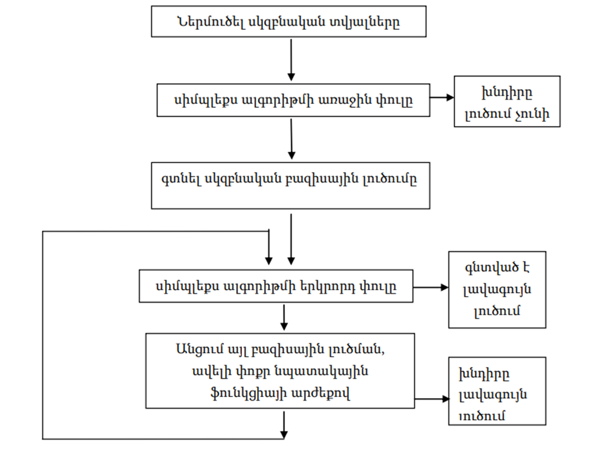
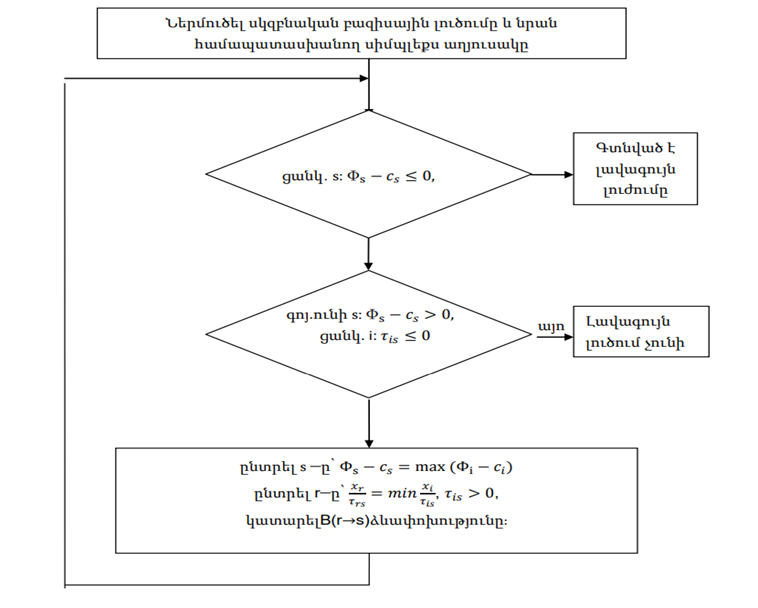

**Բովանդակություն**

[Ներածություն [2](#ներածություն)](#ներածություն)

[Գլուխ 1. Խնդրի մաթեմատիկական մոդելավորում
[9](#գլուխ-1.-խնդրի-մաթեմատիկական-մոդելավորում)](#գլուխ-1.-խնդրի-մաթեմատիկական-մոդելավորում)

[§1.1. Խնդրի ընդհանուր նկարագրություն
[9](#խնդրի-ընդհանուր-նկարագրություն)](#խնդրի-ընդհանուր-նկարագրություն)

[§1.2. Ուռուցիկ ծրագրավորման տարրի ներմուծում
[12](#ուռուցիկ-ծրագրավորման-տարրի-ներմուծում)](#ուռուցիկ-ծրագրավորման-տարրի-ներմուծում)

[§1.3. Մաթեմատիկական մոդելը
[15](#մաթեմատիկական-մոդելը)](#մաթեմատիկական-մոդելը)

[§1.3.1. Որոշում կայացնող փոփոխականներ
[16](#որոշում-կայացնող-փոփոխականներ)](#որոշում-կայացնող-փոփոխականներ)

[§1.3.2. Նպատակային ֆունկցիա
[16](#նպատակային-ֆունկցիա)](#նպատակային-ֆունկցիա)

[§1.3.3. Սահմանափակումներ [19](#սահմանափակումներ)](#սահմանափակումներ)

[§1.3.4. Խնդրի ամբողջական ձևակերպումը
[21](#խնդրի-ամբողջական-ձևակերպումը)](#խնդրի-ամբողջական-ձևակերպումը)

[§1.3.5. Մոդելի տնտեսագիտական ինտերպրետացիան
[21](#մոդելի-տնտեսագիտական-ինտերպրետացիան)](#մոդելի-տնտեսագիտական-ինտերպրետացիան)

[Գլուխ 2. Օպտիմիզացիայի տեսություն և մեթոդներ
[23](#գլուխ-2.-օպտիմիզացիայի-տեսություն-և-մեթոդներ)](#գլուխ-2.-օպտիմիզացիայի-տեսություն-և-մեթոդներ)

[§2.1. Գծային և ամբողջաթիվ ծրագրավորում
[23](#գծային-և-ամբողջաթիվ-ծրագրավորում)](#գծային-և-ամբողջաթիվ-ծրագրավորում)

[§2.1.1 Սիմպլեքս մեթոդ [24](#սիմպլեքս-մեթոդ)](#սիմպլեքս-մեթոդ)

[Գլուխ 3. Ծրագրային իրականացում և թվային փորձարկումներ
[27](#գլուխ-3.-ծրագրային-իրականացում-և-թվային-փորձարկումներ)](#գլուխ-3.-ծրագրային-իրականացում-և-թվային-փորձարկումներ)

[3.1. Օգտագործվող գործիքներ և տեխնոլոգիաներ
[27](#օգտագործվող-գործիքներ-և-տեխնոլոգիաներ)](#օգտագործվող-գործիքներ-և-տեխնոլոգիաներ)

[3.1.1. Ծրագրավորման լեզու՝ Java 17
[27](#ծրագրավորման-լեզու-java-17)](#ծրագրավորման-լեզու-java-17)

[3.1.2. Օպտիմալացման գրադարան՝ ojAlgo 55.0.1
[27](#օպտիմալացման-գրադարան-ojalgo-55.0.1)](#օպտիմալացման-գրադարան-ojalgo-55.0.1)

[3.1.3. Գրաֆիկական գրադարան՝ JFreeChart 1.5.4
[28](#գրաֆիկական-գրադարան-jfreechart-1.5.4)](#գրաֆիկական-գրադարան-jfreechart-1.5.4)

[3.1.4. Կառուցման գործիք՝ Apache Maven
[28](#կառուցման-գործիք-apache-maven)](#կառուցման-գործիք-apache-maven)

[3.2. Ծրագրային կոդ [29](#ծրագրային-կոդ)](#ծրագրային-կոդ)

# Ներածություն

**Թեմայի արդիականությունը․**

Ժամանակակից շուկայական տնտեսության պայմաններում արտադրական
ձեռնարկությունների համար ռեսուրսների արդյունավետ օգտագործումը և
արտադրության ռացիոնալ պլանավորումը դարձել են մրցակցային առավելություն
ձեռք բերելու և շահութաբերության ապահովման առանցքային գործոնները։
Հայաստանի գինեգործական ոլորտը, լինելով երկրի ագրոարդյունաբերական
համալիրի կարևոր բաղկացուցիչ մաս, հանդիպում է բազմաթիվ մարտահրավերների՝
սահմանափակ ռեսուրսների պայմաններում արտադրության ծավալների օպտիմիզացման,
արտադրանքի տեսականու ճիշտ ընտրության և շուկայական պահանջարկի
տատանումներին արդյունավետ արձագանքելու հարցերում։

Արտադրության պլանավորման դասական մոտեցումները, որոնք հիմնված են գծային
ծրագրավորման մեթոդների վրա, հաճախ չափազանց պարզեցնում են իրական
տնտեսական պայմանները։ Այդ մոդելները սովորաբար ենթադրում են, որ ապրանքի
գինը և արտադրության ծախսերը անփոփոխ են և չեն կախված արտադրության
ծավալից։ Սակայն իրականում շուկայական մեխանիզմները շատ ավելի բարդ են՝
պահանջարկը և գինը փոխադարձ կապված են, արտադրության ծավալների աճը կարող է
հանգեցնել գների իջեցման, իսկ որոշակի ապրանքատեսակների արտադրության մեջ
մտնելու համար անհրաժեշտ են նախնական ներդրումներ։

Պահանջարկի գնային էլաստիկության երևույթը, որը արտահայտում է պահանջարկի
քանակական փոփոխության կախվածությունը գնից, դարձնում է արտադրության
պլանավորման խնդիրը ոչ գծային։ Գինու արդյունաբերության համար այս հարցը
հատկապես կարևոր է, քանի որ այս ոլորտում գործում են պրեմիում և ստանդարտ
դասի ապրանքներ՝ տարբեր գնային սեգմենտներում, յուրաքանչյուրն ունենալով իր
հատուկ շուկայական պահանջարկի բնութագիրը։

Ավելին, պրեմիում դասի գինիների արտադրությունը պահանջում է զգալի միանվագ
ֆիքսված ծախսեր՝ սարքավորումների ձեռքբերում, տեխնոլոգիական գծերի
տեղադրում, անձնակազմի ուսուցում և այլն։ Հետևաբար, ձեռնարկությունը պետք է
որոշում կայացնի՝ արդյոք տնտեսապես նպատակահարմար է սկսել այս կամ այն
ապրանքատեսակի արտադրությունը։ Այս որոշումները մաթեմատիկական մոդելավորման
լեզվով արտահայտվում են երկուական փոփոխականների միջոցով, ինչը խնդիրը
դարձնում է խառը-ամբողջաթիվ օպտիմիզացիայի խնդիր։

Այսպիսով, գինու գործարանի արտադրության իրատեսական պլանավորումը պահանջում
է կիրառել համալիր մոտեցում, որը միավորում է ամբողջաթիվ ծրագրավորման
(որոշումների կայացման մոդելավորման համար) և ուռուցիկ ծրագրավորման (ոչ
գծային շուկայական կախվածությունների հաշվարկման համար) մեթոդները։ Նման
խնդիրները դասակարգվում են որպես խառը-ամբողջաթիվ ուռուցիկ ծրագրավորման
(Mixed-Integer Convex Programming - MICP) խնդիրներ և ներկայացնում են
օպտիմիզացիայի տեսության ժամանակակից զարգացումների կիրառական ուղղություն։

Վերջին տարիներին տեղեկատվական տեխնոլոգիաների և կիրառական մաթեմատիկական
մեթոդների զարգացումը ստեղծել են նոր հնարավորություններ բարդ օպտիմիզացիոն
խնդիրների լուծման համար։ Python ծրագրավորման լեզվի և դրա հզոր
գրադարանների (CVXPY, SciPy, NumPy) առկայությունը թույլ են տալիս արագ և
արդյունավետ կերպով մոդելավորել ու լուծել ձեռնարկությունների արտադրական
պլանավորման խնդիրները։ Այս գործիքակազմը հասանելի է դարձնում
մաթեմատիկական մեթոդների կիրառումը գործնական խնդիրների համար, ինչը կարևոր
է հայկական ձեռնարկությունների համար՝ որոնք հաճախ սահմանափակ են
ֆինանսական ռեսուրսներով և չեն կարող ներդնել թանկարժեք կոմերցիոն
օպտիմիզացիոն ծրագրային ապահովումներ։

**Խնդրի ձևակերպումը և նրա տեսական նշանակությունը․**

Սույն դիպլոմային աշխատանքում դիտարկվող խնդիրը կարելի է ձևակերպել հետևյալ
կերպ. անհրաժեշտ է որոշել գինու գործարանի օպտիմալ արտադրական ծրագիրը՝
մաքսիմիզացնելով ընդհանուր շահույթը սահմանափակ ռեսուրսների պայմաններում,
երբ հաշվի են առնվում հետևյալ գործոնները՝

Առաջին՝ արտադրանքի վաճառքից ստացվող եկամուտը կախված է արտադրության
ծավալից ոչ գծային օրենքով՝ շուկայական պահանջարկի էլաստիկության պատճառով։

Երկրորդ՝ պրեմիում դասի գինիների արտադրությունը պահանջում է միանվագ
ֆիքսված ծախսեր, որոնք ծագում են միայն այն դեպքում, եթե տվյալ
ապրանքատեսակը ընդգրկվում է արտադրական ծրագրում։

Երրորդ՝ գործարանն ունի սահմանափակ ռեսուրսներ՝ հումք (խաղող), արտադրական
հզորություններ, աշխատաժամանակ, պահեստային տարածություններ և այլն։

Այս խնդիրը հետաքրքիր է մի քանի պատճառով։ Նախ՝ այն համատեղում է
օպտիմիզացիայի տեսության երկու կարևոր ուղղություններ՝ ամբողջաթիվ և
ուռուցիկ ծրագրավորումները, որոնք սովորաբար դիտարկվում են
առանձին-առանձին։ Ամբողջաթիվ ծրագրավորումը թույլ է տալիս մոդելավորել
դիսկրետ որոշումներ (օրինակ՝ արտադրել կամ չարտադրել տվյալ ապրանքատեսակը),
մինչդեռ ուռուցիկ օպտիմիզացիան արդյունավետ է շուկայական ոչ գծային
կախվածությունների մոդելավորման համար։

Երկրորդը՝ խառը-ամբողջաթիվ ուռուցիկ ծրագրավորման խնդիրները պատկանում են
NP-դժվար խնդիրների դասին, ինչը նշանակում է, որ ընդհանուր դեպքում չկա
պոլինոմիալ ժամանակում աշխատող ալգորիթմ։ Սակայն ուռուցիկության
հատկությունը թույլ է տալիս կիրառել արդյունավետ մոտավոր մեթոդներ և
երաշխավորել լուծման որակը։ Ոռուցիկ ծրագրավորման խնդիրները ունեն կարևոր
հատկություն՝ նրաց լոկալ մինիմումը նաև գլոբալ է։

Երրորդ՝ խնդրի լուծումը պահանջում է համակցել տարբեր մաթեմատիկական
ապարատներ։ Գծային ծրագրավորման խնդիրների համար կիրառվում է սիմպլեքս
մեթոդը, ուռուցիկ ծրագրավորման խնդիրների համար՝ Կուն-Թակերի թեորեմները,
իսկ ամբողջ թվերով ծրագրավորման համար՝ Հոմորիի հատույթների մեթոդը։

**Աշխատանքի նպատակը և խնդիրները․**

Սույն դիպլոմային աշխատանքի հիմնական նպատակն է մշակել գինու գործարանի
արտադրության օպտիմալ պլանավորման համապարփակ մաթեմատիկական մոդել և դրա
հիման վրա ստեղծել ծրագրային լուծում, որը թույլ կտա գտնել մաքսիմալ
շահույթ ապահովող արտադրական ծրագիրը՝ հաշվի առնելով ինչպես ռեսուրսային
սահմանափակումները, այնպես էլ շուկայական պահանջարկի ոչ գծային դինամիկան։

Այս նպատակին հասնելու համար լուծվում են հետևյալ խնդիրները.

Առաջինը վերաբերում է խնդրի մաթեմատիկական մոդելավորմանը։ Անհրաժեշտ է տալ
խնդրի մաթեմատիկական ձևակերպումը, որը կներառի երկուական փոփոխականներ՝
պրեմիում դասի գինիների արտադրության մեջ մտնելու որոշման մոդելավորման
համար, և ուռուցիկ (մասնավորապես՝ քառակուսային) նպատակային ֆունկցիա՝
շուկայական պահանջարկի գնային էլաստիկության հաշվարկման համար։ Մոդելը պետք
է ներառի նաև գծային սահմանափակումներ՝ ռեսուրսների սահմանափակ պաշարների
արտացոլման համար, և տրամաբանական սահմանափակումներ՝ դիսկրետ և անընդհատ
փոփոխականների միջև կապի ապահովման համար։

Երկրորդ խնդիրն է տեսական հիմքերի ուսումնասիրությունը։ Պետք է մանրամասն
դիտարկել գծային ծրագրավորման տեսությունը և Սիմպլեքս մեթոդը՝ որպես
օպտիմիզացիայի հիմնարար ալգորիթմ։ Անհրաժեշտ է ուսումնասիրել ամբողջաթիվ
ծրագրավորման հիմնական մեթոդները՝ Հոմորիի հատումների ալգորիթմը։ Կիրառվում
է նաև ուռուցիկ օպտիմիզացիայի տեսությունը՝ ուռուցիկ և գոգավոր
ֆունկցիաների հատկությունները, Կուն-Թակերի օպտիմալության պայմանները և
քառակուսային ծրագրավորման մեթոդները։ Արդյունքում հանգում ենք
խառը-ամբողջաթիվ ուռուցիկ ծրագրավորման խնդիրների լուծման ալգորիթմներին և
դրանց համակցման սկզբունքներին։

Երրորդ խնդիրը կապված է ծրագրային իրականացման հետ։ Անհրաժեշտ է Python
ծրագրավորման լեզվով մշակել համապարփակ ծրագրային համակարգ, որը կիրառում է
CVXPY գրադարանը՝ ուռուցիկ օպտիմիզացիայի խնդիրների մոդելավորման համար,
NumPy և Pandas գրադարանները՝ տվյալների կառուցվածքների և թվային
հաշվարկների համար, և Matplotlib/Seaborn գրադարանները՝ արդյունքների
վիզուալիզացիայի համար։ Ծրագիրը պետք է ընդունի մուտքային տվյալներ
(ապրանքների բնութագրեր, ռեսուրսների քանակներ, շուկայական պարամետրեր) և
գեներացնի օպտիմալ արտադրական ծրագիրը՝ նշելով յուրաքանչյուր ապրանքատեսակի
արտադրության ծավալները և կանխատեսվող շահույթը։

Չորրորդ խնդիրը վերաբերում է թվային փորձարկումներին և արդյունքների
վերլուծությանը։ Պետք է ստեղծել իրատեսական տվյալների բազա, որը
բնութագրում է գինու գործարանի գործունեությունը (գինիների տեսակները և
արտադրական ռեսուրսները)։ Անհրաժեշտ է իրականացնել համեմատական
ուսումնասիրություն՝ լուծելով խնդիրը երկու տարբերակով. առաջինը՝ պարզեցված
գծային մոդել, որտեղ անտեսվում է գնի կախվածությունը ծավալից, և երկրորդը՝
ամբողջաթիվ ուռուցիկ մոդել։ Պետք է համեմատել ստացված արտադրական ծրագրերը,
վերլուծել տարբերությունները օպտիմալ ծավալների և ընտրված տեսականու մեջ, և
գնահատել՝ որքանով է ոչ գծային շուկայական կախվածությունների հաշվի առնումը
բարելավում կանխատեսվող շահույթը։

**Աշխատանքի գիտական նորույթը և գործնական արժեքը․**

Գիտական նորույթը. Սույն աշխատանքի գիտական նորույթը կայանում է ամբողջաթիվ
և ուռուցիկ ծրագրավորման մեթոդների համակցված կիրառման մեջ արտադրության
պլանավորման հարցում։ Մինչդեռ գոյություն ունեն բազմաթիվ աշխատություններ
գծային ամբողջաթիվ մոդելների կիրառման վերաբերյալ, իսկ ուռուցիկ
օպտիմիզացիան հիմնականում օգտագործվում է ֆինանսական պորտֆելների
օպտիմիզացիայի համար, խառը-ամբողջաթիվ ուռուցիկ մոդելների կիրառումը
արտադրական պլանավորման համար համեմատաբար նոր ուղղություն է։

Աշխատանքում առաջարկվող մոդելը միաժամանակ հաշվի է առնում երեք կարևոր
ասպեկտներ՝ դիսկրետ որոշումների կայացումը (արտադրել կամ չարտադրել),
ռեսուրսների սահմանափակ պաշարները և շուկայական պահանջարկի ոչ գծային
դինամիկան։ Այս համալիր մոտեցումը թույլ է տալիս ավելի իրատեսական կերպով
մոդելավորել արտադրական պլանավորման խնդիրը և ստանալ ավելի ճշգրիտ և
արդյունավետ լուծումներ։

Աշխատանքում ներկայացվող համեմատական վերլուծությունը (գծային և ուռուցիկ
մոդելների միջև) թույլ է տալիս քանակապես գնահատել մոդելավորման
ճշգրտության ազդեցությունը արդյունքի վրա։ Սա կարևոր է ինչպես տեսական,
այնպես էլ գործնական տեսակետից՝ ցույց տալու համար, թե երբ է անհրաժեշտ
կիրառել բարդ մոդելներ և երբ բավարար են պարզեցված մոտարկումները։

Գործնական արժեքը. Աշխատանքի գործնական արժեքը որոշվում է մի քանի
ուղղություններով։

Առաջին՝ մշակված մոդելը և ծրագրային լուծումը կարող են անմիջապես կիրառվել
Հայաստանի գինու գործարանների կողմից՝ իրենց արտադրական ծրագրերի
օպտիմիզացման համար։ Գինեգործական ոլորտում, որտեղ հումքի (խաղողի)
պաշարները սեզոնային են և սահմանափակ, իսկ արտադրական հզորությունները
ֆիքսված են, օպտիմալ պլանավորումը կարող է զգալիորեն բարձրացնել
շահութաբերությունը։

Երկրորդ՝ մշակված մեթոդաբանությունը հեշտությամբ կարող է ադապտացվել այլ
արտադրական ոլորտների համար, որտեղ առկա են նմանատիպ խնդիրներ՝ սահմանափակ
ռեսուրսներ, դիսկրետ որոշումներ և ոչ գծային շուկայական կախվածություններ։
Օրինակ՝ սննդի արդյունաբերություն, դեղագործություն, մետաղագործություն և
այլն։

Երրորդ՝ աշխատանքը ցույց է տալիս, թե ինչպես կարելի է օգտագործել ազատ և
բաց տեղեկատվական տեխնոլոգիաներ (Python, CVXPY, բաց կոդով լուծիչներ) բարդ
օպտիմիզացիոն խնդիրների լուծման համար։ Սա հատկապես արժեքավոր է փոքր և
միջին ձեռնարկությունների համար, որոնք չեն կարող թույլ տալ թանկարժեք
կոմերցիոն ծրագրային ապահովումներ։

Չորրորդ՝ աշխատանքը ծառայում է որպես ուսումնական նյութ՝ օպտիմիզացիայի
տեսությունը գործնական խնդիրներում կիրառելու համար։ Դրանում ներկայացված
մեթոդները և ծրագրային իրականացումը կարող են օգտագործվել ուսանողների և
մասնագետների կողմից՝ հմտությունների զարգացման և նմանատիպ խնդիրների
լուծման համար։

**Աշխատանքի կառուցվածքը․**

Դիպլոմային աշխատանքը բաղկացած է ներածությունից, երեք հիմնական գլուխներից
և եզրակացությունից։

Առաջին գլուխը նվիրված է խնդրի մաթեմատիկական մոդելավորմանը։ Դրանում
տրվում է խնդրի ընդհանուր նկարագիրը, ներկայացվում են որոշում կայացնող
փոփոխականները, ձևակերպվում է նպատակային ֆունկցիան և բոլոր
սահմանափակումները։ Առանձին ուշադրություն է դարձվում ուռուցիկ
ծրագրավորման տարրի ներմուծմանը՝ պահանջարկի գնային էլաստիկության
մոդելավորման համար։

Երկրորդ գլուխը վերաբերում է օպտիմիզացիայի տեսությանը և մեթոդներին։
Այստեղ մանրամասն դիտարկվում են գծային և ամբողջաթիվ ծրագրավորման հիմնական
մեթոդները (Սիմպլեքս, Գոմորիի հատումներ, Branch and Bound??), ուռուցիկ
օպտիմիզացիայի տեսությունը և քառակուսային ծրագրավորման ալգորիթմները,
ինչպես նաև խառը-ամբողջաթիվ ուռուցիկ խնդիրների լուծման մոտեցումները։

Երրորդ գլուխը նվիրված է ծրագրային իրականացմանը և թվային փորձարկումներին։
Նկարագրվում են օգտագործվող ծրագրային գործիքները և տեխնոլոգիաները,
ներկայացվում է մոդելի Python-ով իրականացումը՝ CVXPY գրադարանի միջոցով, և
իրականացվում է մանրակրկիտ համեմատական վերլուծություն գծային և ուռուցիկ
մոդելների միջև՝ իրատեսական տվյալների հիման վրա։

Եզրակացությունում ամփոփվում են կատարված աշխատանքի հիմնական արդյունքները,
ներկայացվում են մշակված մոդելի առավելությունները և սահմանափակումները, և
նշվում են հետագա հետազոտությունների հնարավոր ուղղությունները։

# Գլուխ 1. Խնդրի մաթեմատիկական մոդելավորում

## §1.1. Խնդրի ընդհանուր նկարագրություն

Արդի արտադրական ձեռնարկությունների համար արտադրության պլանավորման
օպտիմալացման խնդիրը կենսական նշանակություն ունի շուկայական մրցակցության
պայմաններում։ Սույն աշխատանքում դիտարկվում է գինու գործարանի արտադրական
գործունեության օպտիմալ կազմակերպման խնդիրը, որը բնութագրվում է մի շարք
առանձնահատկություններով և սահմանափակումներով։ Գինու գործարանն իր
գործունեության շրջանակներում արտադրում է n տեսակի տարբեր գինիներ,
որոնցից յուրաքանչյուրն ունի իր յուրահատուկ տեխնոլոգիական պահանջները,
շուկայական դիրքավորումը և շահութաբերությունը։ Արտադրվող գինիների
տեսականին ներառում է ինչպես զանգվածային սպառման գինիներ, այնպես էլ
պրեմիում դասի արտադրանք, որոնք պահանջում են լրացուցիչ ռեսուրսներ և
ներդրումներ։

Գործարանը բախվում է ռեսուրսների սահմանափակվածության խնդրին։ Արտադրական
գործընթացում ներգրավված են m տեսակի ռեսուրսներ, որոնց թվում են հումք և
նյութերը, մասնավորապես՝ տարբեր սորտերի խաղող, շաքարավազ, խմորիչներ,
կոնսերվանտներ և այլ բաղադրիչներ, որոնց պաշարները սահմանափակ են և կախված
են բերքի ծավալից, մատակարարների հնարավորություններից և պահեստային
տարածությունից։ Դրանց զուգահեռ կարևորվում են արտադրական հզորությունները,
այսինքն՝ խմորման տարողությունները, տակառները, արտադրական գծերը և
շշալցման սարքավորումները, որոնց թողունակությունը սահմանափակված է
տեխնիկական պարամետրերով և շահագործման ռեժիմով։ Նշանակալից դեր է խաղում
նաև աշխատուժը, մասնավորապես՝ որակավորված անձնակազմը, ներառյալ
էկոլոգներին, տեխնոլոգներին և բանվորներին, որոնց աշխատաժամանակի ֆոնդը
սահմանափակված է օրենսդրական նորմերով և կադրային պոտենցիալով։ Բացի այդ,
անհրաժեշտ է հաշվի առնել ֆինանսական միջոցները՝ շրջանառու կապիտալը, որը
անհրաժեշտ է հումքի ձեռքբերման, արտադրական գործընթացի ապահովման և ընթացիկ
ծախսերի ֆինանսավորման համար, ինչպես նաև պահեստային տարածությունները՝
հումքի պահպանման, արտադրանքի պարունակման և պատրաստի արտադրանքի պահման
տարածքները, որոնց ծավալը սահմանափակված է ֆիզիկական տարածությամբ և
պահպանման պայմաններով։

Արտադրվող գինիների տեսականու մեջ առանձնացվում են m (m \< n) տեսակի
պրեմիում դասի գինիներ, որոնք պահանջում են հատուկ մոտեցում։ Այս
կատեգորիայի գինիները բնութագրվում են մի շարք առանձնահատկություններով,
մասնավորապես՝ բարձր որակի հումքով, ընտիր սորտերի խաղողով, որը հավաքվում
է ձեռքով և անցնում է խիստ ընտրություն, ինչպես նաև հատուկ
տեխնոլոգիաներով, որոնք ներառում են երկարատև խմորում, տակառներում
հասունացում և հատուկ մշակման մեթոդներ։ Նշանակալից է նաև պրեմիում
փաթեթավորումը՝ բարձրորակ շշեր, հատուկ պիտակներ և փայտե տուփեր, ինչպես
նաև լրացուցիչ սարքավորումների անհրաժեշտությունը, օրինակ՝ հատուկ
տակառներ, ջերմային վերահսկման համակարգեր և ֆիլտրացիայի լրացուցիչ փուլեր։

Պրեմիում գինիների արտադրությունը սկսելու համար անհրաժեշտ է կատարել
միանվագ ֆիքսված ծախս fⱼ, որը ներառում է սարքավորումների ձեռքբերում և
տեղակայում, մասնավորապես՝ հատուկ տակառներ, ջերմաստիճանի վերահսկման
համակարգեր և ֆիլտրացիայի սարքավորումներ։ Դրան զուգահեռ իրականացվում է
տեխնոլոգիական գծի կարգավորում, այսինքն՝ սարքավորումների ճշգրտում,
փորձարկումներ և որակի վերահսկման համակարգի ստեղծում։ Կարևոր է նաև
անձնակազմի վերապատրաստումը՝ էնոլոգների և տեխնոլոգների հատուկ ուսուցում և
միջազգային սերտիֆիկացիա, ինչպես նաև մարքեթինգային ներդրումները՝ բրենդի
ստեղծում, փաթեթավորման դիզայն և գովազդային արշավներ։ Վերջապես, անհրաժեշտ
է սերտիֆիկացում և լիցենզավորում՝ միջազգային ստանդարտների ստացում և որակի
սերտիֆիկատներ։ Այս ֆիքսված ծախսերը կատարվում են միայն մեկ անգամ՝
պրեմիում գինու տվյալ տեսակի արտադրությունը սկսելու որոշման դեպքում, և
չեն կախված արտադրվող արտադրանքի ծավալից։ Սա ստեղծում է «ամբողջ թե ոչինչ»
տիպի որոշման խնդիր՝ կամ սկսել է տվյալ գինու արտադրությունը և կատարել
ամբողջ ներդրումը, կամ հրաժարվել այդ արտադրանքից։

Յուրաքանչյուր i-րդ տեսակի գինու արտադրության համար պահանջվում են որոշակի
ռեսուրսներ, որոնց քանակը կախված է արտադրվող ծավալից։ Այս ռեսուրսների
պահանջարկը կարող ենք արտահայտել տեխնոլոգիական գործակիցների միջոցով,
որտեղ rₖᵢ-ն ներկայացնում է k-րդ տեսակի ռեսուրսի ծախսը i-րդ գինու մեկ
միավորի, օրինակ՝ մեկ շիշ կամ մեկ լիտր, արտադրության համար, իսկ Rₖ-ն՝
k-րդ տեսակի ռեսուրսի ընդհանուր մատչելի պաշարը պլանավորման
ժամանակահատվածում։ Տեխնոլոգիական գործակիցները rₖᵢ որոշվում են արտադրական
տեխնոլոգիայի, գինու տեսակի հատկանիշների և որակի պահանջների հիման վրա։
Օրինակ՝ խաղողի պահանջարկը մեկ շիշ կարմիր գինու համար կարող է լինել 1.5
կգ, մինչդեռ սպիտակ գինու համար՝ 1.2 կգ։ Խմորման տարողության զբաղեցման
տևողությունը կարող է տարբերվել՝ պարզ գինիների համար 2 շաբաթ, պրեմիում
գինիների համար՝ 4-6 շաբաթ։ Աշխատաժամերի ծախսը կարող է լինել 0.1 ժամ
զանգվածային արտադրանքի համար և 0.5 ժամ՝ պրեմիում գինու համար։

Արտադրության ծախսերը ներառում են նաև փոփոխական ծախսեր, որոնք կախված են
արտադրության ծավալից։ Յուրաքանչյուր i-րդ գինու համար սահմանվում է մեկ
միավորի արտադրության գծային ծախս cᵢ, որը ներառում է հումքի ուղղակի
ծախսերը՝ խաղող, օժանդակ նյութեր, փաթեթավորման նյութեր, էներգետիկ
ծախսերը՝ էլեկտրաէներգիա, գազ, ջուր, աշխատավարձը՝ բանվորների և
տեխնոլոգների աշխատավարձային ֆոնդ, ընթացիկ պահպանում և սպասարկումը՝
սարքավորումների նորոգում, սանիտարական մշակում, ինչպես նաև այլ փոփոխական
ծախսերը՝ տրանսպորտ, որակի վերահսկում, պահեստավորում։ Ենթադրվում է, որ
փոփոխական ծախսերը գծայինորեն կախված են արտադրության ծավալից՝ cᵢ դրամ
յուրաքանչյուր լրացուցիչ միավորի համար։ Այս պարզեցումը արդարացված է միջին
ժամանակահատվածների համար, երբ արտադրական հզորությունների օգտագործումը
գտնվում է նորմալ աշխատանքային միջակայքում և չկան էական սանդղային
էֆեկտներ։

Գործարանի արտադրական ծրագրի մշակման խնդիրը կայանում է հետևյալում՝
անհրաժեշտ է որոշել յուրաքանչյուր i-րդ գինու արտադրվող քանակը xᵢ և
որոշել, թե որ պրեմիում գինիների արտադրությունը սկսել (yⱼ = 1) և որոնցից
հրաժարվել (yⱼ = 0), այնպես որ մաքսիմիզացվի ընդհանուր շահույթը՝ հաշվի
առնելով բոլոր ռեսուրսային սահմանափակումները, ծախսերը և շուկայական
պայմանները։ Խնդրի բարդությունը պայմանավորված է մի քանի գործոններով,
մասնավորապես՝ խառը բնույթով, քանի որ մի մասը շարունակական փոփոխականներ
են՝ արտադրության ծավալներ, իսկ մյուս մասը՝ երկուական՝ արտադրություն
սկսելու որոշումներ։ Բարդությունը պայմանավորված է նաև ռեսուրսների
սահմանափակվածությամբ՝ մի քանի տեսակի ռեսուրսների միաժամանակյա հաշվառում,
ֆիքսված ծախսերով՝ պրեմիում գինիների համար միանվագ ներդրումների
անհրաժեշտություն, և շուկայական փոխհարաբերություններով՝ պահանջարկի և
գների փոխկապակցվածություն։ Այս բոլոր առանձնահատկությունները պահանջում են
համապատասխան մաթեմատիկական ապարատի կիրառում, որը կարող է արդյունավետորեն
մոդելավորել և լուծել տվյալ օպտիմիզացիայի խնդիրը։

## §1.2. Ուռուցիկ ծրագրավորման տարրի ներմուծում

Արտադրության պլանավորման դասական մոդելները հիմնված են գծային
ծրագրավորման ապարատի վրա, որտեղ ենթադրվում է, որ եկամուտը գծայինորեն
կախված է արտադրվող արտադրանքի քանակից։ Այս մոտեցումը ենթադրում է, որ
արտադրանքի վաճառքի գինը մնում է հաստատուն՝ անկախ շուկայում առաջարկվող
քանակից։ Սակայն իրական շուկայական պայմաններում այս ենթադրությունը հաճախ
չի համապատասխանում իրականությանը։ Տնտեսագիտության տեսության համաձայն՝
շուկայում ապրանքի պահանջարկը և գինը փոխկապակցված են։ Այս կախվածությունը
բնութագրվում է պահանջարկի գնային էլաստիկության հասկացությամբ, որը ցույց
է տալիս, թե ինչպես է փոխվում պահանջարկի քանակը գնի փոփոխության
արդյունքում։ Ընդհանուր դեպքում՝ գինը ցածր լինելու դեպքում պահանջարկը
բարձր է, իսկ գնի բարձրացման դեպքում պահանջարկը նվազում է։

Հատկապես գինու արդյունաբերության համար այս կախվածությունը իրական է։
Գինին հանդիսանում է այնպիսի ապրանք, որի սպառումը զգայուն է գնային
փոփոխությունների նկատմամբ։ Սպառողները հակված են փոխարինել թանկ գինիներն
ավելի մատչելի այլընտրանքներով, կամ ընդհակառակը՝ բարձր գնով գինին
դիտարկել որպես պրեստիժի ցուցիչ։ Մեր մոդելում կիրառենք պահանջարկի գնային
կախվածության գծային մոտարկում, որը լայնորեն օգտագործվում է տնտեսագիտական
վերլուծություններում։ Ենթադրենք, որ i-րդ տեսակի գինու համար շուկայում
հավասարակշռության գինը որոշվում է հետևյալ կախվածությամբ՝ pᵢ(xᵢ) = aᵢ -
bᵢxᵢ, որտեղ xᵢ--ն արտադրվող գինու քանակն է՝ շշերով կամ լիտրերով,
pᵢ(xᵢ)--ն՝ մեկ միավորի կամ շշի գինը, aᵢ \> 0--ն՝ ազատ անդամ, որը
բնութագրում է առավելագույն գինը, որը սպառողները պատրաստ են վճարել փոքր
քանակների համար, իսկ bᵢ \> 0--ն՝ պահանջարկի էլաստիկության գործակից, որը
ցույց է տալիս, թե որքանով է իջնում գինը արտադրության ծավալի
յուրաքանչյուր միավորի ավելացման դեպքում։

Այս գծային կախվածությունը արտացոլում է հետևյալ տնտեսագիտական իմաստը։ Երբ
xᵢ = 0, այսինքն՝ արտադրանքը շուկայում բացակայում է, տեսականորեն գինը
հասնում է իր առավելագույն արժեքին aᵢ։ Սա ցույց է տալիս արտադրանքի
բացառիկության կամ դեֆիցիտի դեպքում սպառողների պատրաստակամությունը բարձր
գներ վճարել։ Յուրաքանչյուր լրացուցիչ արտադրված միավոր մտցնելով շուկա՝
գինը իջնում է bᵢ չափով, ինչը արտացոլում է մատակարարման ավելացման և
սպառողների հագեցվածության էֆեկտը։ Գործակից bᵢ-ի արժեքը որոշում է շուկայի
զգայունությունը առաջարկի փոփոխությունների նկատմամբ։ Փոքր bᵢ նշանակում է,
որ շուկան կայուն է և գները քիչ են փոխվում ծավալների փոփոխության դեպքում,
իսկ մեծ bᵢ-ն ցույց է տալիս բարձր մրցակցություն և սուր գնային արձագանք
առաջարկի փոփոխություններին։

Գործնականում պարամետրերը aᵢ և bᵢ կարող են գնահատվել պատմական տվյալների
վերլուծության միջոցով՝ ուսումնասիրելով անցյալ ժամանակահատվածների վաճառքի
ծավալների և գների փոխհարաբերությունները, շուկայի հետազոտությունների
միջոցով՝ ուսումնասիրելով սպառողների վարքագիծը տարբեր գնային
մակարդակներում, ռեգրեսիոն վերլուծության միջոցով՝ կիրառելով էկոնոմետրիկ
մեթոդներ պահանջարկի ֆունկցիայի պարամետրերի գնահատման համար, ինչպես նաև
փորձագիտական գնահատականների միջոցով՝ մարքեթինգի և վաճառքի բաժինների
փորձագետների կարծիքների հիման վրա։ Գնային կախվածության այս մոդելավորումը
ենթադրում է մի քանի կարևոր պայմաններ, մասնավորապես՝ կատարյալ
մրցակցություն, երբ գործարանը չունի մենաշնորհային կարգավիճակ և չի կարող
միակողմանիորեն սահմանել գները, շուկայական հավասարակշռություն, երբ
արտադրված ամբողջ քանակը վաճառվում է հավասարակշռության գնով, գծային
մոտարկման վավերականություն, երբ աշխատանքային միջակայքում գծային մոդելը
բավականաչափ ճշգրիտ է, և անկախություն, երբ տարբեր գինիների շուկաները
չունեն խաչաձև փոխազդեցություն, չնայած իրականում լինում են փոխարինող և
լրացնող ապրանքներ։

Հիմնվելով այս գնային մոդելի վրա՝ կարող ենք որոշել i-րդ գինու վաճառքից
ստացվող ընդհանուր հասույթը։ Եթե արտադրվում և վաճառվում է xᵢ քանակի
արտադրանք pᵢ(xᵢ) գնով, ապա ընդհանուր հասույթը կլինի՝ Rᵢ(xᵢ) = xᵢ ·
pᵢ(xᵢ) = xᵢ · (aᵢ - bᵢxᵢ) = aᵢxᵢ - bᵢxᵢ²։ Այս արտահայտությունը
ներկայացնում է քառակուսային ֆունկցիա՝ ներքև ուղղված ճյուղերով պարաբոլի
տեսքով։ Վերլուծենք այս ֆունկցիայի հիմնական հատկությունները։ Նախ՝
գոգավորությունը, քանի որ երկրորդ ածանցյալը ըստ xᵢ-ի հավասար է -2bᵢ \< 0,
ինչը նշանակում է, որ ֆունկցիան խիստ ուռուցիկ է։ Սա երաշխավորում է, որ
եթե գոյություն ունի լոկալ մաքսիմում, այն նաև գլոբալ մաքսիմումն է։
Երկրորդ՝ մաքսիմումի կետը, որը առանց սահմանափակումների դեպքում հասույթի
մաքսիմումը հասնում է xᵢ\* = aᵢ/(2bᵢ) կետում, որտեղ մաքսիմալ հասույթը
կազմում է Rᵢ\* = aᵢ²/(4bᵢ)։ Երրորդ՝ տնտեսագիտական իմաստը, հասույթի
գոգավորությունը արտացոլում է «կոր եկամտի» էֆեկտը։ Արտադրության
ավելացումը միաժամանակ ավելացնում է վաճառքի ծավալը, բայց նվազեցնում գինը,
և որոշակի կետից հետո գնի անկումը գերակշռում է ծավալի աճը։ Չորրորդ՝
սահմանափակումների ազդեցությունը, իրական խնդրում օպտիմալ լուծումը կարող է
տարբերվել անսահմանափակ մաքսիմումից՝ պայմանավորված ռեսուրսների կամ
արտադրական հզորությունների սահմանափակումներով։

Հասույթի ֆունկցիայի գոգավորությունը հանդիսանում է մաթեմատիկական
օպտիմիզացիայի տեսանկյունից նշանակալի հատկություն։ Ուռուցիկ ֆունկցիայի
մաքսիմիզացման խնդիրը կամ համարժեքորեն՝ գոգավոր ֆունկցիայի մինիմիզացիան,
պատկանում է ուռուցիկ օպտիմիզացիայի դասին, որը բնութագրվում է մի շարք
կարևոր առավելություններով։ Դրանց թվում են լոկալ և գլոբալ օպտիմումների
համընկնումը, քանի որ ցանկացած լոկալ մաքսիմում հանդիսանում է նաև գլոբալ
մաքսիմում, ինչը պարզեցնում է լուծման որոնումը։ Բացի այդ, գոյություն
ունեն արդյունավետ ալգորիթմներ, այսինքն՝ բազմաթիվ արդյունավետ թվային
մեթոդներ, որոնք երաշխավորված ժամանակում գտնում են օպտիմալ լուծում։
Կարևոր են նաև անցնելիության հատկությունները, քանի որ ուռուցիկ
օպտիմիզացիայի խնդրի լուծումների բազմությունը նույնպես ուռուցիկ է, ինչպես
նաև կայունությունը, երբ փոքր աղմուկների կամ տվյալների անորոշությունների
դեպքում լուծումը փոքր է փոխվում։

Սույն խնդրում նպատակային ֆունկցիան կներառի մի քանի գինիների հասույթների
գումարը հանած ծախսերը։ Քանի որ ուռուցիկ ֆունկցիաների գումարը նույնպես
ուռուցիկ է, իսկ գծային ֆունկցիաները՝ ծախսերը, նույնպես ուռուցիկ են, ապա
ամբողջ նպատակային ֆունկցիան կլինի ուռուցիկ։ Սա թույլ է տալիս կիրառել
ուռուցիկ օպտիմիզացիայի հզոր մեթոդները։ Գոգավոր նպատակային ֆունկցիայի
ներմուծումը նաև բերում է լրացուցիչ ինտերպրետացիայի հնարավորություն։
Նպատակային ֆունկցիայի գրադիենտը կամ առաջին ածանցյալները հետևյալն է՝
∂Rᵢ/∂xᵢ = aᵢ - 2bᵢxᵢ։ Սա հանդիսանում է սահմանային հասույթը՝ լրացուցիչ
մեկ միավոր արտադրելուց ստացվող հասույթի ավելացումը։ Օպտիմալ լուծման
դեպքում, եթե i-րդ գինին արտադրվում է և չկան ակտիվ սահմանափակումներ, ապա
սահմանային հասույթը պետք է հավասար լինի սահմանային ծախսին cᵢ։ Մոդելի այս
բաղադրիչը հանդիսանում է ուռուցիկ ծրագրավորման տարրը, որը տարբերում է մեր
խնդիրը դասական գծային մոդելներից և ավելի մոտ է իրական շուկայական
պայմաններին։ Այն թույլ է տալիս հաշվի առնել պահանջարկի էլաստիկությունը,
գների և ծավալների փոխազդեցությունը, և գտնել ավելի իրատեսական և
շահութաբեր արտադրական պլան։

## §1.3. Մաթեմատիկական մոդելը

Վերոնշյալ դիտարկումների հիման վրա կարող ենք ձևակերպել գինու գործարանի
արտադրության պլանավորման համալիր օպտիմիզացիայի խնդիրը որպես
խառը-ամբողջաթիվ ուռուցիկ ծրագրավորման (Mixed-Integer Convex
Programming - MICP) մաթեմատիկական մոդել։

### §1.3.1. Որոշում կայացնող փոփոխականներ

Մոդելը պարունակում է երկու տեսակի որոշում կայացնող փոփոխականներ։ Նախ՝
շարունակական փոփոխականներ՝ xᵢ ≥ 0, i = 1, 2, \..., n, որտեղ xᵢ-ն
ներկայացնում է i-րդ տեսակի գինու արտադրվող քանակը՝ չափվում է շշերով,
լիտրերով կամ այլ համապատասխան միավորներով։ Այս փոփոխականները
շարունակական են և կարող են ընդունել ցանկացած ոչ բացասական իրական արժեք
իրենց ֆիզիկական սահմանների միջակայքում։ Սահմանափակումը xᵢ ≥ 0 արտացոլում
է ակնհայտ ֆիզիկական պայմանը՝ արտադրության քանակը չի կարող լինել
բացասական։ Վերին սահմանները, եթե գոյություն ունեն, կորոշվեն ռեսուրսային
սահմանափակումներից և շուկայական պայմաններից։

Երկրորդ տեսակը երկուական կամ բինար փոփոխականներն են՝ yⱼ ∈ {0, 1}, j = 1,
2, \..., m, որտեղ yⱼ-ն հանդիսանում է տրամաբանական փոփոխական, որը կապված
է j-րդ պրեմիում գինու արտադրության որոշման հետ։ Կոնկրետ՝ yⱼ = 1, եթե
j-րդ պրեմիում գինու արտադրությունը իրականացվում է, և 0, եթե՝ չի
արտադրվում։ Այս երկուական փոփոխականները մոդելավորում են «ամբողջ թե
ոչինչ» տիպի որոշումները, որոնք բնորոշ են ֆիքսված ծախսերի առկայության
դեպքում։ Եթե որոշվում է արտադրել պրեմիում գինի, ապա պետք է կատարել
ամբողջ միանվագ ներդրումը։ Հակառակ դեպքում ոչ մի ծախս չի կատարվում և
գինին չի արտադրվում։ Փոփոխականների ընդհանուր քանակը կազմում է n + m հատ,
որտեղ n-ը շարունակական փոփոխականներն են, իսկ m-ը՝ երկուական։ Այս խառը
բնույթը հանդիսանում է մոդելի բարդության հիմնական աղբյուրներից մեկը։

### §1.3.2. Նպատակային ֆունկցիա

Մոդելի նպատակը կայանում է ընդհանուր շահույթի մաքսիմիզացման մեջ, որը
սահմանվում է որպես ընդհանուր հասույթը հանած ընդհանուր ծախսերը։
Նպատակային ֆունկցիան ունի հետևյալ տեսքը՝ max Z = Σᵢ₌₁ⁿ (aᵢxᵢ - bᵢxᵢ²) -
Σᵢ₌₁ⁿ cᵢxᵢ - Σⱼ₌₁ᵐ fⱼyⱼ։ Վերլուծենք նպատակային ֆունկցիայի յուրաքանչյուր
բաղադրիչը։ Առաջին անդամը վաճառքի ընդհանուր հասույթն է՝ Σᵢ₌₁ⁿ (aᵢxᵢ -
bᵢxᵢ²), որը ներկայացնում է բոլոր n տեսակի գինիների վաճառքից ստացվող
ընդհանուր հասույթը։ Յուրաքանչյուր i-րդ գինու համար հասույթը Rᵢ(xᵢ) =
aᵢxᵢ - bᵢxᵢ² սահմանվել է նախորդ բաժնում՝ որպես արտադրության ծավալի
քառակուսային ֆունկցիա։ Պարամետրերի իմաստը հետևյալն է՝ aᵢ \> 0--ն գնի
գործակիցն է, որը ցույց է տալիս արտադրանքի սկզբնական շուկայական արժեքը,
bᵢ \> 0--ն՝ պահանջարկի էլաստիկության գործակիցը, որը որոշում է գնի
նվազման տեմպը արտադրության ավելացման դեպքում։ aᵢxᵢ--ն գծային բաղադրիչն
է, որը մոդելավորում է հասույթի ավելացումը ծավալի աճի դեպքում, իսկ
-bᵢxᵢ²--ն՝ քառակուսային բաղադրիչը, որը արտացոլում է գնի անկման էֆեկտը։
Քառակուսային անդամի բացասական նշանը ապահովում է ֆունկցիայի
ուռուցիկությունը, ինչը տնտեսագիտական տեսանկյունից արտացոլում է նվազող
սահմանային հասույթի օրենքը։

Երկրորդ անդամը փոփոխական արտադրական ծախսերն են՝ -Σᵢ₌₁ⁿ cᵢxᵢ, որը
ներկայացնում է արտադրության ամբողջ փոփոխական ծախսերը՝ բոլոր գինիների
համար միասին։ Յուրաքանչյուր i-րդ գինու արտադրության համար մեկ միավորի
ծախսը կազմում է cᵢ դրամ, ուստի xᵢ միավորի արտադրության ընդհանուր ծախսը
կազմում է cᵢxᵢ։ Փոփոխական ծախսերը ներառում են հումքի ուղղակի ծախսերը՝
խաղող, խմորիչներ, շաքար և այլ բաղադրիչներ, էներգետիկ ռեսուրսները՝
էլեկտրաէներգիա, գազ, ջուր, որոնք օգտագործվում են արտադրական
գործընթացում, արտադրական աշխատավարձը՝ բանվորների և տեխնոլոգների
աշխատավարձ, որը կախված է արտադրության ծավալից, փաթեթավորման նյութերը՝
շշեր, պիտակներ, կափարիչներ, տուփեր, տրանսպորտային ծախսերը՝ հումքի
մատակարարում և պատրաստի արտադրանքի բաշխում, ինչպես նաև այլ ուղղակի
ծախսերը՝ որակի վերահսկում, սանիտարական մշակում։ Գծային մոդելավորումը
ենթադրում է, որ մեկ միավորի ծախսը մնում է հաստատուն՝ անկախ արտադրության
ծավալից։ Սա հիմնավորված ենթադրություն է միջին ծավալների միջակայքում, երբ
չկան էական սանդղային էֆեկտներ կամ արտադրական հզորությունների
գերծանրաբեռնում։

Երրորդ անդամը ֆիքսված ծախսերն են պրեմիում գինիների համար՝ -Σⱼ₌₁ᵐ fⱼyⱼ,
որը մոդելավորում է պրեմիում դասի գինիների արտադրություն սկսելու համար
անհրաժեշտ միանվագ ֆիքսված ծախսերը։ Յուրաքանչյուր j-րդ պրեմիում գինու
համար անհրաժեշտ է միանվագ ներդրում fⱼ \> 0, որը կատարվում է միայն այն
դեպքում, եթե որոշվում է սկսել դրա արտադրությունը։ Արտադրության տարբեր
հարաբերության արտահայտումը հետևյալն է՝ եթե yⱼ = 1, ապա ծախսվում է fⱼ,
իսկ եթե yⱼ = 0, ապա ծախս չկա։ Ֆիքսված ծախսերը ներառում են
սարքավորումների ձեռքբերումը՝ հատուկ տակառներ, ջերմաստիճանի վերահսկման
համակարգեր, ֆիլտրացիայի լրացուցիչ սարքավորումներ, տեխնոլոգիական
նախապատրաստումը՝ գծի կարգավորում, փորձարկումներ, որակի ստանդարտների
մշակում, անձնակազմի վերապատրաստումը՝ էնոլոգների մասնագիտական ուսուցում,
միջազգային սերտիֆիկացիա, մարքեթինգային ներդրումները՝ բրենդի ստեղծում,
փաթեթավորման դիզայն, գովազդային արշավներ, սերտիֆիկացիա և լիցենզավորումը՝
միջազգային որակի ստանդարտների ստացում, ինչպես նաև ենթակառուցվածքային
բարելավումները՝ պահեստների վերակառուցում, հատուկ պահպանման պայմանների
ստեղծում։ Ֆիքսված ծախսերի գործակիցները fⱼ կարող են էականորեն տարբերվել՝
կախված պրեմիում գինու տեսակից, տեխնոլոգիական պահանջներից և շուկայական
դիրքավորումից։

Նպատակային ֆունկցիայի ամբողջական տեսքը միավորելով բոլոր բաղադրիչները՝
ստանում ենք՝ Z(x, y) = Σᵢ₌₁ⁿ \[(aᵢ - cᵢ)xᵢ - bᵢxᵢ²\] - Σⱼ₌₁ᵐ fⱼyⱼ։ Կարող
ենք նաև վերաձևակերպել՝ Z(x, y) = Σᵢ₌₁ⁿ \[pᵢ(xᵢ) - cᵢ\]xᵢ - Σⱼ₌₁ᵐ fⱼyⱼ,
որտեղ \[pᵢ(xᵢ) - cᵢ\] ներկայացնում է մեկ միավորի շահույթը՝ գինը հանած
ծախսը։ Նպատակային ֆունկցիայի մաթեմատիկական հատկությունները հետևյալն են։
Նախ՝ ուռուցիկություն, քանի որ ֆունկցիան Z(x, y) խիստ ուռուցիկ է x-երի
նկատմամբ՝ յուրաքանչյուր ֆիքսված y-ի դեպքում, քանի որ երկրորդ ածանցյալի
մատրիցը բացասական որոշված է։ Երկրորդ՝ տարանջատելիություն, քանի որ
նպատակային ֆունկցիան տարանջատելի է գինիների միջև՝ յուրաքանչյուր i-րդ
գինու ներդրումը կախված է միայն xᵢ-ից, ոչ թե այլ գինիների ծավալներից,
չնայած գոյություն ունեն անուղղակի փոխազդեցություններ ռեսուրսների
միջոցով։ Երրորդ՝ գծայնություն y-երի նկատմամբ, քանի որ երկուական
փոփոխականների yⱼ-ների նկատմամբ ֆունկցիան գծային է, ինչը պարզեցնում է
որոշ վերլուծական գործողությունները։

### §1.3.3. Սահմանափակումներ

Օպտիմիզացիայի խնդիրը ձևակերպվում է նպատակային ֆունկցիայի մաքսիմիզացման
տեսքով՝ սահմանափակումների որոշակի բազմության վրա։ Սահմանափակումները
արտացոլում են ֆիզիկական, տեխնոլոգիական և տրամաբանական սահմանաչափերը,
որոնք պետք է բավարարվեն ցանկացած իրագործելի արտադրական պլանի դեպքում։
Ռեսուրսների սահմանափակումները պայմանավորված են նրանով, որ արտադրության
համար անհրաժեշտ ռեսուրսների պաշարները սահմանափակ են։ Յուրաքանչյուր k-րդ
տեսակի ռեսուրսի համար գոյություն ունի հետևյալ սահմանափակումը՝ Σᵢ₌₁ⁿ
rₖᵢxᵢ ≤ Rₖ, ∀k = 1, 2, \..., K, որտեղ rₖᵢ ≥ 0--ն k-րդ ռեսուրսի ծախսն է
i-րդ գինու մեկ միավորի արտադրության համար, Rₖ \> 0--ն՝ k-րդ ռեսուրսի
ընդհանուր մատչելի պաշարը պլանավորման ժամանակահատվածում, իսկ Σᵢ₌₁ⁿ
rₖᵢxᵢ--ն՝ k-րդ ռեսուրսի ընդհանուր օգտագործումը բոլոր գինիների
արտադրության համար։ Այս սահմանափակումները գծային են և սահմանում են
ուռուցիկ տարածություն։ Յուրաքանչյուր անհավասարություն սահմանում է
կիսատարածություն, իսկ դրանց հատումը ստեղծում է պոլիեդրոն։

Ռեսուրսների կոնկրետ օրինակները ներառում են խաղողի պաշարը, որտեղ r₁ᵢ-ն
կիլոգրամ խաղող է մեկ շիշ գինու համար, R₁-ը՝ տարեկան հասանելի խաղողի
ընդհանուր քանակն է։ Խմորման տարողությունը, որտեղ r₂ᵢ-ն տակառի
ժամանակ-ծավալ է մեկ շիշ գինու համար, R₂-ը՝ տակառների ընդհանուր
տարողությունն է×ժամանակահատվածը։ Աշխատաժամերը, որտեղ r₃ᵢ-ն աշխատաժամերն
են մեկ շիշ արտադրության համար, R₃-ը՝ անձնակազմի ընդհանուր հասանելի
աշխատաժամերն են։ Շշալցման հզորությունը, որտեղ r₄ᵢ-ն շշալցման գծի
ժամանակն է մեկ շիշ գինու համար, R₄-ը՝ ընդհանուր հասանելի շշալցման
ժամանակն է։ Պահեստային տարածությունը, որտեղ r₅ᵢ-ն պահեստային
տարածությունն է մեկ շիշ գինու համար, R₅-ը՝ ընդհանուր պահեստային
տարողությունն է։ Ֆինանսական ռեսուրսները, որտեղ r₆ᵢ-ն մեկ շիշ
արտադրության համար անհրաժեշտ շրջանառու կապիտալն է, R₆-ը՝ հասանելի
շրջանառու միջոցներն են։

Տրամաբանական կապի սահմանափակումները պրեմիում գինիների դեպքում անհրաժեշտ
է ապահովել տրամաբանական կապ երկուական որոշման փոփոխականի և արտադրության
ծավալի միջև։ Այս կապը մոդելավորվում է հետևյալ սահմանափակմամբ՝ xⱼ ≤ M·yⱼ,
∀j ∈ {պրեմիում տեսակներ}, որտեղ M \> 0-ը բավականաչափ մեծ թիվ է։ Այս
սահմանափակման տրամաբանական իմաստը հետևյալն է։ Եթե yⱼ = 0, ապա xⱼ ≤ 0,
այսինքն՝ xⱼ = 0, ինչը նշանակում է, որ եթե չի որոշվել սկսել j-րդ պրեմիում
գինու արտադրությունը, ապա դրա արտադրության ծավալը պետք է լինի զրո։ Եթե
yⱼ = 1, ապա xⱼ ≤ M, և եթե M ընտրված է բավականաչափ մեծ, ապա այս
սահմանափակումը չի սահմանափակում xⱼ-ն՝ ռեսուրսային սահմանափակումների
համեմատությամբ։ M պարամետրի ընտրությունը կարևոր տեխնիկական հարց է։
Չափազանց մեծ M կարող է հանգեցնել թվային անկայունության, քանի որ ստեղծում
է չափազանց «թույլ» սահմանափակումներ, որոնք դժվարացնում են լուծիչների
աշխատանքը։ Չափազանց փոքր M կարող է արհեստականորեն սահմանափակել
արտադրության ծավալները և հանգեցնել ենթաօպտիմալ լուծումների։ Օպտիմալ
ընտրությունը պետք է լինի այնպիսին, որ լինի բավականաչափ մեծ՝
չսահմանափակելու իրագործելի լուծումները, բայց ոչ ավելի մեծ, քան անհրաժեշտ
է։ Գործնականում հաճախ ընտրում են M = min{Rₖ/rₖⱼ : k = 1, \..., K}, որը
ներկայացնում է j-րդ գինու մաքսիմալ հնարավոր արտադրությունը՝ կախված
ամենասահմանափակող ռեսուրսից։

Որոշ դեպքերում օգտակար է սահմանել նաև ստորին սահմանափակում՝ xⱼ ≥ Lⱼ·yⱼ,
∀j ∈ {պրեմիում տեսակներ}, որտեղ Lⱼ \> 0-ը մինիմալ տնտեսապես արդարացված
արտադրական ծավալն է։ Սա նշանակում է, որ եթե որոշվում է սկսել պրեմիում
գինու արտադրությունը, ապա պետք է արտադրել առնվազն Lⱼ քանակ՝ ֆիքսված
ծախսերը արդարացնելու համար։ Ոչ բացասականության սահմանափակումները
պահանջում են, որ բոլոր արտադրության ծավալները պետք է լինեն ոչ բացասական՝
xᵢ ≥ 0, ∀i = 1, 2, \..., n։ Սա արտացոլում է ակնհայտ ֆիզիկական պայմանը՝
չի կարող արտադրվել բացասական քանակությամբ արտադրանք։ Իրական գործնական
իրավիճակներում կարող են առաջանալ լրացուցիչ սահմանափակումներ, օրինակ՝
շուկայական պահանջարկի վերին սահմանները, տեխնոլոգիական կապերը, եթե որոշ
գինիների արտադրությունը տեխնոլոգիապես կախված է, նվազագույն արտադրական
պարտավորությունները, եթե գոյություն ունեն պայմանագրային
պարտավորություններ, և տեսականու զուգակցման պահանջները, եթե կա պահանջ
պահպանել արտադրական տեսականու հավասարակշռություն։

### §1.3.4. Խնդրի ամբողջական ձևակերպումը

Միավորելով բոլոր բաղադրիչները՝ ստանում ենք հետևյալ օպտիմիզացիայի խնդիրը։
Պետք է մաքսիմիզացնել Z = Σᵢ₌₁ⁿ (aᵢxᵢ - bᵢxᵢ²) - Σᵢ₌₁ⁿ cᵢxᵢ - Σⱼ₌₁ᵐ fⱼyⱼ։
Պայմանով՝ Σᵢ₌₁ⁿ rₖᵢxᵢ ≤ Rₖ, ∀k = 1, \..., K, որը ռեսուրսային
սահմանափակումներն են, xⱼ ≤ M·yⱼ, ∀j = 1, \..., m, որը տրամաբանական կապն
է, xᵢ ≥ 0, ∀i = 1, \..., n, որը ոչ բացասականությունն է, և yⱼ ∈ {0, 1},
∀j = 1, \..., m, որը երկուականությունն է։

### §1.3.5. Մոդելի տնտեսագիտական ինտերպրետացիան

Մաթեմատիկական մոդելի յուրաքանչյուր էլեմենտ ունի հստակ տնտեսագիտական
իմաստ։ Նպատակային ֆունկցիան ներկայացնում է գործարանի ամբողջական
ֆինանսական արդյունքը՝ շահույթը՝ հաշվի առնելով հասույթը, փոփոխական և
ֆիքսված ծախսերը։ Քառակուսային անդամները մոդելավորում են շուկայի գնային
արձագանքը առաջարկի փոփոխությանը, արտացոլելով պահանջարկի էլաստիկության
էֆեկտը։ Ռեսուրսային սահմանափակումները արտացոլում են իրական արտադրական
հնարավորությունների սահմանը և ռեսուրսների սպառվող բնույթը։ Ֆիքսված
ծախսեր և երկուական փոփոխականները մոդելավորում են սանդղային տնտեսությունը
և մուտքի ծախսերը՝ բնորոշ պրեմիում արտադրանքի սեգմենտին։ Տրամաբանական
կապը ապահովում է որոշումների հետևողականությունը՝ չի թույլատրվում
արտադրել առանց անհրաժեշտ ներդրումների կատարման։ Այս մոդելի լուծումը
կորոշի օպտիմալ արտադրական պլանը՝ յուրաքանչյուր գինու արտադրվող քանակները
և որոշումը՝ արտադրել թե ոչ պրեմիում գինին։ Սա ամփոփում է գինու գործարանի
արտադրության պլանավորման խնդրի մաթեմատիկական մոդելավորումը, որը
հանդիսանում է հետագա վերլուծության և ծրագրային իրականացման հիմքը։

# Գլուխ 2. Օպտիմիզացիայի տեսություն և մեթոդներ

## §2.1. Գծային և ամբողջաթիվ ծրագրավորում

Գծային ծրագրավորման խնդիրը օպտիմիզացիայի տեսության հիմնարար խնդիրներից
մեկն է, որը ձևակերպվում է հետևյալ կերպ՝

Մաքսիմիզացնել: z = c₁x₁ + c₂x₂ + \... + cₙxₙ

Սահմանափակումներ:

a₁₁x₁ + a₁₂x₂ + \... + a₁ₙxₙ ≤ b₁

a₂₁x₁ + a₂₂x₂ + \... + a₂ₙxₙ ≤ b₂

\...

aₘ₁x₁ + aₘ₂x₂ + \... + aₘₙxₙ ≤ bₘ

x₁, x₂, \..., xₙ ≥ 0

որտեղ՝

-   x = (x₁, x₂, \..., xₙ) - որոշում կայացնող փոփոխականների վեկտորը

-   c = (c₁, c₂, \..., cₙ) - նպատակային ֆունկցիայի գործակիցների վեկտորը

-   A - m×n չափանի սահմանափակումների մատրիցը

Գծային ծրագրավորման խնդրի երկրաչափական մեկնաբանությունը կայանում է
նրանում, որ սահմանափակումները սահմանում են n-չափանի տարածության մեջ
բազմություն, որը կոչվում է թույլատրելի տարածք կամ թույլատրելի
բազմություն։ Նպատակային ֆունկցիան ներկայացնում է գծային հարթություն
(հիպերհարթություն), և օպտիմումը գտնվում է թույլատրելի տարածքի գագաթներից
մեկում։

### §2.1.1 Սիմպլեքս մեթոդ

Սիմպլեքս մեթոդը գծային ծրագրավորման խնդիրների լուծման ամենատարածված և
արդյունավետ ալգորիթմներից մեկն է, որը մշակվել է ամերիկացի մաթեմատիկոս
Ջորջ Դանցիգի կողմից 1947 թվականին։ Այն հիմնված է բազմանիստ թույլատրելի
տիրույթի գագաթներով անցնելու սկզբունքի վրա՝ նպատակային ֆունկցիայի
օպտիմալ արժեքը գտնելու համար։

**1․Սիմպլեքս ալգորիթմ**

Ներմուծենք սիմպլեքս ալգորիթմը ԿԳԾ-մինիմիզացիայի խնդրի համար\`

{width="6.929861111111111in"
height="5.1819444444444445in"}

1.  **Սիմպլեքս աղյուսակ**

> Սահմանենք սիմպլեքս աղյուսակը ԿԳԾ-min խնդրի համար, որը
> համապատասխանելում է նրա որոշակի բազիսային լուծմանը: Ենթադրենք

$\overrightarrow{x}\  = \ (x_{1}...x_{n}) - ը$ հետևյալ խնդրի բազիսային
լուծում է\`

$$\left\{ \begin{array}{r}
\overrightarrow{c}\ \overrightarrow{x}\  \rightarrow \ min \\
A\overrightarrow{x} = \overrightarrow{b} \\
\overrightarrow{x} \geq \ \overrightarrow{0}
\end{array}\ \ \ \ \ \ \ \ \ \ \ \ \ \ \ \ \ \ \ \ \ \ \ \ \ \ \ \ \ (1)\  \right.\ $$

որի ոչ զրոյական կոորդինատները թող լինեն ճիշտ այնքան, որքան խնդրում
մասնակցող հավասարումների թիվն է\`m: Ենթադրենք դրանք համարակալված են

B(1),B(2),\...,B(m)

ձևով: Այդ դեպքում
${{\overrightarrow{a}}^{*}}_{B(1)},{{\overrightarrow{a}}^{*}}_{B(2)},...,{{\overrightarrow{a}}^{*}}_{B(n)}$
վեկտորները կկազմեն բազիս $R^{n}$-ում: Հետևաբար ցանկացած
${{\overrightarrow{a}}^{*}}_{j}$ կարելի է ներկայացնել նրանց գծային
կոմբինացիայով\`

${{\overrightarrow{a}}^{*}}_{j} = \sum_{i = 1}^{m}{\tau_{ij}{{\overrightarrow{a}}^{*}}_{B(i)},\ j = \overline{1,n}}:$
(2)

Մասնավոր դեպքում, եթե $J\  \in \ \{ B(k)\}$, ապա
$\tau_{ij}\  = \ \left\{ \begin{array}{r}
0,\ i \neq j \\
1,\ i = j
\end{array} \right.\ $

Մյուս կողմից, քանի որ $\overrightarrow{x}$-ը (1)-ի լուծումն է,
կունենանք.

$\overrightarrow{b}\  = \sum_{j = 1}^{n}{x_{j}{{\overrightarrow{a}}^{*}}_{j} = \sum_{i = 1}^{m}{x_{B(i)}{{\overrightarrow{a}}^{*}}_{B(i)}}}$
(3)

Սահմանենք $\phi_{j}$ թվերը հետևյալ ձևով.

$\phi_{j} = \sum_{i = 1}^{m}\tau_{ij}C_{B(i)},\ j = \overline{1,n}$ (4)

Եթե $J\  \in \ \{\ {\overrightarrow{y}}_{0}B(k)\}$ , ապա
$\phi_{j} = c_{j}:$

Սահմանենք (3) խնդրի $\overrightarrow{x}$ բազիսային լուծմանը
համապատասխանող սիմպլեքս աղյուսակը, որպես (m+1, n+1) չափանի աղյուսակը,
որի վերին ձախ (m, n)մասում գրված են թվերը, վերջին տողի առաջին n
վանդակներում\`$\phi_{j}\  - c_{j}$ մեծությունները, որոնք կոչվում են
գնահատականներ: Աղյուսակի վերջին սյան առաջին m վանդակներում գրում են
$x_{B(i)},...,x_{B(m)}$ ոչ բացասական մեծությունները, իսկ վերջին
վանդակում\` նպատակային ֆունկցիայի արժեքը նշված բազիսային լուծման համար:
Նկատենք, որ $J \in \{ B(k)\}$ արժեքների դեպքում կունենանք
$\phi_{j}\  - c_{j} = 0$ գնահատականները:

Օրինակ 1:

$$\left\{ \begin{array}{r}
f(\overrightarrow{x}) = - 3x_{1} - 2x_{2} \rightarrow min \\
x_{1} + 2x_{2} + x_{3} = 7 \\
2x_{1} + x_{2} + x_{4} = 8 \\
x_{2} + x_{5} = 3 \\
\overrightarrow{x} \geq \overrightarrow{0}
\end{array} \right.\ $$

Այս դեպքում սահմանափակումների մատրիցը կլինի.

$$A = \ \left( \begin{matrix}
1 & 2 & 1 & 0 & 0 \\
2 & 1 & 0 & 1 & 0 \\
0 & 1 & 0 & 0 & 1
\end{matrix}\ \ \  \right)$$

Իսկ ${\overrightarrow{x}}_{1} = (0,\ 0,\ 7,\ 8,\ 3)$ -ը\` խնդրի
բազիսային լուծումը: Այդ լուծման համար սիմպլեքս աղյուսակը կունենա հետևյալ
տեսքը.

  ----------------------------------------------------------------------------------------------------------------------------------------------------------------------------------------------------------------------------
              $${{\overrightarrow{a}}^{*}}_{1}$$   $${{\overrightarrow{a}}^{*}}_{2}$$   $${{\overrightarrow{a}}^{*}}_{3}$$   $${{\overrightarrow{a}}^{*}}_{4}$$   $${{\overrightarrow{a}}^{*}}_{5}$$   $$\overrightarrow{b}$$
  ---------- ------------------------------------ ------------------------------------ ------------------------------------ ------------------------------------ ------------------------------------ ------------------------
      0                       1                                    2                                    1                                    0                                    0                              7

      0                       2                                    1                                    0                                    1                                    0                              8

      0                       0                                    1                                    0                                    0                                    1                              3

                              3                                    2                                    0                                    0                                    0                              0
  ----------------------------------------------------------------------------------------------------------------------------------------------------------------------------------------------------------------------------

Նկատենք, որ աղյուսակի առաջին սյունը չի ներառված սիմպլեքս աղյուսակի
սահմանման մեջ: Այդտեղ բերված են $\{ C_{B(i)}\}$ արժեքները\`
գնահատականների հաշվարկը հեշտացնելու հպատակով:

# Գլուխ 3. Ծրագրային իրականացում և թվային փորձարկումներ

## 3.1. Օգտագործվող գործիքներ և տեխնոլոգիաներ

Ծրագրային համակարգի մշակման ընթացքում ընտրված գործիքները և
տեխնոլոգիաները ուղղված են ապահովելու խնդրի մաթեմատիկական ճշգրիտ
մոդելավորումը, արդյունավետ օպտիմալացման կատարումը և արդյունքների
հասկանալի գրաֆիկական ներկայացումը: Ստորև ներկայացված են բոլոր հիմնական
բաղադրիչները՝ ըստ իրենց նշանակության ոլորտների:

### 3.1.1. Ծրագրավորման լեզու՝ Java 17

Ծրագրի հիմնական ծրագրավորման լեզուն Java 17-ն է, որը ընտրվել է մի շարք
կարևոր հատկանիշների շնորհիվ: Դրանցից է հարթակային անկախությունը
(Platform Independence)․ Java-ի «Write Once, Run Anywhere» սկզբունքը
ապահովում է, որ կոմպիլյացված bytecode-ը կարող է կատարվել ցանկացած
օպերացիոն համակարգում, որտեղ տեղադրված է JVM (Java Virtual Machine): Սա
կարևոր է դիպլոմային նախագծի ցուցադրման համար: Ընտրված է Java 17-ի LTS
տարբերակը, որն ապահովում է երկարաժամկետ աջակցություն մինչև 2029 թ.:

### 3.1.2. Օպտիմալացման գրադարան՝ ojAlgo 55.0.1

ojAlgo-ն Java-ի ամենահզոր բաց կոդով (open-source) մաթեմատիկական
օպտիմալացման գրադարանն է, որն ապահովում է խառը-ամբողջաթիվ քառակուսային
ծրագրավորման (Mixed-Integer Quadratic Programming, MIQP) խնդիրների
լուծումը: Գրադարանն աջակցում է քառակուսային նպատակային ֆունկցիաներ, ինչը
հնարավոր է դարձնում A·X − B·X² − C·X արտահայտության մոդելավորումը։ MIQP
խնդիրների լուծման համար ojAlgo-ն կիրառում է Branch-and-Bound (B&B)
ալգորիթմ: Լուծիչի արդյունավետության բարձրացման համար յուրաքանչյուր
X\[i\] փոփոխականի համար ավտոմատ հաշվվում է վերին սահման (upper bound)։
Սա կտրուկ կրճատում է լուծիչի որոնման տիրույթը և 10-30 անգամ արագացնում
լուծումը:

### 3.1.3. Գրաֆիկական գրադարան՝ JFreeChart 1.5.4

JFreeChart-ը Java-ի ամենատարածված բաց կոդով գծապատկերների գրադարանն է,
որն ապահովում է պրոֆեսիոնալ գրաֆիկների ստեղծումը: Ծրագրում կիրառվում են
երեք տեսակի գծապատկեր՝ Ձողային գծապատկեր (Bar Chart), XY գծային
գծապատկեր (XY Line Chart) և Կուտակված Ձողային գծապատկեր (Stacked Bar
Chart)։

### 3.1.4. Կառուցման գործիք՝ Apache Maven

Apache Maven-ն օգտագործվում է նախագծի կախվածությունների կառավարման
(dependency management) և կոմպիլյացիայի ավտոմատացման համար: pom.xml
ֆայլում սահմանված են հետևյալ կախվածությունները.

{width="5.904861111111111in"
height="1.9958333333333333in"}

Ամփոփելով՝ Java 17 + ojAlgo + JFreeChart + Swing + Maven կոմբինացիան
ապահովում է ամբողջական, ինքնուրույն, բաց կոդով լուծում, որը ճշգրիտ
մոդելավորում է MIQP խնդիրը, ցուցադրում արդյունքները ինտերակտիվ
գրաֆիկական ինտերֆեյսով և հեշտությամբ կարող է կատարվել ցանկացած Java-ն
աջակցող հարթակում:

### 

### 

## 3.2. Ծրագրային կոդ

package com.diploma;\
\
import org.jfree.chart.ChartFactory;\
import org.jfree.chart.ChartPanel;\
import org.jfree.chart.JFreeChart;\
import org.jfree.chart.axis.CategoryAxis;\
import org.jfree.chart.axis.NumberAxis;\
import org.jfree.chart.plot.CategoryPlot;\
import org.jfree.chart.plot.PlotOrientation;\
import org.jfree.chart.plot.XYPlot;\
import org.jfree.chart.renderer.category.BarRenderer;\
import org.jfree.chart.renderer.category.StackedBarRenderer;\
import org.jfree.chart.renderer.xy.XYLineAndShapeRenderer;\
import org.jfree.data.category.DefaultCategoryDataset;\
import org.jfree.data.xy.XYSeries;\
import org.jfree.data.xy.XYSeriesCollection;\
import org.ojalgo.optimisation.Expression;\
import org.ojalgo.optimisation.ExpressionsBasedModel;\
import org.ojalgo.optimisation.Optimisation;\
import org.ojalgo.optimisation.Variable;\
\
import javax.swing.\*;\
import javax.swing.border.EmptyBorder;\
import java.awt.\*;\
import java.util.Scanner;\
\
public class WineProduction {\
\
private static final int *DEF_N_STANDARD* = 4;\
private static final int *DEF_N_PREMIUM* = 3;\
\
private static final double\[\] *DEF_A* = { 3000, 2800, 3200, 2600,
4000, 5500, 7000 };\
\
private static final double\[\] *DEF_B* = { 30, 28, 32, 26, 60, 55, 70
};\
\
// private static final double\[\] DEF_B = { 0, 0, 0, 0, 0, 0, 0 };\
\
private static final double\[\] *DEF_C* = { 800, 750, 900, 700, 1000,
1800, 800 };\
\
private static final double\[\] *DEF_F* = { 18000, 15000, 50000 };\
\
private static final int *DEF_N_RESOURCES* = 3;\
\
private static final double\[\] *DEF_R* = { 600, 500, 400 };\
\
private static final double\[\]\[\] *DEF_r* = {\
{ 5, 4, 6, 4, 8, 7, 9 },\
{ 3, 3, 4, 2.5, 5, 5, 6 },\
{ 2, 1.5, 2.5, 1.5, 4, 3.5, 5 }\
};\
\
private static final double *DEF_M* = 30;\
\
public static void main(String\[\] args) {\
Scanner scanner = new Scanner(System.*in*);\
\
System.*out*.println(\"=\".repeat(70));\
System.*out*.println(\"ԳԻՆՈՒ ԱՐՏԱԴՐՈՒԹՅԱՆ ՕՊՏԻՄԱԼԱՑՈՒՄ\");\
System.*out*.println(\"=\".repeat(70));\
System.*out*.println();\
System.*out*.println(\" 1 --- Օգտագործել առկա (default) տվյալները\");\
System.*out*.println(\" 2 --- Մուտքագրել նոր տվյալներ\");\
System.*out*.println();\
System.*out*.print(\"Ընտրեք (1 կամ 2): \");\
\
int choice = 0;\
while (choice != 1 && choice != 2) {\
String line = scanner.nextLine().trim();\
if (line.equals(\"1\") \|\| line.equals(\"2\")) {\
choice = Integer.*parseInt*(line);\
} else {\
System.*out*.print(\"Խնդրում ենք մուտքագրել 1 կամ 2: \");\
}\
}\
\
int nStandard;\
int nPremium;\
double\[\] A;\
double\[\] B;\
double\[\] C;\
double\[\] F;\
int nResources;\
double\[\] R;\
double\[\]\[\] r;\
double M;\
\
if (choice == 1) {\
nStandard = *DEF_N_STANDARD*;\
nPremium = *DEF_N_PREMIUM*;\
A = *DEF_A*.clone();\
B = *DEF_B*.clone();\
C = *DEF_C*.clone();\
F = *DEF_F*.clone();\
nResources = *DEF_N_RESOURCES*;\
R = *DEF_R*.clone();\
r = new double\[nResources\]\[nStandard + nPremium\];\
for (int k = 0; k \< nResources; k++)\
r\[k\] = *DEF_r*\[k\].clone();\
M = *DEF_M*;\
\
System.*out*.println();\
System.*out*.println(\"Օգտագործվում են առկա տվյալները:\");\
System.*out*.printf(\" Ստանդարտ գինիներ: %d, Պրեմիում գինիներ: %d%n\",
nStandard, nPremium);\
System.*out*.printf(\" Ռեսուրսների տեսակներ: %d, M = %.0f%n\",
nResources, M);\
\
} else {\
System.*out*.println();\
System.*out*.print(\"Ստանդարտ գինիների քանակը: \");\
nStandard = Integer.*parseInt*(scanner.nextLine().trim());\
\
System.*out*.print(\"Պրեմիում գինիների քանակը: \");\
nPremium = Integer.*parseInt*(scanner.nextLine().trim());\
\
int nWines = nStandard + nPremium;\
System.*out*.printf(\"%nԳինիների ընդհանուր քանակը: %d (%d ստանդ. + %d
պրեմ.)%n\",\
nWines, nStandard, nPremium);\
\
A = new double\[nWines\];\
System.*out*.printf(\"%nՄուտքագրեք A գործակիցները %d գինու համար:%n\",
nWines);\
for (int i = 0; i \< nWines; i++) {\
System.*out*.printf(\" A\[%d\]: \", i + 1);\
A\[i\] = Double.*parseDouble*(scanner.nextLine().trim());\
}\
\
B = new double\[nWines\];\
System.*out*.printf(\"%nՄուտքագրեք B գործակիցները %d գինու համար:%n\",
nWines);\
for (int i = 0; i \< nWines; i++) {\
System.*out*.printf(\" B\[%d\]: \", i + 1);\
B\[i\] = Double.*parseDouble*(scanner.nextLine().trim());\
}\
\
C = new double\[nWines\];\
System.*out*.printf(\"%nՄուտքագրեք C փոփոխական ծախսերի գործակիցները %d
գինու համար:%n\", nWines);\
for (int i = 0; i \< nWines; i++) {\
System.*out*.printf(\" C\[%d\]: \", i + 1);\
C\[i\] = Double.*parseDouble*(scanner.nextLine().trim());\
}\
\
F = new double\[nPremium\];\
System.*out*.printf(\"%nՄուտքագրեք F ֆիքսված ծախսերի գործակիցները %d
պրեմիում գինու համար:%n\", nPremium);\
for (int j = 0; j \< nPremium; j++) {\
System.*out*.printf(\" F\[%d\]: \", j + 1);\
F\[j\] = Double.*parseDouble*(scanner.nextLine().trim());\
}\
\
System.*out*.print(\"\\nՌեսուրսների տեսակների քանակը: \");\
nResources = Integer.*parseInt*(scanner.nextLine().trim());\
\
R = new double\[nResources\];\
System.*out*.println(\"\\nՄուտքագրեք յուրաքանչյուր ռեսուրսի ընդհանուր
հասանելիությունը:\");\
for (int k = 0; k \< nResources; k++) {\
System.*out*.printf(\" R\[%d\]: \", k + 1);\
R\[k\] = Double.*parseDouble*(scanner.nextLine().trim());\
}\
\
r = new double\[nResources\]\[nWines\];\
System.*out*.printf(\"%nՄուտքագրեք ռեսուրսների սպառումը - %d ռեսուրս x
%d գինի:%n\",\
nResources, nWines);\
for (int k = 0; k \< nResources; k++) {\
System.*out*.printf(\"Ռեսուրս %d:%n\", k + 1);\
for (int i = 0; i \< nWines; i++) {\
System.*out*.printf(\" r\[%d\]\[%d\]: \", k + 1, i + 1);\
r\[k\]\[i\] = Double.*parseDouble*(scanner.nextLine().trim());\
}\
}\
\
System.*out*.print(\"\\nՄուտքագրեք M հաստատունը: \");\
M = Double.*parseDouble*(scanner.nextLine().trim());\
}\
\
int nWines = nStandard + nPremium;\
\
System.*out*.println(\"\\n\" + \"=\".repeat(70));\
System.*out*.println(\"ԼՈՒԾՈՒՄ ojAlgo-ի ՄԻՋՈՑՈՎ\...\");\
System.*out*.println(\"=\".repeat(70));\
\
ExpressionsBasedModel model = new ExpressionsBasedModel();\
\
Variable\[\] X = new Variable\[nWines\];\
for (int i = 0; i \< nWines; i++)\
X\[i\] = model.addVariable(\"X\" + (i + 1)).integer(true).lower(0);\
\
Variable\[\] Y = new Variable\[nPremium\];\
for (int j = 0; j \< nPremium; j++)\
Y\[j\] = model.addVariable(\"Y\" + (j + 1)).binary();\
\
Expression objLinear = model.addExpression(\"objLinear\").weight(1);\
for (int i = 0; i \< nWines; i++)\
objLinear.set(X\[i\], A\[i\] - C\[i\]);\
for (int j = 0; j \< nPremium; j++)\
objLinear.set(Y\[j\], -F\[j\]);\
\
Expression objQuad = model.addExpression(\"objQuad\").weight(1);\
for (int i = 0; i \< nWines; i++)\
objQuad.set(X\[i\], X\[i\], -B\[i\]);\
\
for (int k = 0; k \< nResources; k++) {\
Expression res = model.addExpression(\"resource\" + (k +
1)).upper(R\[k\]);\
for (int i = 0; i \< nWines; i++)\
res.set(X\[i\], r\[k\]\[i\]);\
}\
\
for (int j = 0; j \< nPremium; j++) {\
int wineIdx = nStandard + j;\
Expression bigM = model.addExpression(\"bigM\" + (j + 1)).upper(0);\
bigM.set(X\[wineIdx\], 1.0);\
bigM.set(Y\[j\], -M);\
}\
\
\
Optimisation.Result result = model.maximise();\
\
if (result.getState() != Optimisation.State.*OPTIMAL\
*&& result.getState() != Optimisation.State.*FEASIBLE*) {\
System.*out*.println(\"\\nԼուծիչի կարգավիճակ: \" + result.getState());\
System.*out*.println(\"Օպտիմալ լուծում չի գտնվել։\");\
return;\
}\
\
double\[\] XOpt = new double\[nWines\];\
double\[\] YOpt = new double\[nPremium\];\
for (int i = 0; i \< nWines; i++) XOpt\[i\] =
result.get(i).doubleValue();\
for (int j = 0; j \< nPremium; j++) YOpt\[j\] = result.get(nWines +
j).doubleValue();\
\
double totalRevenue = 0;\
double totalVarCost = 0;\
double totalFixedCost = 0;\
\
System.*out*.println(\"\\n\" + \"=\".repeat(70));\
System.*out*.println(\"ՕՊՏԻՄԱԼ ԼՈՒԾՈՒՄ ԳՏՆՎԵԼ Է\");\
System.*out*.println(\"=\".repeat(70));\
System.*out*.println(\"\\nԼուծիչի կարգավիճակ: \" + result.getState());\
\
System.*out*.println(\"\\n\" + \"-\".repeat(70));\
System.*out*.println(\"ԱՐՏԱԴՐՈՒԹՅԱՆ ՔԱՆԱԿՆԵՐ:\");\
System.*out*.println(\"-\".repeat(70));\
\
for (int i = 0; i \< nWines; i++) {\
String wineType = (i \< nStandard) ? \"Ստանդարտ\" : \"Պրեմիում\";\
int xVal = (int) Math.*round*(XOpt\[i\]);\
double rev = A\[i\] \* xVal - B\[i\] \* xVal \* xVal;\
double varCost = C\[i\] \* xVal;\
double net = rev - varCost;\
totalRevenue += rev;\
totalVarCost += varCost;\
\
System.*out*.printf(\"%nԳինի %d (%s):%n\", i + 1, wineType);\
System.*out*.printf(\" Արտադրության քանակը: %d միավոր%n\", xVal);\
System.*out*.printf(\" Եկամուտ: %10.2f AMD%n\", rev);\
System.*out*.printf(\" Փոփոխական ծախսեր: %10.2f AMD%n\", varCost);\
System.*out*.printf(\" Շահույթ: %10.2f AMD%n\", net);\
}\
\
System.*out*.println(\"\\n\" + \"-\".repeat(70));\
System.*out*.println(\"ՊՐԵՄԻՈՒՄ ԳԻՆԻՆԵՐԻ ՈՐՈՇՈՒՄՆԵՐ:\");\
System.*out*.println(\"-\".repeat(70));\
\
for (int j = 0; j \< nPremium; j++) {\
int wineIdx = nStandard + j;\
int yVal = (int) Math.*round*(YOpt\[j\]);\
int xVal = (int) Math.*round*(XOpt\[wineIdx\]);\
String status = (yVal == 1) ? \"ԱՐՏԱԴՐՎՈՒՄ Է\" : \"ՉԻ ԱՐՏԱԴՐՎՈՒՄ\";\
double fixedCost = (yVal == 1) ? F\[j\] : 0.0;\
totalFixedCost += fixedCost;\
\
System.*out*.printf(\"%nՊրեմիում Գինի %d:%n\", wineIdx + 1);\
System.*out*.printf(\" Որոշում Y\[%d\] = %d (%s)%n\", j + 1, yVal,
status);\
System.*out*.printf(\" Քանակ X\[%d\] = %d միավոր%n\", wineIdx + 1,
xVal);\
if (yVal == 1)\
System.*out*.printf(\" Ֆիքսված ծախս (F\*Y): %10.2f AMD%n\", fixedCost);\
}\
\
double netProfit = totalRevenue - totalVarCost - totalFixedCost;\
\
System.*out*.println(\"\\n\" + \"=\".repeat(70));\
System.*out*.println(\"ՇԱՀՈՒՅԹԻ ԿԱՌՈՒՑՎԱԾՔ:\");\
System.*out*.println(\"=\".repeat(70));\
System.*out*.printf(\"Ընդհանուր եկամուտ (A\*X - B\*X²): %12.2f AMD%n\",
totalRevenue);\
System.*out*.printf(\" - Փոփոխական ծախսեր (C\*X): %12.2f AMD%n\",
totalVarCost);\
System.*out*.printf(\" - Ֆիքսված ծախսեր (F\*Y): %12.2f AMD%n\",
totalFixedCost);\
System.*out*.println(\" \" + \"=\".repeat(42));\
System.*out*.printf(\" = ՇԱՀՈՒՅԹ: %12.2f AMD%n\", netProfit);\
System.*out*.println(\"=\".repeat(70));\
\
System.*out*.println(\"\\n\" + \"-\".repeat(70));\
System.*out*.println(\"ՌԵՍՈՒՐՍՆԵՐԻ ՕԳՏԱԳՈՐԾՈՒՄ:\");\
System.*out*.println(\"-\".repeat(70));\
\
for (int k = 0; k \< nResources; k++) {\
double used = 0;\
for (int i = 0; i \< nWines; i++) used += r\[k\]\[i\] \*
Math.*round*(XOpt\[i\]);\
double remaining = R\[k\] - used;\
double percent = (R\[k\] \> 0) ? (used / R\[k\] \* 100.0) : 0.0;\
\
System.*out*.printf(\"%nՌեսուրս %d:%n\", k + 1);\
System.*out*.printf(\" Օգտագործված: %10.2f / %.2f (%5.1f%%)%n\", used,
R\[k\], percent);\
System.*out*.printf(\" Մնացածը: %10.2f%n\", remaining);\
}\
\
System.*out*.println(\"\\n\" + \"=\".repeat(70));\
\
*drawProductionQuantitiesChart*(XOpt, nStandard, nPremium);\
*drawProfitCurves*(A, B, C, XOpt, nWines);\
*drawBinaryDecisionTable*(XOpt, YOpt, A, B, C, F, nStandard, nPremium,\
totalRevenue, totalVarCost, totalFixedCost, netProfit);\
*drawResourceStackedByWine*(XOpt, r, nWines, nResources);\
\
scanner.close();\
}\
\
static void drawProductionQuantitiesChart(double\[\] XOpt, int
nStandard, int nPremium) {\
int nWines = nStandard + nPremium;\
DefaultCategoryDataset dataset = new DefaultCategoryDataset();\
for (int i = 0; i \< nWines; i++) {\
String type = (i \< nStandard) ? \"Ստանդարտ\" : \"Պրեմիում\";\
String label = \"Գինի \" + (i + 1);\
dataset.addValue(Math.*round*(XOpt\[i\]), type, label);\
}\
JFreeChart chart = ChartFactory.*createBarChart*(\
\"Արտադրության Քանակներ ըստ Գինու\",\
\"Գինի\", \"Արտադրված Միավորներ\",\
dataset, PlotOrientation.*VERTICAL*, true, true, false);\
*styleChart*(chart);\
CategoryPlot plot = chart.getCategoryPlot();\
BarRenderer renderer = (BarRenderer) plot.getRenderer();\
renderer.setSeriesPaint(0, new Color(70, 130, 180));\
renderer.setSeriesPaint(1, new Color(178, 34, 34));\
*showChart*(chart, \"Գծապատկեր 1 -- Արտադրության Քանակներ\", 700, 450);\
}\
\
static void drawProfitCurves(double\[\] A, double\[\] B, double\[\] C,\
double\[\] XOpt, int nWines) {\
XYSeriesCollection dataset = new XYSeriesCollection();\
for (int i = 0; i \< nWines; i++) {\
XYSeries series = new XYSeries(\"Գինի \" + (i + 1));\
int maxX = (int) Math.*max*(Math.*round*(XOpt\[i\]) \* 2 + 10, 30);\
for (int x = 0; x \<= maxX; x++) {\
double profit = A\[i\] \* x - B\[i\] \* x \* x - C\[i\] \* x;\
series.add(x, profit);\
}\
dataset.addSeries(series);\
}\
for (int i = 0; i \< nWines; i++) {\
int xVal = (int) Math.*round*(XOpt\[i\]);\
double yVal = A\[i\] \* xVal - B\[i\] \* xVal \* xVal - C\[i\] \* xVal;\
XYSeries marker = new XYSeries(\"Օպտ. Գ\" + (i + 1));\
marker.add(xVal, yVal);\
dataset.addSeries(marker);\
}\
JFreeChart chart = ChartFactory.*createXYLineChart*(\
\"Շահույթի Կոր ըստ Գինու (A·x − B·x² − C·x)\",\
\"Արտադրության Քանակ\", \"Շահույթ (AMD)\",\
dataset, PlotOrientation.*VERTICAL*, true, true, false);\
*styleChart*(chart);\
XYPlot plot = chart.getXYPlot();\
XYLineAndShapeRenderer renderer = new XYLineAndShapeRenderer();\
Color\[\] palette = {\
new Color(70,130,180), new Color(178,34,34),\
new Color(60,179,113), new Color(255,165,0),\
new Color(148,0,211), new Color(0,206,209)\
};\
for (int i = 0; i \< nWines; i++) {\
renderer.setSeriesPaint(i, palette\[i % palette.length\]);\
renderer.setSeriesLinesVisible(i, true);\
renderer.setSeriesShapesVisible(i, false);\
renderer.setSeriesStroke(i, new BasicStroke(2f));\
}\
for (int i = 0; i \< nWines; i++) {\
int idx = nWines + i;\
renderer.setSeriesPaint(idx, palette\[i % palette.length\]);\
renderer.setSeriesLinesVisible(idx, false);\
renderer.setSeriesShapesVisible(idx, true);\
renderer.setSeriesShape(idx, new java.awt.geom.Ellipse2D.Double(-6, -6,
12, 12));\
}\
plot.setRenderer(renderer);\
*showChart*(chart, \"Գծապատկեր 2 -- Շահույթի Կորեր\", 800, 500);\
}\
\
static void drawBinaryDecisionTable(double\[\] XOpt, double\[\] YOpt,\
double\[\] A, double\[\] B, double\[\] C, double\[\] F,\
int nStandard, int nPremium,\
double totalRevenue, double totalVarCost,\
double totalFixedCost, double netProfit) {\
int nWines = nStandard + nPremium;\
\
String\[\] colsTop = {\
\"Գինի\", \"Տեսակ\", \"Որոշում (Y)\", \"Քանակ (X)\",\
\"Եկամուտ (AMD)\", \"Փոփ. Ծախս (AMD)\", \"Ֆիքս. Ծախս (AMD)\",\
\"Շահույթ (AMD)\", \"Կարգավիճակ\"\
};\
Object\[\]\[\] dataTop = new Object\[nWines\]\[9\];\
\
for (int i = 0; i \< nWines; i++) {\
int xVal = (int) Math.*round*(XOpt\[i\]);\
double rev = A\[i\] \* xVal - B\[i\] \* xVal \* xVal;\
double varCost = C\[i\] \* xVal;\
double wineProfit = rev - varCost;\
dataTop\[i\]\[0\] = \"Գինի \" + (i + 1);\
if (i \< nStandard) {\
dataTop\[i\]\[1\] = \"Ստանդարտ\";\
dataTop\[i\]\[2\] = \"Կ/Չ\";\
dataTop\[i\]\[3\] = xVal;\
dataTop\[i\]\[4\] = String.*format*(\"%.2f\", rev);\
dataTop\[i\]\[5\] = String.*format*(\"%.2f\", varCost);\
dataTop\[i\]\[6\] = \"0.00\";\
dataTop\[i\]\[7\] = String.*format*(\"%.2f\", wineProfit);\
dataTop\[i\]\[8\] = xVal \> 0 ? \"✔ ԱՐՏԱԴՐՎՈՒՄ Է\" : \"✘ ՉԻ
ԱՐՏԱԴՐՎՈՒՄ\";\
} else {\
int j = i - nStandard;\
int yVal = (int) Math.*round*(YOpt\[j\]);\
double fixedCost = yVal == 1 ? F\[j\] : 0.0;\
double wineProfitNet = wineProfit - fixedCost;\
dataTop\[i\]\[1\] = \"Պրեմիում\";\
dataTop\[i\]\[2\] = yVal;\
dataTop\[i\]\[3\] = xVal;\
dataTop\[i\]\[4\] = String.*format*(\"%.2f\", rev);\
dataTop\[i\]\[5\] = String.*format*(\"%.2f\", varCost);\
dataTop\[i\]\[6\] = String.*format*(\"%.2f\", fixedCost);\
dataTop\[i\]\[7\] = String.*format*(\"%.2f\", wineProfitNet);\
dataTop\[i\]\[8\] = yVal == 1 ? \"✔ ԱՐՏԱԴՐՎՈՒՄ Է\" : \"✘ ՉԻ
ԱՐՏԱԴՐՎՈՒՄ\";\
}\
}\
\
JTable tableTop = new JTable(dataTop, colsTop) {\
\@Override public boolean isCellEditable(int r, int c) { return false;
}\
};\
*styleMainTable*(tableTop);\
\
String\[\] colsSum = {\
\"Ընդ. Եկամուտ (AMD)\", \"Ընդ. Փոփ. Ծախս (AMD)\",\
\"Ընդ. Ֆիքս. Ծախս (AMD)\", \"Ընդ. Շահույթ (AMD)\"\
};\
Object\[\]\[\] dataSum = {{\
String.*format*(\"%.2f\", totalRevenue),\
String.*format*(\"%.2f\", totalVarCost),\
String.*format*(\"%.2f\", totalFixedCost),\
String.*format*(\"%.2f\", netProfit)\
}};\
JTable tableSum = new JTable(dataSum, colsSum) {\
\@Override public boolean isCellEditable(int r, int c) { return false;
}\
};\
tableSum.setRowHeight(32);\
tableSum.setFont(new Font(\"SansSerif\", Font.*BOLD*, 13));\
tableSum.getTableHeader().setFont(new Font(\"SansSerif\", Font.*BOLD*,
13));\
tableSum.setBackground(new Color(30, 50, 30));\
tableSum.setForeground(new Color(120, 255, 120));\
tableSum.setGridColor(new Color(80, 120, 80));\
tableSum.getTableHeader().setBackground(new Color(20, 70, 20));\
tableSum.getTableHeader().setForeground(Color.*WHITE*);\
tableSum.setDefaultRenderer(Object.class, new
javax.swing.table.DefaultTableCellRenderer() {\
\@Override\
public Component getTableCellRendererComponent(\
JTable t, Object val, boolean sel, boolean focus, int row, int col) {\
super.getTableCellRendererComponent(t, val, sel, focus, row, col);\
if (col == 3) {\
setBackground(new Color(80, 70, 0));\
setForeground(new Color(255, 220, 50));\
setFont(getFont().deriveFont(Font.*BOLD*));\
} else {\
setBackground(new Color(30, 50, 30));\
setForeground(new Color(120, 255, 120));\
}\
setHorizontalAlignment(*CENTER*);\
return this;\
}\
});\
\
JFrame frame = new JFrame(\"Գծապատկեր 3 -- Գինիների Արտադրության
Աղյուսակ\");\
frame.setDefaultCloseOperation(JFrame.*DISPOSE_ON_CLOSE*);\
\
JLabel titleLabel = new JLabel(\" Գինիների Արտադրության Մանրամասն
Աղյուսակ\", SwingConstants.*LEFT*);\
titleLabel.setFont(new Font(\"SansSerif\", Font.*BOLD*, 16));\
titleLabel.setForeground(Color.*WHITE*);\
titleLabel.setOpaque(true);\
titleLabel.setBackground(new Color(30, 30, 30));\
titleLabel.setBorder(new EmptyBorder(10, 10, 10, 10));\
\
JScrollPane scrollTop = new JScrollPane(tableTop);\
scrollTop.setPreferredSize(new Dimension(1100, 50 + nWines \* 30));\
scrollTop.setBorder(BorderFactory.*createTitledBorder*(\
BorderFactory.*createLineBorder*(new Color(80, 80, 80)), \"Գինիների
Ցանկ\",\
javax.swing.border.TitledBorder.*LEFT*,
javax.swing.border.TitledBorder.*TOP*,\
new Font(\"SansSerif\", Font.*BOLD*, 12), new Color(180, 180, 180)));\
scrollTop.getViewport().setBackground(new Color(40, 40, 40));\
\
JScrollPane scrollSum = new JScrollPane(tableSum);\
scrollSum.setPreferredSize(new Dimension(1100, 80));\
scrollSum.setBorder(BorderFactory.*createTitledBorder*(\
BorderFactory.*createLineBorder*(new Color(80, 120, 80)),
\"Ընդհանուր\",\
javax.swing.border.TitledBorder.*LEFT*,
javax.swing.border.TitledBorder.*TOP*,\
new Font(\"SansSerif\", Font.*BOLD*, 12), new Color(120, 220, 120)));\
scrollSum.getViewport().setBackground(new Color(30, 50, 30));\
\
JPanel content = new JPanel();\
content.setLayout(new BoxLayout(content, BoxLayout.*Y_AXIS*));\
content.setBackground(new Color(30, 30, 30));\
content.setBorder(new EmptyBorder(0, 8, 8, 8));\
content.add(scrollTop);\
content.add(Box.*createVerticalStrut*(10));\
content.add(scrollSum);\
\
JPanel root = new JPanel(new BorderLayout());\
root.setBackground(new Color(30, 30, 30));\
root.add(titleLabel, BorderLayout.*NORTH*);\
root.add(content, BorderLayout.*CENTER*);\
\
frame.setContentPane(root);\
frame.pack();\
frame.setLocationRelativeTo(null);\
frame.setVisible(true);\
}\
\
private static void styleMainTable(JTable table) {\
table.setRowHeight(28);\
table.setFont(new Font(\"SansSerif\", Font.*PLAIN*, 13));\
table.getTableHeader().setFont(new Font(\"SansSerif\", Font.*BOLD*,
13));\
table.setBackground(new Color(40, 40, 40));\
table.setForeground(Color.*WHITE*);\
table.setGridColor(new Color(80, 80, 80));\
table.getTableHeader().setBackground(new Color(60, 60, 60));\
table.getTableHeader().setForeground(Color.*WHITE*);\
table.setDefaultRenderer(Object.class, new
javax.swing.table.DefaultTableCellRenderer() {\
\@Override\
public Component getTableCellRendererComponent(\
JTable t, Object val, boolean sel, boolean focus, int row, int col) {\
super.getTableCellRendererComponent(t, val, sel, focus, row, col);\
String status = String.*valueOf*(t.getValueAt(row, 8));\
setBackground(status.startsWith(\"✔\") ? new Color(0, 70, 0) : new
Color(70, 0, 0));\
setForeground(Color.*WHITE*);\
if (col == 4) setForeground(new Color(100, 210, 255));\
if (col == 7) { setForeground(new Color(100, 255, 160));
setFont(getFont().deriveFont(Font.*BOLD*)); }\
return this;\
}\
});\
}\
\
static void drawResourceStackedByWine(double\[\] XOpt, double\[\]\[\]
r,\
int nWines, int nResources) {\
DefaultCategoryDataset dataset = new DefaultCategoryDataset();\
for (int i = 0; i \< nWines; i++) {\
int xVal = (int) Math.*round*(XOpt\[i\]);\
for (int k = 0; k \< nResources; k++)\
dataset.addValue(r\[k\]\[i\] \* xVal, \"Գինի \" + (i + 1), \"Ռեսուրս
\" + (k + 1));\
}\
JFreeChart chart = ChartFactory.*createStackedBarChart*(\
\"Ռեսուրսների Սպառում -- Բաշխում ըստ Գինու\",\
\"Ռեսուրս\", \"Սպառված Քանակ\",\
dataset, PlotOrientation.*VERTICAL*, true, true, false);\
*styleChart*(chart);\
CategoryPlot plot = chart.getCategoryPlot();\
StackedBarRenderer renderer = (StackedBarRenderer) plot.getRenderer();\
Color\[\] palette = {\
new Color(70,130,180), new Color(178,34,34),\
new Color(60,179,113), new Color(255,165,0),\
new Color(148,0,211), new Color(0,206,209)\
};\
for (int i = 0; i \< nWines; i++) renderer.setSeriesPaint(i, palette\[i
% palette.length\]);\
*showChart*(chart, \"Գծապատկեր 4 -- Ռեսուրսների Սպառում ըստ Գինու\",
700, 450);\
}\
\
private static void styleChart(JFreeChart chart) {\
chart.setBackgroundPaint(new Color(30, 30, 30));\
chart.getTitle().setPaint(Color.*WHITE*);\
chart.getTitle().setFont(new Font(\"SansSerif\", Font.*BOLD*, 15));\
if (chart.getLegend() != null) {\
chart.getLegend().setBackgroundPaint(new Color(40, 40, 40));\
chart.getLegend().setItemPaint(Color.*WHITE*);\
}\
if (chart.getPlot() instanceof CategoryPlot cp) {\
cp.setBackgroundPaint(new Color(45, 45, 45));\
cp.setDomainGridlinePaint(new Color(80, 80, 80));\
cp.setRangeGridlinePaint(new Color(80, 80, 80));\
*styleCategoryAxes*(cp);\
} else if (chart.getPlot() instanceof XYPlot xp) {\
xp.setBackgroundPaint(new Color(45, 45, 45));\
xp.setDomainGridlinePaint(new Color(80, 80, 80));\
xp.setRangeGridlinePaint(new Color(80, 80, 80));\
*styleXYAxes*(xp);\
}\
}\
\
private static void styleCategoryAxes(CategoryPlot plot) {\
CategoryAxis domain = plot.getDomainAxis();\
domain.setTickLabelPaint(Color.*WHITE*);\
domain.setLabelPaint(Color.*WHITE*);\
NumberAxis range = (NumberAxis) plot.getRangeAxis();\
range.setTickLabelPaint(Color.*WHITE*);\
range.setLabelPaint(Color.*WHITE*);\
}\
\
private static void styleXYAxes(XYPlot plot) {\
plot.getDomainAxis().setTickLabelPaint(Color.*WHITE*);\
plot.getDomainAxis().setLabelPaint(Color.*WHITE*);\
plot.getRangeAxis().setTickLabelPaint(Color.*WHITE*);\
plot.getRangeAxis().setLabelPaint(Color.*WHITE*);\
}\
\
private static void showChart(JFreeChart chart, String title, int w, int
h) {\
JFrame frame = new JFrame(title);\
frame.setDefaultCloseOperation(JFrame.*DISPOSE_ON_CLOSE*);\
ChartPanel panel = new ChartPanel(chart);\
panel.setPreferredSize(new Dimension(w, h));\
frame.setContentPane(panel);\
frame.pack();\
frame.setLocationRelativeTo(null);\
frame.setVisible(true);\
}\
}
